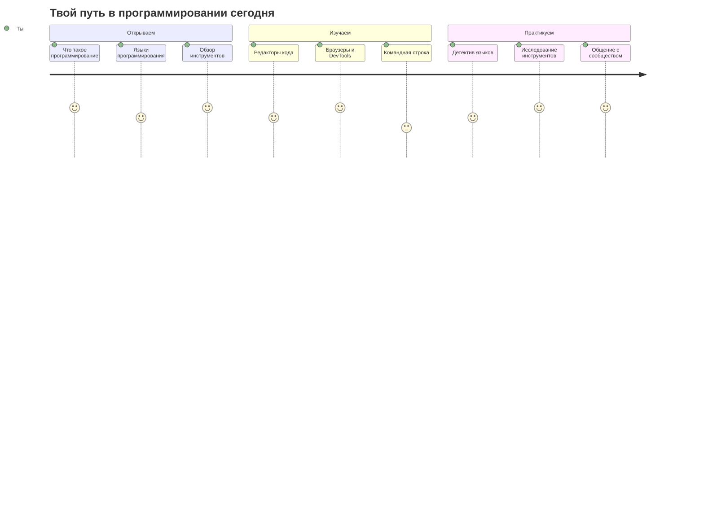
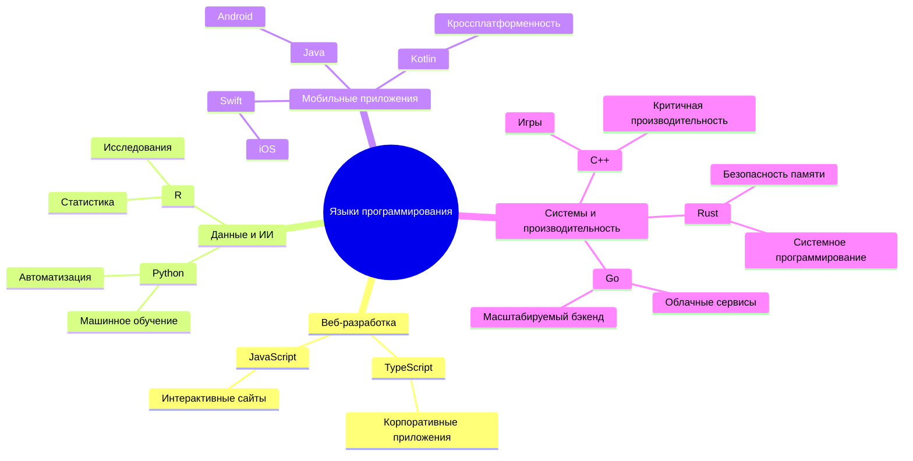
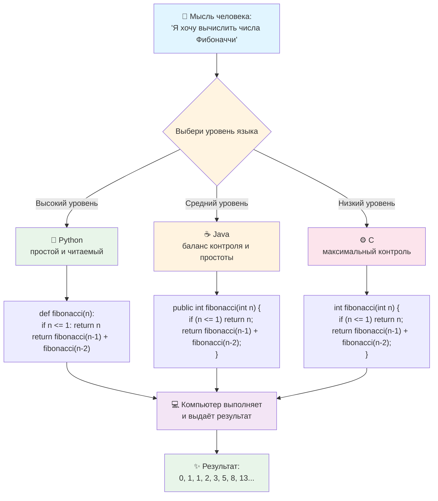
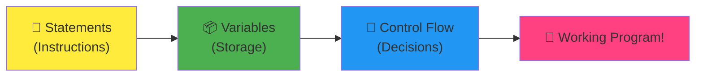
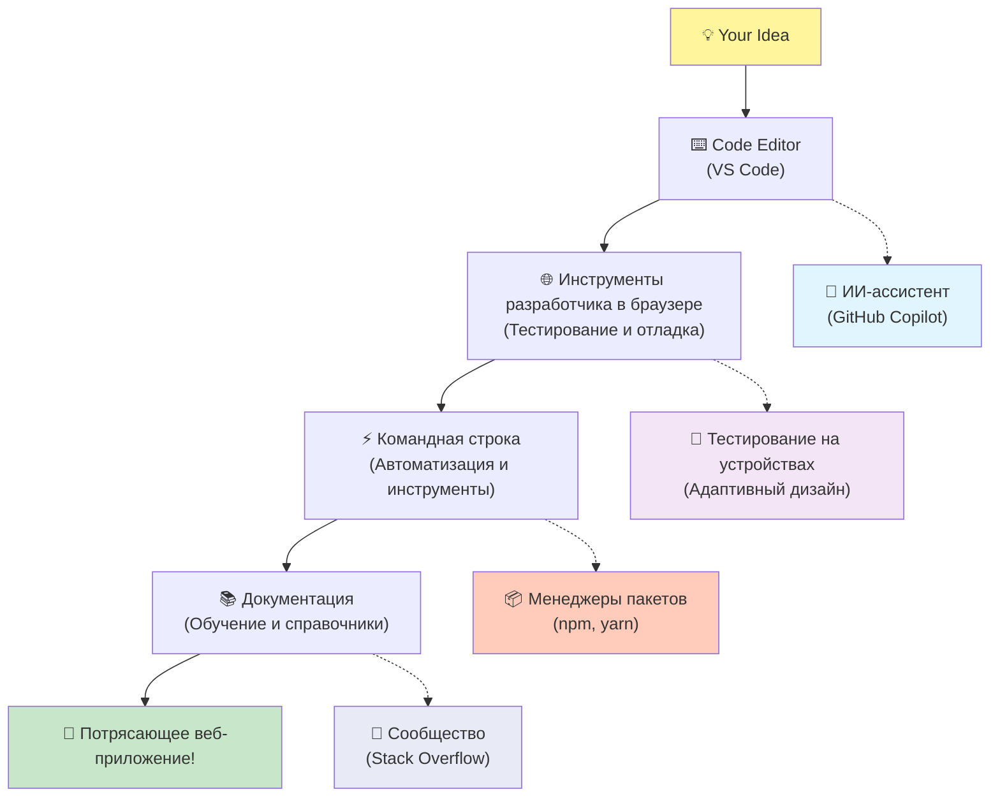
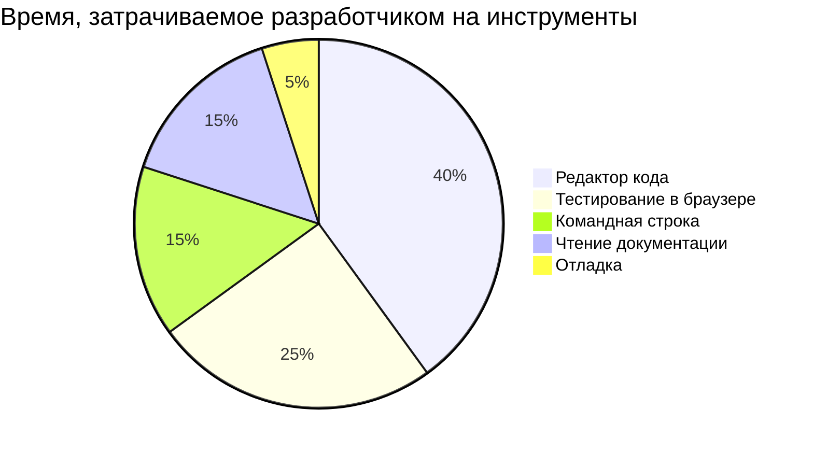
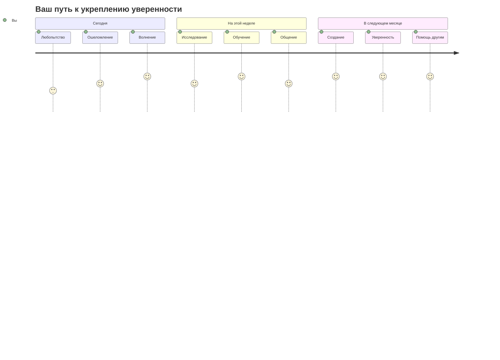

# Введение в языки программирования и современные инструменты разработчика

Привет, будущий разработчик! 👋 Могу я рассказать тебе кое-что, что до сих пор вызывает у меня мурашки каждый божий день? Ты вот-вот откроешь для себя, что программирование — это не просто про компьютеры. Это настоящие суперспособности, которые позволяют воплощать в жизнь самые смелые идеи!

Знаешь это чувство, когда ты используешь свое любимое приложение и всё просто идеально работает? Когда ты нажимаешь на кнопку и происходит что-то по-настоящему волшебное, от чего ты думаешь: "вау, как они это СДЕЛАЛИ?" Так вот, кто-то такой же, как ты — скорее всего, сидящий в любимой кофейне в два часа ночи с третьим эспрессо — написал код, который создал это волшебство. И вот что действительно взорвёт тебе мозг: к концу этого урока ты не только поймёшь, как они это сделали, но и сам захочешь попробовать!

Послушай, я прекрасно понимаю, если программирование сейчас кажется тебе чем-то пугающим. Когда я только начинал, я честно думал, что нужно быть каким-то математическим гением или начать кодить ещё в пять лет. Но вот что полностью изменило мою точку зрения: программирование — это в точности как изучение нового языка для общения. Ты начинаешь с "привет" и "спасибо", потом учишься заказывать кофе, и не успеешь оглянуться, как уже ведёшь глубокие философские дискуссии! Только в данном случае ты общаешься с компьютерами, и, честно говоря? Это самые терпеливые собеседники, которые у тебя когда-либо были — они никогда не осуждают твои ошибки и всегда готовы попробовать снова!

Сегодня мы исследуем невероятные инструменты, которые делают современную веб-разработку не просто возможной, а по-настоящему затягивающей. Я говорю о тех же самых редакторах, браузерах и рабочих процессах, которые разработчики Netflix, Spotify и твоей любимой инди-студии используют каждый день. И вот что заставит тебя танцевать от радости: большинство этих профессиональных инструментов индустриального стандарта совершенно бесплатны!


> Скетчноут от [Tomomi Imura](https://twitter.com/girlie_mac)



Прежде чем мы перейдем к самому интересному, мне интересно: что вы уже знаете об этом мире программирования? И послушайте, если вы смотрите на эти вопросы и думаете: «Я буквально не имею ни малейшего понятия обо всем этом», это не просто нормально, это идеально! Это означает, что вы находитесь именно в нужном месте. Относитесь к этому тесту как к растяжке перед тренировкой: мы просто разогреваем мышцы мозга!

[Пройдите тест перед уроком](https://forms.office.com/r/dru4TE0U9n?origin=lprLink)


## Приключение, в которое мы собираемся отправиться вместе

Хорошо, я искренне трясусь от волнения по поводу того, что мы собираемся исследовать сегодня! Серьезно, мне бы хотелось увидеть ваше лицо, когда некоторые из этих концепций сработают. Вот невероятное путешествие, которое мы совершаем вместе:

- **Что на самом деле представляет собой программирование (и почему оно самое крутое!)** – Мы собираемся выяснить, почему код – это буквально невидимая магия, питающая все вокруг вас, от будильника, который каким-то образом знает, что сегодня утро понедельника, до алгоритма, который идеально обрабатывает ваши рекомендации Netflix.
- **Языки программирования и их удивительные особенности**. Представьте себе, что вы идете на вечеринку, где у каждого человека совершенно разные суперспособности и способы решения проблем. Вот на что похож мир языков программирования, и вам понравится познакомиться с ними!
- **Основные строительные блоки, которые делают цифровую магию реальностью**. Воспринимайте их как идеальный творческий набор LEGO. Как только вы поймете, как эти части сочетаются друг с другом, вы поймете, что можете построить буквально все, о чем мечтает ваше воображение.
- **Профессиональные инструменты, которые заставят вас почувствовать, будто вам только что вручили палочку волшебника** – Я не драматизирую – эти инструменты действительно заставят вас почувствовать, что вы обладаете сверхспособностями, и что самое приятное? Это те же самые, которые используют профессионалы!

> 💡 **Вот в чем дело**: даже не думайте сегодня все запомнить! Прямо сейчас я просто хочу, чтобы вы почувствовали искру волнения по поводу того, что возможно. Детали будут складываться естественным образом, когда мы будем практиковаться вместе – именно так происходит настоящее обучение!

> Вы можете пройти этот урок на сайте [Microsoft Learn](https://docs.microsoft.com/learn/modules/web-development-101/introduction-programming/?WT.mc_id=academic-77807-sagibbon)!

## Так что же такое *программирование*?

Хорошо, давайте ответим на вопрос на миллион долларов: что такое программирование на самом деле?

Я расскажу вам историю, которая полностью изменила мое представление об этом. На прошлой неделе я пытался объяснить маме, как пользоваться нашим новым пультом Smart TV. Я поймал себя на том, что говорю что-то вроде: «Нажми красную кнопку, но не большую красную кнопку, а маленькую красную кнопку слева… нет, другую левую… ладно, теперь подержи ее две секунды, не одну, не три…» Звучит знакомо? 😅

Это программирование! Это искусство давать невероятно подробные пошаговые инструкции для чего-то очень мощного, но требующего, чтобы все было прописано идеально. За исключением того, что вместо того, чтобы объяснять маме (которая может спросить «какая красная кнопка?!»), вы объясняете компьютеру (который просто делает именно то, что вы говорите, даже если то, что вы сказали, не совсем то, что вы имели в виду).

Вот что поразило меня, когда я впервые узнал об этом: компьютеры на самом деле довольно просты по своей сути. Они буквально понимают только две вещи – 1 и 0, что, по сути, означает просто «да» и «нет» или «включено» и «выключено». Вот и все! Но вот что становится волшебным: нам не нужно говорить единицами и нулями, как в «Матрице». Вот тут-то и приходят на помощь **языки программирования**. Это похоже на лучшего в мире переводчика, который берет ваши совершенно нормальные человеческие мысли и переводит их на компьютерный язык.

И вот что до сих пор вызывает у меня настоящий озноб каждое утро, когда я просыпаюсь: буквально *все* цифровые технологии в вашей жизни начались с кого-то вроде вас, вероятно, сидящего в пижаме с чашкой кофе и печатающего код на своем ноутбуке. Тот фильтр Instagram, благодаря которому ты выглядишь безупречно? Кто-то это закодировал. Рекомендация, которая привела вас к вашей новой любимой песне? Разработчик построил этот алгоритм. Приложение, которое поможет вам разделить счета за ужин с друзьями? Да, кто-то подумал: «Это раздражает, держу пари, что я смогу это исправить», а потом… они это сделали!

Когда вы учитесь программировать, вы не просто приобретаете новый навык – вы становитесь частью этого невероятного сообщества людей, решающих проблемы, которые проводят свои дни, думая: «А что, если бы я мог создать что-то, что сделает чей-то день немного лучше?» Честно говоря, есть ли что-нибудь круче этого?

✅ **Поиск интересных фактов**: Вот кое-что очень интересное, на что стоит обратить внимание в свободное время: как вы думаете, кто был первым в мире программистом? Даю подсказку: возможно, это будет не тот, кого вы ждете! История этого человека просто увлекательна и показывает, что программирование всегда было связано с творческим решением проблем и нестандартным мышлением.

### 🧠 **Время заезда: как вы себя чувствуете?**

**Найдите минутку, чтобы подумать:**
- Имеет ли для вас сейчас смысл идея «давать инструкции компьютерам»?
- Можете ли вы придумать повседневную задачу, которую вы хотели бы автоматизировать с помощью программирования?
- Какие вопросы возникают у вас в голове по поводу всего этого программирования?

> **Помните**: совершенно нормально, если некоторые понятия сейчас кажутся вам нечеткими. Изучение программирования похоже на изучение нового языка: вашему мозгу требуется время, чтобы построить эти нейронные пути. У тебя все отлично!

## Языки программирования похожи на разные виды магии

Хорошо, это прозвучит странно, но будьте верны мне: языки программирования во многом похожи на разные типы музыки. Подумайте об этом: у вас есть джаз, плавный и импровизационный, рок, мощный и простой, классика, элегантная и структурированная, и хип-хоп, творческий и выразительный. У каждого стиля своя атмосфера, свое сообщество страстных поклонников, и каждый из них идеально подходит для разных настроений и случаев.

Языки программирования работают точно так же! Вы не будете использовать один и тот же язык для создания забавной мобильной игры, которую вы будете использовать для обработки огромных объемов климатических данных, точно так же, как вы не будете играть в дэт-метал на уроках йоги (ну, во всяком случае, на большинстве занятий йогой! 😄).

Но вот что поражает меня каждый раз, когда я думаю об этом: эти языки подобны тому, что рядом с тобой сидит самый терпеливый и блестящий переводчик в мире. Вы можете выражать свои идеи так, как это кажется естественным вашему человеческому мозгу, и они берут на себя всю невероятно сложную работу по переводу их в 1 и 0, которые на самом деле говорят компьютеры. Это как иметь друга, который прекрасно владеет как «человеческим творчеством», так и «компьютерной логикой» — и он никогда не устает, никогда не нуждается в перерывах на кофе и никогда не осуждает вас за то, что вы задаете один и тот же вопрос дважды!

### Популярные языки программирования и их использование


| Язык | Лучше всего подходит для | Почему он популярен |
|----------|----------|------------------|
| **Python** | Наука о данных, автоматизация, ИИ | Легко читается и изучается, мощные библиотеки |
| **Java** | Корпоративные приложения, приложения для Android | Платформонезависимый, надежный для больших систем |
| **C#** | Приложения для Windows, разработка игр | Сильная поддержка экосистемы Microsoft |
| **Go** | Облачные сервисы, бэкенд-системы | Быстрый, простой, разработан для современных вычислений |

### Высокоуровневые и низкоуровневые языки

Хорошо, это была концепция, которая, честно говоря, сломала мне мозг, когда я только начинал учиться, поэтому я поделюсь аналогией, которая наконец-то помогла мне все понять – и я очень надеюсь, что она поможет и вам!

Представьте, что вы приехали в страну, языка которой вы не знаете, и вам отчаянно нужно найти ближайший туалет (мы все там были, верно? 😅):

- **Низкоуровневое программирование** — это как выучить местный диалект настолько хорошо, что вы можете болтать с бабушкой, продающей фрукты на углу, используя культурные отсылки, местный сленг и внутренние шутки, которые поймет только тот, кто там вырос. Супер впечатляюще и невероятно эффективно... если вы свободно говорите! Но довольно ошеломляюще, когда вы просто пытаетесь найти туалет.

- **Высокоуровневое программирование** — это как иметь того замечательного местного друга, который просто вас понимает. Вы можете сказать «Мне очень нужно найти туалет» на простом русском, и он возьмет на себя весь культурный перевод и даст вам указания так, чтобы это было совершенно понятно вашему неместному мозгу.

В терминах программирования:
- **Низкоуровневые языки** (такие как Ассемблер или C) позволяют вам вести невероятно подробные беседы с реальным оборудованием компьютера, но вам нужно думать как машина, что... ну, скажем так, это довольно большой сдвиг в мышлении!
- **Высокоуровневые языки** (такие как JavaScript, Python или C#) позволяют вам думать как человек, пока они занимаются всей машинной речью за кулисами. Плюс, у них есть эти невероятно гостеприимные сообщества, полные людей, которые помнят, каково это быть новичком, и искренне хотят помочь!

Угадайте, с каких я предложу вам начать? 😉 Высокоуровневые языки — это как тренировочные колеса, которые вы на самом деле никогда не захотите снимать, потому что они делают весь опыт намного приятнее!





```javascript
// Шаг 1: Базовая настройка Фибоначчи
const fibonacciCount = 10;
let current = 0;
let next = 1;
```

**Вот что делает этот код:**
- **Объявляет** константу, чтобы указать, сколько чисел Фибоначчи мы хотим сгенерировать
- **Инициализирует** две переменные для отслеживания текущего и следующего чисел в последовательности
- **Устанавливает** начальные значения (0 и 1), которые определяют узор Фибоначчи
- **Отображает** заголовок для идентификации нашего вывода

```javascript
// Шаг 2: Генерация последовательности с помощью цикла
for (let i = 0; i < fibonacciCount; i++) {

  // Вычисление следующего числа в последовательности
  const sum = current + next;
  current = next;
  next = sum;
}
```


- **Проходим** по каждой позиции в нашей последовательности с помощью цикла `for`
- **Отображаем** каждое число с его позицией, используя форматирование шаблонных строк
- **Вычисляем** следующее число Фибоначчи, складывая текущее и следующее значения
- **Обновляем** наши отслеживающие переменные для перехода к следующей итерации

```javascript
// Шаг 3: Современный функциональный подход
const generateFibonacci = (count) => {
  const sequence = [0, 1];
  for (let i = 2; i < count; i++) {
  }
   return sequence;
};


const fibSequence = generateFibonacci(10);
console.log(fibSequence);
```


- **Создали** многоразовую функцию, используя современный синтаксис стрелочных функций
- **Создали** массив для хранения полной последовательности вместо отображения по одному
- **Использовали** индексацию массива для вычисления каждого нового числа из предыдущих значений
- **Вернули** полную последовательность для гибкого использования в других частях нашей программы

**Низкоуровневый язык (ARM Assembly) – дружелюбный к компьютеру:**

```assembly
 area ascen,code,readonly
 entry
 code32
 adr r0,thumb+1
 bx r0
 code16
thumb
 mov r0,#00
 sub r0,r0,#01
 mov r1,#01
 mov r4,#10
 ldr r2,=0x40000000
back add r0,r1
 str r0,[r2]
 add r2,#04
 mov r3,r0
 mov r0,r1
 mov r1,r3
 sub r4,#01
 cmp r4,#00
 bne back
 end
```


**Ключевые различия, которые вы заметите:**
- **Читаемость**: JavaScript использует описательные имена, такие как `fibonacciCount`, в то время как Ассемблер использует загадочные метки, такие как `r0`, `r1`
- **Комментарии**: Высокоуровневые языки поощряют пояснительные комментарии, которые делают код самодокументируемым
- **Структура**: Логический поток JavaScript соответствует тому, как люди думают о проблемах шаг за шагом
- **Поддержка**: Обновление версии на JavaScript для различных требований является простым и понятным

✅ **О последовательности Фибоначчи**: Этот абсолютно великолепный числовой узор (где каждое число равно сумме двух предыдущих: 0, 1, 1, 2, 3, 5, 8...) встречается буквально *повсюду* в природе! Вы найдете его в спиралях подсолнуха, узорах на шишках, в том, как изгибаются раковины наутилуса, и даже в том, как растут ветви деревьев. Просто поразительно, как математика и код могут помочь нам понять и воссоздать узоры, которые природа использует для создания красоты!


## Строительные блоки, которые делают магию возможной

Хорошо, теперь, когда вы увидели, как выглядят языки программирования в действии, давайте разберем фундаментальные части, из которых состоит буквально каждая когда-либо написанная программа. Думайте о них как об основных ингредиентах в вашем любимом рецепте – как только вы поймете, что делает каждый из них, вы сможете читать и писать код практически на любом языке!

Это немного похоже на изучение грамматики программирования. Помните, как в школе вы учили о существительных, глаголах и о том, как составлять предложения? У программирования есть своя версия грамматики, и, честно говоря, она гораздо логичнее и снисходительнее, чем грамматика русского языка когда-либо была! 😄

### Инструкции: Пошаговые указания

Давайте начнем с **инструкций** (statements) – они похожи на отдельные предложения в разговоре с вашим компьютером. Каждая инструкция говорит компьютеру сделать одну конкретную вещь, вроде как давать указания: «Поверни здесь налево», «Остановись на красный свет», «Припаркуйся на том месте».

Что мне нравится в инструкциях, так это то, насколько они обычно читабельны. Посмотрите на это:

```javascript
// Basic statements that perform single actions
const userName = "Алекс";
console.log("Привет, мир!");
const sum = 5 + 3;
```


- **Объявляет** константную переменную для хранения имени пользователя
- **Отображает** приветственное сообщение в консоль
- **Вычисляет** и сохраняет результат математической операции

```javascript
// Statements that interact with web pages
document.title = "Мой потрясающий сайт";
document.body.style.backgroundColor = "lightblue";
```


- **Изменяет** заголовок веб-страницы, который отображается во вкладке браузера
- **Меняет** цвет фона всего тела страницы

### Переменные: Система памяти вашей программы

Хорошо, **переменные** – это, честно говоря, одна из моих самых любимых концепций для обучения, потому что они очень похожи на то, что вы уже используете каждый день!

Подумайте на секунду о списке контактов в вашем телефоне. Вы не запоминаете номера телефонов всех – вместо этого вы сохраняете «Мама», «Лучший друг» или «Пиццерия, которая доставляет до 2 часов ночи» и позволяете вашему телефону помнить фактические номера. Переменные работают точно так же! Они как подписанные контейнеры, где ваша программа может хранить информацию и извлекать ее позже, используя имя, которое действительно имеет смысл.

Вот что действительно круто: переменные могут меняться по мере выполнения вашей программы (отсюда и название «переменная» – видите, что они сделали?). Точно так же, как вы можете обновить контакт той пиццерии, когда найдете место еще лучше, переменные могут обновляться по мере того, как ваша программа узнает новую информацию или по мере изменения ситуаций!

Позвольте мне показать вам, как это красиво и просто:

```javascript
// Step 1: Creating basic variables
const siteName = "Панель погоды";
let currentWeather = "солнечно";
let temperature = 24;
let isRaining = false;
```


- **Храните** неизменяемые значения в `const` переменных (например, название сайта)
- **Используйте** `let` для значений, которые могут меняться в ходе выполнения вашей программы
- **Присваивайте** разные типы данных: строки (текст), числа и булевы значения (истина/ложь)
- **Выбирайте** описательные имена, которые объясняют, что содержит каждая переменная

```javascript
// Step 2: Working with objects to group related data
const weatherData = {
  location: "Сан-Франциско",
  humidity: 65,
  windSpeed: 12
};
```


- **Создали** объект для группировки связанной информации о погоде
- **Организовали** несколько частей данных под одним именем переменной
- **Использовали** пары ключ-значение для четкой маркировки каждой части информации

```javascript
// Step 3: Using and updating variables
console.log(`${siteName}: Сегодня ${currentWeather} и ${temperature}°C`);
console.log(`Скорость ветра: ${weatherData.windSpeed} м/с`);

// Обновление изменяемых переменных
currentWeather = "облачно";
temperature = 20;
```

**Давайте разберем каждую часть:**
- **Отображаем** информацию, используя шаблонные строки с синтаксисом `${}`
- **Получаем доступ** к свойствам объекта, используя точечную нотацию (`weatherData.windSpeed`)
- **Обновляем** переменные, объявленные с помощью `let`, чтобы отразить изменяющиеся условия
- **Комбинируем** несколько переменных для создания осмысленных сообщений

```javascript
// Step 4: Modern destructuring for cleaner code
const { location, humidity } = weatherData;
console.log(`Влажность в ${location}: ${humidity}%`);
```

**Что вам нужно знать:**
- **Извлекайте** определенные свойства из объектов, используя деструктурирующее присваивание
- **Создавайте** новые переменные автоматически с теми же именами, что и ключи объекта
- **Упрощайте** код, избегая повторяющейся точечной нотации

### Управление потоком: Обучение вашей программы думать

Хорошо, вот здесь программирование становится абсолютно умопомрачительным! **Управление потоком** (Control flow) – это, по сути, обучение вашей программы принимать умные решения, точно так же, как вы делаете это каждый день, даже не задумываясь.

Представьте себе: сегодня утром вы, вероятно, прошли через что-то вроде: «Если идет дождь, я возьму зонт. Если холодно, я надену куртку. Если я опаздываю, я пропущу завтрак и возьму кофе по дороге». Ваш мозг естественным образом следует этой логике «если-то» десятки раз каждый день!

Это то, что заставляет программы казаться умными и живыми, а не просто следовать какому-то скучному, предсказуемому сценарию. Они могут фактически посмотреть на ситуацию, оценить, что происходит, и отреагировать соответствующим образом. Это как дать вашей программе мозг, который может адаптироваться и делать выбор!

Хотите увидеть, как это красиво работает? Позвольте мне показать вам:

```javascript
// Step 1: Basic conditional logic
const userAge = 17;

if (userAge >= 18) {
  console.log("You can vote!");
} else {
  const yearsToWait = 18 - userAge;
  console.log(`You'll be able to vote in ${yearsToWait} year(s).`);
}
```

**Вот что делает этот код:**
- **Проверяет**, соответствует ли возраст пользователя требованию для голосования
- **Выполняет** разные блоки кода в зависимости от результата условия
- **Вычисляет** и отображает, сколько времени осталось до возможности голосовать, если возраст меньше 18
- **Предоставляет** конкретную, полезную обратную связь для каждого сценария

```javascript
// Step 2: Multiple conditions with logical operators
const userAge = 17;
const hasPermission = true;

if (userAge >= 18 && hasPermission) {
  console.log("Access granted: You can enter the venue.");
} else if (userAge >= 16) {
  console.log("You need parent permission to enter.");
} else {
  console.log("Sorry, you must be at least 16 years old.");
}
```

**Разберем, что здесь происходит:**
- **Комбинирует** несколько условий с помощью оператора `&&` (и)
- **Создает** иерархию условий с помощью `else if` для нескольких сценариев
- **Обрабатывает** все возможные случаи с помощью конечного оператора `else`
- **Предоставляет** четкую, действенную обратную связь для каждой различной ситуации

```javascript
// Step 3: Concise conditional with ternary operator
const votingStatus = userAge >= 18 ? "Может голосовать" : "Пока не может голосовать";
console.log(`Статус: ${votingStatus}`);
```

**Что вам нужно помнить:**
- **Используйте** тернарный оператор (`? :`) для простых условий с двумя вариантами
- **Напишите** сначала условие, затем `?`, затем результат для `true`, затем `:`, затем результат для `false`
- **Применяйте** этот шаблон, когда вам нужно присвоить значения на основе условий

```javascript
// Step 4: Handling multiple specific cases
const dayOfWeek = "Вторник";

switch (dayOfWeek) {
switch (dayOfWeek) {
  case "Вторник":
  case "Среда":
  case "Четверг":
  case "Пятница":
  console.log("Это будний день - время работать!");
  break;
  case "Суббота":
  case "Воскресенье":
  console.log("Это выходной - время отдыхать!");
  break;
  default:
  default:
}
```

**Этот код выполняет следующее:**
- **Сравнивает** значение переменной с несколькими конкретными случаями
- **Группирует** похожие случаи вместе (будни против выходных)
- **Выполняет** соответствующий блок кода при нахождении совпадения
- **Включает** случай `default` для обработки неожиданных значений
- **Использует** операторы `break` для предотвращения перехода кода к следующему случаю

> 💡 **Аналогия из реальной жизни**: Думайте об управлении потоком как о самом терпеливом в мире GPS, дающем вам указания. Он может сказать: «Если на Главной улице пробка, поезжайте по шоссе. Если на шоссе ремонт, попробуйте живописный маршрут». Программы используют точно такой же тип условной логики, чтобы разумно реагировать на различные ситуации и всегда предоставлять пользователям наилучший возможный опыт.

### 🎯 **Проверка концепции: Владение строительными блоками**

**Давайте посмотрим, как у вас дела с основами:**
- Можете ли вы объяснить разницу между переменной и инструкцией своими словами?
- Придумайте реальный сценарий, где вы бы использовали решение «если-то» (как в нашем примере с голосованием)
- Что вас удивило в логике программирования?

**Быстрый заряд уверенности:**






|---------|--------------|--------------|
| **Автодополнение** | Предлагает код по мере ввода | Ускоряет кодирование и уменьшает опечатки |
| **Инструменты отладки** | Помогает находить и исправлять ошибки | Экономит часы времени на устранение неполадок |
| **Расширения** | Добавляют специализированные функции | Настраивайте ваш редактор для любой технологии |
| **ИИ-ассистенты** | Предлагают код и объяснения | Ускоряют обучение и производительность |

> 🎥 **Видеоресурс**: Хотите увидеть эти инструменты в действии? Посмотрите это [видео об инструментах ремесла](https://youtube.com/watch?v=69WJeXGBdxg) для всестороннего обзора.

#### Рекомендуемые редакторы для веб-разработки

**[Visual Studio Code](https://code.visualstudio.com/?WT.mc_id=academic-77807-sagibbon)** (Бесплатно)
- Самый популярный среди веб-разработчиков
- Отличная экосистема расширений
- Встроенный терминал и интеграция с Git
- **Обязательные расширения**:
  - [GitHub Copilot](https://marketplace.visualstudio.com/items?itemName=GitHub.copilot) - Предложения кода на базе ИИ
  - [Live Share](https://marketplace.visualstudio.com/items?itemName=MS-vsliveshare.vsliveshare) - Совместная работа в реальном времени
  - [Prettier](https://marketplace.visualstudio.com/items?itemName=esbenp.prettier-vscode) - Автоматическое форматирование кода
  - [Code Spell Checker](https://marketplace.visualstudio.com/items?itemName=streetsidesoftware.code-spell-checker) - Ловит опечатки в вашем коде

**[JetBrains WebStorm](https://www.jetbrains.com/webstorm/)** (Платно, бесплатно для студентов)
- Продвинутые инструменты отладки и тестирования
- Интеллектуальное автодополнение кода
- Встроенный контроль версий

**Облачные IDE** (Различные цены)
- [GitHub Codespaces](https://github.com/features/codespaces) - Полноценный VS Code в вашем браузере
- [Replit](https://replit.com/) - Отлично подходит для обучения и обмена кодом
- [StackBlitz](https://stackblitz.com/) - Мгновенная full-stack веб-разработка

> 💡 **Совет для начинающих**: Начните с Visual Studio Code – он бесплатный, широко используется в индустрии и имеет огромное сообщество, создающее полезные руководства и расширения.


### Веб-браузеры: Ваша секретная лаборатория разработки

Хорошо, приготовьтесь к тому, что ваш мозг будет полностью взорван! Вы знаете, как вы использовали браузеры для прокрутки социальных сетей и просмотра видео? Что ж, оказывается, они все это время скрывали эту невероятную секретную лабораторию для разработчиков, просто ожидая, когда вы ее обнаружите!

Каждый раз, когда вы щелкаете правой кнопкой мыши на веб-странице и выбираете «Проверить элемент», вы открываете скрытый мир инструментов разработчика, которые, честно говоря, мощнее, чем некоторые дорогие программы, за которые я раньше платил сотни долларов. Это как обнаружить, что ваша обычная старая кухня скрывала лабораторию профессионального шеф-повара за секретной панелью!

Когда мне впервые показали инструменты разработчика в браузере, я провел около трех часов, просто щелкая по всему и думая: «ПОДОЖДИТЕ, ОНО И ЭТО МОЖЕТ?!» Вы можете буквально редактировать любой веб-сайт в реальном времени, видеть, насколько быстро все загружается, тестировать, как ваш сайт выглядит на разных устройствах, и даже отлаживать JavaScript как настоящий профессионал. Это абсолютно умопомрачительно!

**Вот почему браузеры — ваше секретное оружие:**

Когда вы создаете веб-сайт или веб-приложение, вам нужно видеть, как оно выглядит и ведет себя в реальном мире. Браузеры не только отображают вашу работу, но и предоставляют подробную обратную связь о производительности, доступности и потенциальных проблемах.

#### Инструменты разработчика в браузере (DevTools)

Современные браузеры включают в себя комплексные наборы для разработки:

| Категория инструмента | Что он делает | Пример использования |
|---------------|--------------|------------------|
| **Консоль** | Просмотр сообщений об ошибках и тестирование JavaScript | Отладка проблем и эксперименты с кодом |
| **Монитор сети** | Отслеживание загрузки ресурсов | Оптимизация производительности и времени загрузки |
| **Проверка доступности** | Тестирование на инклюзивный дизайн | Убедитесь, что ваш сайт работает для всех пользователей |
| **Симулятор устройств** | Предварительный просмотр на экранах разных размеров | Тестирование адаптивного дизайна без нескольких устройств |

#### Рекомендуемые браузеры для разработки

- **[Chrome](https://developers.google.com/web/tools/chrome-devtools/)** - Стандартные в индустрии DevTools с обширной документацией
- **[Firefox](https://developer.mozilla.org/docs/Tools)** - Отличные инструменты для CSS Grid и доступности
- **[Edge](https://docs.microsoft.com/microsoft-edge/devtools-guide-chromium/?WT.mc_id=academic-77807-sagibbon)** - Построен на Chromium с ресурсами для разработчиков от Microsoft

> ⚠️ **Важный совет по тестированию**: Всегда тестируйте свои веб-сайты в нескольких браузерах! То, что идеально работает в Chrome, может выглядеть иначе в Safari или Firefox. Профессиональные разработчики тестируют на всех основных браузерах, чтобы обеспечить единообразный пользовательский опыт.


### Инструменты командной строки: Ваш путь к суперспособностям разработчика

Хорошо, давайте будем абсолютно честны насчет командной строки, потому что я хочу, чтобы вы услышали это от кого-то, кто действительно это понимает. Когда я впервые увидел ее – просто этот страшный черный экран с мигающим текстом – я буквально подумал: «Нет, абсолютно нет! Это выглядит как что-то из хакерского фильма 1980-х, и я определенно недостаточно умен для этого!» 😅

Но вот что я хотел бы, чтобы мне кто-то сказал тогда, и что я говорю вам прямо сейчас: командная строка не страшная – на самом деле это как прямой разговор с вашим компьютером. Думайте об этом как о разнице между заказом еды через модное приложение с картинками и меню (что приятно и легко) и входом в ваш любимый местный ресторан, где шеф-повар точно знает, что вам нравится, и может приготовить что-то идеальное, просто услышав от вас «удивите меня чем-нибудь потрясающим».

Командная строка – это место, где разработчики чувствуют себя настоящими волшебниками. Вы печатаете несколько кажущихся волшебными слов (ладно, это просто команды, но они ощущаются волшебными!), нажимаете Enter, и БУМ – вы создали целые структуры проектов, установили мощные инструменты со всего мира или развернули свое приложение в интернете для миллионов людей. Как только вы впервые почувствуете эту силу, это, честно говоря, довольно затягивает!

**Почему командная строка станет вашим любимым инструментом:**

Хотя графические интерфейсы отлично подходят для многих задач, командная строка превосходит их в автоматизации, точности и скорости. Многие инструменты разработки работают в основном через интерфейсы командной строки, и научившись эффективно их использовать, вы можете значительно повысить свою производительность.

```bash
# Step 1: Create and navigate to project directory
mkdir my-awesome-website
cd my-awesome-website
```

**Вот что делает этот код:**
- **Создает** новый каталог с именем «мой-потрясающий-сайт» для вашего проекта
- **Переходит** во вновь созданный каталог, чтобы начать работу

```bash
# Step 2: Initialize project with package.json
npm init -y

# Install modern development tools
npm install --save-dev vite prettier eslint
npm install --save-dev @eslint/js
```


- **Инициализирует** новый проект Node.js с настройками по умолчанию, используя `npm init -y`
- **Устанавливает** Vite как современный инструмент сборки для быстрой разработки и производственных сборок
- **Добавляет** Prettier для автоматического форматирования кода и ESLint для проверки качества кода
- **Использует** флаг `--save-dev`, чтобы пометить их как зависимости только для разработки

```bash
# Step 3: Create project structure and files
mkdir src assets
echo '<!DOCTYPE html><html><head><title>My Site</title></head><body><h1>Hello World</h1></body></html>' > index.html

# Start development server
npx vite
```


- **Организовали** наш проект, создав отдельные папки для исходного кода и активов
- **Сгенерировали** базовый HTML-файл с правильной структурой документа
- **Запустили** сервер разработки Vite для живой перезагрузки и горячей замены модулей

#### Основные инструменты командной строки для веб-разработки

| Инструмент | Назначение | Зачем он вам нужен |
|------|---------|-----------------|
| **[Node.js & npm](https://nodejs.org/)** | Среда выполнения JavaScript и управление пакетами | Запуск JavaScript вне браузеров, установка современных инструментов |
| **[Vite](https://vitejs.dev/)** | Инструмент сборки и сервер разработки | Молниеносная разработка с горячей заменой модулей |
| **[ESLint](https://eslint.org/)** | Качество кода | Автоматический поиск и исправление проблем в вашем JavaScript |
| **[Prettier](https://prettier.io/)** | Форматирование кода | Поддержание единообразного и читаемого форматирования кода |

#### Опции для конкретных платформ

**Windows:**
- **[PowerShell](https://docs.microsoft.com/powershell/?WT.mc_id=academic-77807-sagibbon)** 💻 - Мощная среда для написания сценариев
- **[Командная строка](https://docs.microsoft.com/windows-server/administration/windows-commands/?WT.mc_id=academic-77807-sagibbon)** 💻 - Традиционная командная строка Windows

**macOS:**
- **[iTerm2](https://iterm2.com/)** - Улучшенный терминал с расширенными функциями

**Linux:**
- **[KDE Konsole](https://docs.kde.org/trunk5/en/konsole/konsole/index.html)** - Продвинутый эмулятор терминала

**[Mozilla Developer Network (MDN)](https://developer.mozilla.org/docs/Web)**
- Комплексные руководства по HTML, CSS и JavaScript
- Включает информацию о совместимости с браузерами
- Содержит практические примеры и интерактивные демонстрации

**[Web.dev](https://web.dev)** (от Google)
- Современные лучшие практики веб-разработки
- Руководства по оптимизации производительности
- Принципы доступности и инклюзивного дизайна
- Примеры из реальных проектов

**[Документация для разработчиков Microsoft](https://docs.microsoft.com/microsoft-edge/#microsoft-edge-for-developers)**
- Ресурсы по разработке для браузера Edge
- Руководства по прогрессивным веб-приложениям (PWA)
- Информация о кросс-платформенной разработке

**[Пути обучения Frontend Masters](https://frontendmasters.com/learn/)**
- Структурированные учебные программы
- Видеокурсы от экспертов отрасли
- Практические задания по кодированию

> 📚 **Стратегия обучения**: Не пытайтесь запомнить документацию – вместо этого научитесь эффективно по ней ориентироваться. Добавляйте в закладки часто используемые справочники и практикуйтесь в использовании функций поиска для быстрого нахождения конкретной информации.

### 🔧 **Проверка владения инструментами: Что вам больше всего откликнулось?**

**Найдите минутку, чтобы подумать:**
- Какой инструмент вы больше всего хотите попробовать первым? (Здесь нет неправильного ответа!)
- Командная строка все еще кажется пугающей, или вам стало любопытно?
- Можете ли вы представить, как используете инструменты разработчика в браузере, чтобы заглянуть за кулисы ваших любимых веб-сайтов?



> **Забавный факт**: Большинство разработчиков проводят около 40% своего времени в редакторе кода, но обратите внимание, сколько времени уходит на тестирование, обучение и решение проблем. Программирование – это не просто написание кода, это создание опыта!

✅ **Пища для размышлений**: Вот кое-что интересное для размышления – как вы думаете, чем могут отличаться инструменты для создания веб-сайтов (разработка) от инструментов для проектирования их внешнего вида (дизайн)? Это как разница между архитектором, который проектирует красивый дом, и подрядчиком, который его строит. Оба важны, но им нужны разные наборы инструментов! Такое мышление действительно поможет вам увидеть общую картину того, как веб-сайты появляются на свет.

## Задание от агента GitHub Copilot 🚀

Используйте режим агента, чтобы выполнить следующее задание:

**Описание:** Изучите возможности современного редактора кода или IDE и продемонстрируйте, как он может улучшить ваш рабочий процесс как веб-разработчика.

**Запрос:** Выберите редактор кода или IDE (например, Visual Studio Code, WebStorm или облачную IDE). Перечислите три функции или расширения, которые помогают вам писать, отлаживать или поддерживать код более эффективно. Для каждого из них предоставьте краткое объяснение того, как это улучшает ваш рабочий процесс.

---

## 🚀 Испытание

**Хорошо, детектив, готовы к вашему первому делу?**

Теперь, когда у вас есть эта потрясающая основа, у меня есть приключение, которое поможет вам увидеть, насколько невероятно разнообразен и увлекателен мир программирования. И послушайте – это еще не о написании кода, так что не напрягайтесь! Представьте себя детективом по языкам программирования на вашем первом захватывающем деле!

**Ваша миссия, если вы решите ее принять:**
1. **Станьте исследователем языков**: Выберите три языка программирования из совершенно разных вселенных – может быть, один, который создает веб-сайты, один, который создает мобильные приложения, и один, который обрабатывает данные для ученых. Найдите примеры одной и той же простой задачи, написанной на каждом языке. Я обещаю, вы будете абсолютно поражены тем, насколько по-разному они могут выглядеть, делая одно и то же!

2. **Раскройте их истории происхождения**: Что делает каждый язык особенным? Вот крутой факт – каждый язык программирования был создан потому, что кто-то подумал: «Знаете что? Должен быть лучший способ решить эту конкретную проблему». Можете ли вы выяснить, что это были за проблемы? Некоторые из этих историй действительно увлекательны!

3. **Познакомьтесь с сообществами**: Посмотрите, насколько гостеприимны и увлечены сообщества каждого языка. У некоторых миллионы разработчиков делятся знаниями и помогают друг другу, другие меньше, но невероятно сплоченные и поддерживающие. Вам понравится видеть разные характеры этих сообществ!

4. **Следуйте своей интуиции**: Какой язык кажется вам наиболее доступным прямо сейчас? Не переживайте о том, чтобы сделать «идеальный» выбор – просто прислушайтесь к своим инстинктам! Здесь, честно говоря, нет неправильного ответа, и вы всегда можете изучить другие позже.

**Бонусная детективная работа**: Попробуйте выяснить, какие крупные веб-сайты или приложения созданы с использованием каждого языка. Я гарантирую, вы будете шокированы, узнав, что лежит в основе Instagram, Netflix или той мобильной игры, в которую вы не можете перестать играть!

> 💡 **Помните**: Вы не пытаетесь стать экспертом в каком-либо из этих языков сегодня. Вы просто знакомитесь с районом, прежде чем решить, где вы хотите обосноваться. Не торопитесь, получайте удовольствие и позвольте своему любопытству вести вас!

## Давайте отпразднуем то, что вы открыли!

Боже мой, вы впитали столько невероятной информации сегодня! Я искренне рад видеть, сколько из этого удивительного путешествия осталось с вами. И помните – это не тест, где вам нужно все сделать идеально. Это скорее празднование всех крутых вещей, которые вы узнали об этом увлекательном мире, в который вы собираетесь погрузиться!

[Пройдите тест после урока](https://ff-quizzes.netlify.app/web/)

## Обзор и самостоятельное изучение

**Не торопитесь, исследуйте и получайте удовольствие!**

Вы проделали большой путь сегодня, и этим можно гордиться! Теперь начинается самое интересное – изучение тем, которые вызвали у вас любопытство. Помните, это не домашнее задание – это приключение!

**Углубитесь в то, что вас волнует:**

**Попрактикуйтесь с языками программирования:**
- Посетите официальные сайты 2-3 языков, которые привлекли ваше внимание. У каждого из них своя индивидуальность и история!
- Попробуйте онлайн-площадки для кодирования, такие как [CodePen](https://codepen.io/), [JSFiddle](https://jsfiddle.net/) или [Replit](https://replit.com/). Не бойтесь экспериментировать – вы ничего не сломаете!
- Прочитайте о том, как появился ваш любимый язык. Серьезно, некоторые из этих историй происхождения увлекательны и помогут вам понять, почему языки работают так, как они работают.

**Освойтесь с вашими новыми инструментами:**
- Скачайте Visual Studio Code, если вы еще этого не сделали – он бесплатный, и он вам понравится!
- Потратьте несколько минут на просмотр магазина расширений. Это как App Store для вашего редактора кода!
- Откройте инструменты разработчика в вашем браузере и просто пощелкайте по ним. Не беспокойтесь о том, чтобы все понять – просто ознакомьтесь с тем, что там есть.

**Присоединяйтесь к сообществу:**
- Подпишитесь на некоторые сообщества разработчиков на [Dev.to](https://dev.to/), [Stack Overflow](https://stackoverflow.com/) или [GitHub](https://github.com/). Сообщество программистов невероятно гостеприимно к новичкам!
- Посмотрите несколько видео по кодированию для начинающих на YouTube. Там так много замечательных авторов, которые помнят, каково это – начинать.
- Рассмотрите возможность присоединения к местным встречам или онлайн-сообществам. Поверьте мне, разработчики любят помогать новичкам!

> 🎯 **Слушайте, вот что я хочу, чтобы вы запомнили**: От вас не ожидается, что вы станете волшебником кодирования за одну ночь! Прямо сейчас вы просто знакомитесь с этим удивительным новым миром, частью которого вы собираетесь стать. Не торопитесь, наслаждайтесь путешествием и помните – каждый разработчик, которым вы восхищаетесь, когда-то сидел именно там, где вы сейчас, чувствуя волнение и, возможно, немного ошеломление. Это абсолютно нормально, и это значит, что вы все делаете правильно!


## Задание

[Чтение документации](assignment.md)

> 💡 **Небольшой толчок для вашего задания**: Я бы очень хотел, чтобы вы изучили некоторые инструменты, которые мы еще не рассматривали! Пропустите редакторы, браузеры и инструменты командной строки, о которых мы уже говорили – существует целая невероятная вселенная удивительных инструментов разработки, которые только и ждут, чтобы их открыли. Ищите те, которые активно поддерживаются и имеют живые, полезные сообщества (у них, как правило, лучшие учебные пособия и самые отзывчивые люди, когда вы неизбежно застрянете и понадобится дружеская помощь).

---

## 🚀 Ваша временная шкала путешествия в программирование

### ⚡ **Что вы можете сделать в следующие 5 минут**
- [ ] Добавить в закладки 2-3 сайта языков программирования, которые привлекли ваше внимание
- [ ] Скачать Visual Studio Code, если вы еще этого не сделали
- [ ] Открыть инструменты разработчика в вашем браузере (F12) и пощелкать по любому сайту
- [ ] Присоединиться к одному сообществу программистов (Dev.to, Reddit r/webdev или Stack Overflow)

### ⏰ **Что вы можете сделать за этот час**
- [ ] Пройти тест после урока и обдумать свои ответы
- [ ] Настроить VS Code с расширением GitHub Copilot
- [ ] Попробовать пример «Hello World» на 2 разных языках программирования онлайн
- [ ] Посмотреть видео «День из жизни разработчика» на YouTube
- [ ] Начать свою детективную работу по языкам программирования (из испытания)

### 📅 **Ваше приключение на неделю**
- [ ] Выполнить задание и изучить 3 новых инструмента разработки
- [ ] Подписаться на 5 разработчиков или аккаунтов о программировании в социальных сетях
- [ ] Попробовать создать что-то крошечное в CodePen или Replit (даже просто «Привет, [Ваше имя]!»)
- [ ] Прочитать один пост в блоге разработчика о чьем-то пути в кодировании
- [ ] Присоединиться к виртуальной встрече или посмотреть доклад о программировании
- [ ] Начать изучать выбранный вами язык с помощью онлайн-уроков

### 🗓️ **Ваша трансформация за месяц**
- [ ] Создать свой первый небольшой проект (даже простая веб-страница считается!)
- [ ] Внести вклад в проект с открытым исходным кодом (начните с исправлений в документации)
- [ ] Стать наставником для кого-то, кто только начинает свой путь в программировании
- [ ] Создать свой сайт-портфолио разработчика
- [ ] Связаться с местными сообществами разработчиков или учебными группами
- [ ] Начать планировать свою следующую учебную веху

### 🎯 **Итоговая проверка-рефлексия**

**Прежде чем двигаться дальше, найдите минутку, чтобы отпраздновать:**
- Что вас сегодня взволновало в программировании?
- Какой инструмент или концепцию вы хотите изучить в первую очередь?
- Как вы себя чувствуете, начиная это путешествие в программирование?
- Какой один вопрос вы бы хотели задать разработчику прямо сейчас?



> 🌟 **Помните**: Каждый эксперт когда-то был новичком. Каждый старший разработчик когда-то чувствовал себя точно так же, как вы сейчас – взволнованным, может быть, немного ошеломленным и определенно любопытным относительно того, что возможно. Вы в прекрасной компании, и это путешествие будет невероятным. Добро пожаловать в чудесный мир программирования! 🎉
