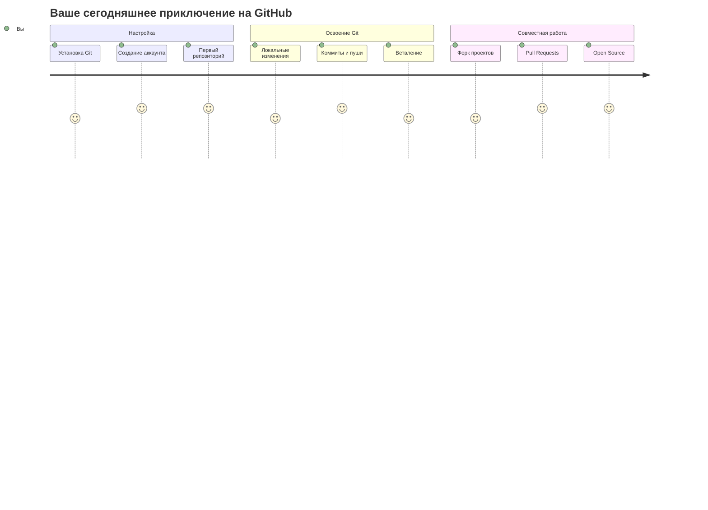
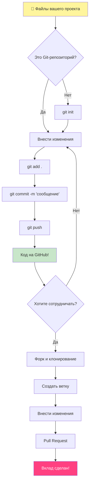
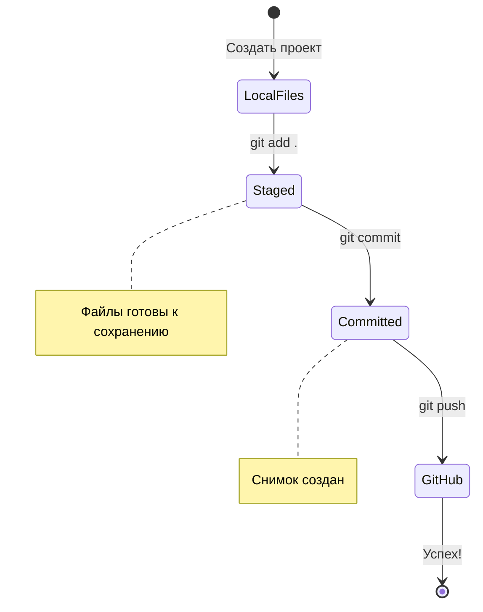
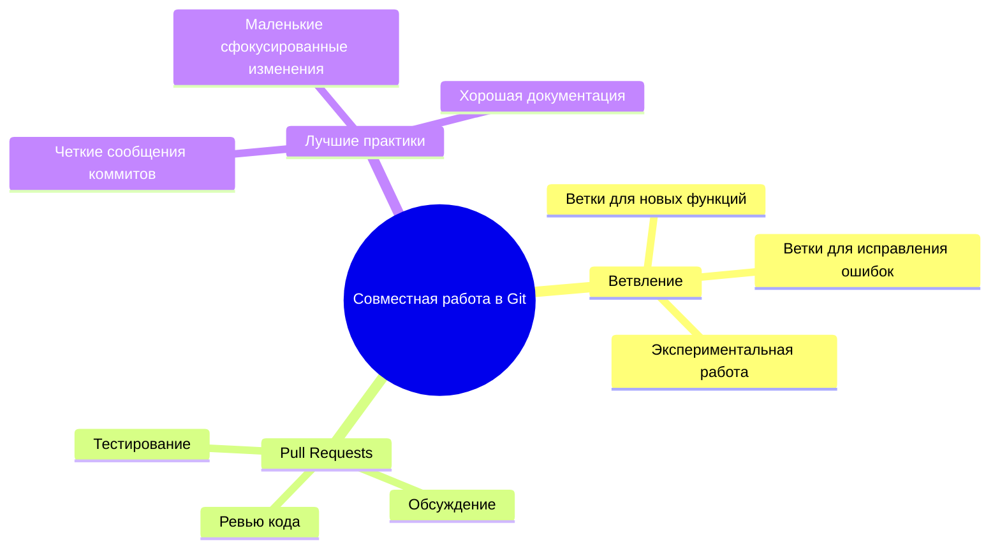
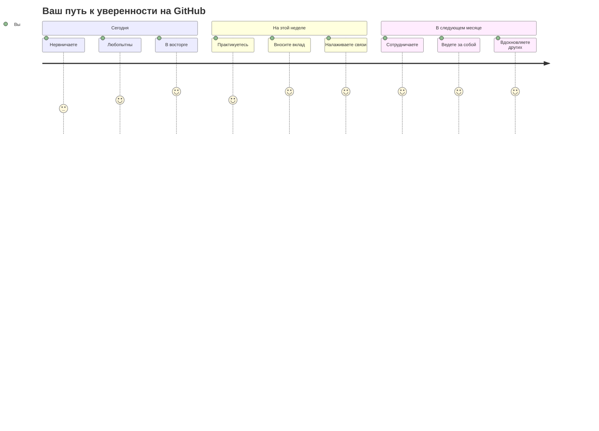

# Введение в GitHub

Привет, будущий разработчик! Готовы присоединиться к миллионам программистов по всему миру? Я искренне рад представить вам GitHub – думайте о нем как о социальной сети для программистов, только вместо того, чтобы делиться фотографиями своего обеда, мы делимся кодом и вместе создаем невероятные вещи!

Вот что меня абсолютно поражает: каждое приложение на вашем телефоне, каждый сайт, который вы посещаете, и большинство инструментов, которыми вы научитесь пользоваться, были созданы командами разработчиков, сотрудничающих на платформах, подобных GitHub. То музыкальное приложение, которое вы любите? Кто-то вроде вас внес в него свой вклад. Та игра, от которой вы не можете оторваться? Да, вероятно, она была создана при помощи совместной работы на GitHub. И теперь ВЫ научитесь быть частью этого удивительного сообщества!

Я знаю, что поначалу это может показаться сложным – черт, я помню, как смотрел на свою первую страницу GitHub и думал: «Что, черт возьми, все это значит?» Но вот в чем дело: каждый разработчик начинал именно там, где вы находитесь сейчас. К концу этого урока у вас будет свой собственный репозиторий на GitHub (думайте о нем как о вашей личной витрине проектов в облаке), и вы будете знать, как сохранять свою работу, делиться ею с другими и даже вносить вклад в проекты, которыми пользуются миллионы людей.

Мы пройдем этот путь вместе, шаг за шагом. Без спешки, без давления – только вы, я и несколько действительно крутых инструментов, которые вот-вот станут вашими новыми лучшими друзьями!


> Скетчноут от [Tomomi Imura](https://twitter.com/girlie_mac)



## Квиз перед лекцией
[Квиз перед лекцией](https://ff-quizzes.netlify.app)

## Введение

Прежде чем мы погрузимся в действительно захватывающие вещи, давайте подготовим ваш компьютер к магии GitHub! Думайте об этом как об организации художественных принадлежностей перед созданием шедевра – наличие готовых инструментов делает все намного проще и веселее.

Я лично проведу вас через каждый шаг настройки, и я обещаю, что это не так страшно, как может показаться на первый взгляд. Если что-то не получается с первого раза, это совершенно нормально! Я помню, как настраивал свою первую среду разработки и чувствовал, будто пытаюсь читать древние иероглифы. Каждый разработчик был именно там, где вы сейчас, и задавался вопросом, все ли он делает правильно. Спойлер: если вы здесь и учитесь, вы уже все делаете правильно!

В этом уроке мы рассмотрим:

- отслеживание работы, которую вы делаете на своем компьютере
- работа над проектами с другими людьми
- как вносить вклад в программное обеспечение с открытым исходным кодом

### Предварительные требования

Давайте подготовим ваш компьютер к магии GitHub! Не волнуйтесь – эту настройку нужно сделать всего один раз, и после этого вы будете готовы ко всему вашему пути в программировании.

Итак, начнем с основ! Сначала нам нужно проверить, установлен ли Git на вашем компьютере. Git — это, по сути, как супер-умный ассистент, который помнит каждое изменение, которое вы вносите в свой код – гораздо лучше, чем судорожно нажимать Ctrl+S каждые две секунды (мы все там были!).

Давайте посмотрим, установлен ли Git, введя эту волшебную команду в вашем терминале:
`git --version`

Если Git еще не установлен, не беда! Просто перейдите на [страницу загрузки Git](https://git-scm.com/downloads) и скачайте его. После установки нам нужно правильно представить вас Git:

>  **Первоначальная настройка**: Эти команды сообщают Git, кто вы. Эта информация будет прикреплена к каждому вашему коммиту, поэтому выберите имя и адрес электронной почты, которыми вы готовы делиться публично.

```bash
git config --global user.name "ваше-имя"
git config --global user.email "ваша-почта"
```

Чтобы проверить, настроен ли Git, вы можете ввести:
```bash
git config --list
```

Вам также понадобится аккаунт на GitHub, редактор кода (например, Visual Studio Code) и открыть терминал (или командную строку).

Перейдите на [github.com](https://github.com/) и создайте аккаунт, если у вас его еще нет, или войдите и заполните свой профиль.

**Современный совет**: Рассмотрите возможность настройки [SSH-ключей](https://docs.github.com/en/authentication/connecting-to-github-with-ssh) или использования [GitHub CLI](https://cli.github.com/) для более простой аутентификации без паролей.

 GitHub — не единственный в мире репозиторий кода; есть и другие, но GitHub — самый известный.

### Подготовка

Вам понадобится папка с проектом на вашем локальном компьютере (ноутбуке или ПК) и публичный репозиторий на GitHub, который будет служить примером того, как вносить вклад в проекты других людей.

### Сохранение вашего кода в безопасности

Давайте поговорим о безопасности на мгновение – но не волнуйтесь, мы не будем перегружать вас страшными вещами! Думайте об этих практиках безопасности как о запирании машины или дома. Это простые привычки, которые становятся второй натурой и защищают вашу тяжелую работу.

Мы покажем вам современные и безопасные способы работы с GitHub с самого начала. Таким образом, вы выработаете хорошие привычки, которые сослужат вам хорошую службу на протяжении всей вашей карьеры в программировании.

При работе с GitHub важно соблюдать лучшие практики безопасности:

| Область безопасности | Лучшая практика | Почему это важно |
|---------------|---------------|----------------|
| **Аутентификация** | Используйте SSH-ключи или Personal Access Tokens | Пароли менее безопасны и постепенно выводятся из употребления |
| **Двухфакторная аутентификация** | Включите 2FA в своем аккаунте GitHub | Добавляет дополнительный уровень защиты аккаунта |
| **Безопасность репозитория** | Никогда не коммитьте конфиденциальную информацию | API-ключи и пароли никогда не должны находиться в публичных репозиториях |
| **Управление зависимостями** | Включите Dependabot для обновлений | Поддерживает ваши зависимости в безопасности и актуальном состоянии |

> **Критическое напоминание о безопасности**: Никогда не коммитьте API-ключи, пароли или другую конфиденциальную информацию в любой репозиторий. Используйте переменные окружения и файлы `.gitignore` для защиты конфиденциальных данных.

**Настройка современной аутентификации:**

```bash
# Генерация SSH-ключа (современный алгоритм ed25519)
ssh-keygen -t ed25519 -C "your_email@example.com"

# Настройка Git для использования SSH
git remote set-url origin git@github.com:username/repository.git
```

> **Совет от профессионала**: SSH-ключи избавляют от необходимости многократно вводить пароли и являются более безопасными, чем традиционные методы аутентификации.

---

## Управляйте своим кодом как профессионал

Хорошо, ИМЕННО здесь все становится по-настоящему захватывающим!  Мы собираемся научиться отслеживать и управлять вашим кодом так, как это делают профессионалы, и, честно говоря, это одна из моих любимых тем для обучения, потому что она кардинально меняет все.

Представьте себе: вы пишете удивительную историю и хотите отслеживать каждый черновик, каждую блестящую правку и каждый момент «подождите, это гениально!». Именно это Git делает для вашего кода! Это как иметь самый невероятный блокнот для путешествий во времени, который помнит ВСЁ – каждое нажатие клавиши, каждое изменение, каждый момент «ой, это все сломало», который вы можете мгновенно отменить.

Буду честен – поначалу это может показаться ошеломляющим. Когда я начинал, я думал: «Почему я не могу просто сохранять файлы как обычно?» Но поверьте мне: как только вы поймете Git (а вы поймете!), у вас будет один из тех моментов прозрения, когда вы подумаете: «Как я ВООБЩЕ раньше кодил без этого?» Это как обнаружить, что вы можете летать, когда всю жизнь ходили пешком!

Допустим, у вас есть локальная папка с каким-то кодовым проектом, и вы хотите начать отслеживать свой прогресс с помощью git - системы контроля версий. Некоторые сравнивают использование git с написанием любовного письма самому себе в будущем. Читая свои сообщения коммитов через дни, недели или месяцы, вы сможете вспомнить, почему вы приняли то или иное решение, или «откатить» изменение - то есть, когда вы пишете хорошие «сообщения коммитов».



### Задание: Создайте свой первый репозиторий!

> 🎯 **Ваша миссия (и я так рад за вас!)**: Мы вместе создадим ваш первый репозиторий на GitHub! К тому времени, как мы закончим, у вас будет свой собственный уголок в интернете, где живет ваш код, и вы сделаете свой первый «коммит» (на языке разработчиков это означает сохранение вашей работы очень умным способом).
>
> Это действительно особенный момент – вы вот-вот официально присоединитесь к мировому сообществу разработчиков! Я до сих пор помню трепет от создания своего первого репозитория и мысль: «Ух ты, я действительно это делаю!»

Давайте пройдем это приключение вместе, шаг за шагом. Не торопитесь с каждой частью – здесь нет призов за спешку, и я обещаю, что каждый шаг будет понятен. Помните, каждая звезда программирования, которой вы восхищаетесь, когда-то сидела именно там, где вы сейчас, собираясь создать свой первый репозиторий. Как это круто, правда?

> Посмотрите видео
>
> [](https://www.youtube.com/watch?v=9R31OUPpxU4)

**Давайте сделаем это вместе:**

1. **Создайте свой репозиторий на GitHub**. Перейдите на GitHub.com и найдите ярко-зеленую кнопку **New** (или знак **+** в правом верхнем углу). Нажмите на нее и выберите **New repository**.

   Вот что нужно сделать:
   1. Дайте вашему репозиторию имя – пусть оно будет значимым для вас!
   1. Добавьте описание, если хотите (это поможет другим понять, о чем ваш проект)
   1. Решите, хотите ли вы сделать его публичным (все могут его видеть) или приватным (только для вас)
   1. Я рекомендую отметить галочкой добавление файла README – это как главная страница вашего проекта
   1. Нажмите **Create repository** и празднуйте – вы только что создали свой первый репозиторий!

2. **Перейдите в папку вашего проекта**. Теперь давайте откроем ваш терминал (не волнуйтесь, он не такой страшный, как кажется!). Нам нужно сказать вашему компьютеру, где находятся файлы вашего проекта. Введите эту команду:

   ```bash
   cd [имя вашей папки]
   ```

   **Что мы здесь делаем:**
   - Мы, по сути, говорим: «Эй, компьютер, перенеси меня в папку моего проекта»
   - Это как открытие определенной папки на рабочем столе, но мы делаем это с помощью текстовых команд
   - Замените `[имя вашей папки]` на фактическое имя папки вашего проекта

3. **Превратите вашу папку в Git-репозиторий**. Здесь и происходит волшебство! Введите:

   ```bash
   git init
   ```

   **Вот что только что произошло (довольно круто!):**
   - Git только что создал скрытую папку `.git` в вашем проекте – вы ее не увидите, но она там есть!
   - Ваша обычная папка теперь стала «репозиторием», который может отслеживать каждое ваше изменение
   - Думайте об этом, как о наделении вашей папки суперспособностями все запоминать

4. **Проверьте, что происходит**. Давайте посмотрим, что Git думает о вашем проекте прямо сейчас:

   ```bash
   git status
   ```

   **Понимание того, что говорит вам Git:**

   Вы можете увидеть что-то вроде этого:

   ```output
   Changes not staged for commit:
   (use "git add <file>..." to update what will be committed)
   (use "git restore <file>..." to discard changes in working directory)

      modified:   file.txt
      modified:   file2.txt
   ```

   **Не паникуйте! Вот что это значит:**
   - Файлы **красного** цвета — это файлы с изменениями, которые еще не готовы к сохранению
   - Файлы **зеленого** цвета (когда вы их увидите) готовы к сохранению
   - Git помогает вам, точно указывая, что вы можете сделать дальше

   > **Совет от профессионала**: команда `git status` — ваш лучший друг! Используйте ее всякий раз, когда вы не уверены, что происходит. Это как спросить у Git: «Эй, какая сейчас ситуация?»

5. **Подготовьте файлы к сохранению** (это называется «индексация» или "staging"):

   ```bash
   git add .
   ```

   **Что мы только что сделали:**
   - Мы сказали Git: «Эй, я хочу включить ВСЕ мои файлы в следующее сохранение»
   - `.` означает «все в этой папке»
   - Теперь ваши файлы «проиндексированы» и готовы к следующему шагу

   **Хотите быть более избирательными?** Вы можете добавлять только определенные файлы:

   ```bash
   git add [имя файла или папки]
   ```

   **Зачем это может понадобиться?**
   - Иногда вы хотите сохранить связанные изменения вместе
   - Это помогает организовать вашу работу в логические блоки
   - Упрощает понимание того, что и когда изменилось

   **Передумали?** Не беда! Вы можете отменить индексацию файлов так:

   ```bash
   # Отменить индексацию всего
   git reset

   # Отменить индексацию одного файла
   git reset [имя файла]
   ```

   Не волнуйтесь – это не удаляет вашу работу, а просто убирает файлы из стопки «готово к сохранению».

6. **Сохраните свою работу навсегда** (делаем первый коммит!):

   ```bash
   git commit -m "первый коммит"
   ```

   ** Поздравляю! Вы только что сделали свой первый коммит!**

   **Вот что только что произошло:**
   - Git сделал «снимок» всех ваших проиндексированных файлов в этот самый момент
   - Ваше сообщение коммита «первый коммит» объясняет, что это за точка сохранения
   - Git присвоил этому снимку уникальный ID, чтобы вы всегда могли его найти
   - Вы официально начали отслеживать историю вашего проекта!

   >  **Сообщения для будущих коммитов**: для следующих коммитов будьте более описательными! Вместо «обновил всякое», попробуйте «Добавил контактную форму на главную страницу» или «Исправил ошибку в меню навигации». Ваше будущее «я» скажет вам спасибо!

7. **Подключите ваш локальный проект к GitHub**. Прямо сейчас ваш проект существует только на вашем компьютере. Давайте подключим его к вашему репозиторию на GitHub, чтобы вы могли поделиться им со всем миром!

   Сначала перейдите на страницу вашего репозитория на GitHub и скопируйте URL. Затем вернитесь сюда и введите:

   ```bash
   git remote add origin https://github.com/username/repository_name.git
   ```

   (Замените этот URL на URL вашего реального репозитория!)

   **Что мы только что сделали:**
   - Мы создали связь между вашим локальным проектом и вашим репозиторием на GitHub
   - «Origin» — это просто псевдоним для вашего репозитория GitHub – это как добавить контакт в телефонную книгу
   - Теперь ваш локальный Git знает, куда отправлять ваш код, когда вы будете готовы им поделиться

    **Более простой способ**: Если у вас установлен GitHub CLI, вы можете сделать это одной командой:
   ```bash
   gh repo create my-repo --public --push --source=.
   ```

8. **Отправьте ваш код на GitHub** (важный момент!):

   ```bash
   git push -u origin main
   ```

   ** Вот оно! Вы загружаете свой код на GitHub!**

   **Что происходит:**
   - Ваши коммиты перемещаются с вашего компьютера на GitHub
   - Флаг `-u` устанавливает постоянную связь, чтобы будущие отправки были проще
   - «main» — это название вашей основной ветки (как главная папка)
   - После этого для будущих загрузок вы можете просто вводить `git push`!

    **Краткое примечание**: если ваша ветка называется иначе (например, «master»), используйте это имя. Вы можете проверить это с помощью `git branch --show-current`.

9. **Ваш новый ежедневный ритм кодирования** (здесь это становится затягивающим!):

   С этого момента, когда вы вносите изменения в свой проект, у вас есть этот простой трехшаговый танец:

   ```bash
   git add .
   git commit -m "опишите, что вы изменили"
   git push
   ```

   **Это становится вашим пульсом кодирования:**
   - Внесите крутые изменения в свой код ✨
   - Подготовьте их с помощью `git add` («Эй, Git, обрати внимание на эти изменения!»)
   - Сохраните их с помощью `git commit` и описательного сообщения (ваше будущее «я» скажет вам спасибо!)
   - Поделитесь ими с миром с помощью `git push`
   - Повторяйте — серьезно, это становится таким же естественным, как дыхание!

   Я люблю этот рабочий процесс, потому что это как иметь несколько точек сохранения в видеоигре. Сделали изменение, которое вам нравится? Закоммитьте его! Хотите попробовать что-то рискованное? Нет проблем – вы всегда можете вернуться к последнему коммиту, если что-то пойдет не так!

   >  **Совет**: вы также можете использовать файл `.gitignore`, чтобы файлы, которые вы не хотите отслеживать, не появлялись на GitHub - например, тот файл с заметками, который вы храните в той же папке, но которому не место в публичном репозитории. Вы можете найти шаблоны для файлов `.gitignore` на [.gitignore templates](https://github.com/github/gitignore) или создать его с помощью [gitignore.io](https://www.toptal.com/developers/gitignore).

### 🧠 Проверка первого репозитория: как это было?

**Найдите минутку, чтобы отпраздновать и поразмыслить:**
- Каково было увидеть свой код на GitHub в первый раз?
- Какой шаг показался самым запутанным, а какой — удивительно легким?
- Можете ли вы объяснить разницу между `git add`, `git commit` и `git push` своими словами?



> **Помните**: даже опытные разработчики иногда забывают точные команды. Чтобы этот рабочий процесс стал мышечной памятью, нужна практика - вы отлично справляетесь!

#### Современные рабочие процессы Git

Рассмотрите возможность внедрения этих современных практик:

- **Семантические коммиты (Conventional Commits)**: Используйте стандартизированный формат сообщений коммитов, такой как `feat:`, `fix:`, `docs:` и т.д. Узнайте больше на [conventionalcommits.org](https://www.conventionalcommits.org/)
- **Атомарные коммиты**: Каждый коммит должен представлять одно логическое изменение
- **Частые коммиты**: Делайте коммиты часто с описательными сообщениями, а не большими и редкими

#### Сообщения коммитов

Отличная тема коммита в Git завершает следующее предложение:
Если применить этот коммит, он <ваша тема здесь>

Для темы используйте повелительное наклонение в настоящем времени: «изменить», а не «изменил» или «изменения».
Как и в теме, в теле (необязательно) также используйте повелительное наклонение в настоящем времени. Тело должно включать мотивацию для изменения и сравнивать это с предыдущим поведением. Вы объясняете `почему`, а не `как`.

 Потратьте несколько минут на изучение GitHub. Можете ли вы найти действительно отличное сообщение коммита? А очень минималистичное? Какую информацию, по вашему мнению, наиболее важно и полезно передавать в сообщении коммита?

## Работа с другими (самое интересное!)

Держитесь крепче, потому что ИМЕННО здесь GitHub становится абсолютно волшебным! 🪄 Вы освоили управление собственным кодом, но теперь мы погружаемся в мою самую любимую часть – сотрудничество с удивительными людьми со всего мира.

Представьте себе: вы просыпаетесь завтра и видите, что кто-то в Токио улучшил ваш код, пока вы спали. Затем кто-то в Берлине исправляет ошибку, с которой вы застряли. К полудню разработчик из Сан-Паулу добавил функцию, о которой вы даже не думали. Это не научная фантастика — это просто вторник во вселенной GitHub!

Что меня действительно волнует, так это то, что навыки совместной работы, которые вы вот-вот изучите? Это ТОЧНО ТЕ ЖЕ рабочие процессы, которые команды в Google, Microsoft и ваших любимых стартапах используют каждый день. Вы не просто изучаете крутой инструмент — вы изучаете секретный язык, который заставляет весь мир программного обеспечения работать вместе.

Серьезно, как только вы испытаете восторг от того, что кто-то принял ваш первый pull request, вы поймете, почему разработчики так увлечены открытым исходным кодом. Это как быть частью самого большого и креативного командного проекта в мире!

> Посмотрите видео
>
> [](https://www.youtube.com/watch?v=bFCM-PC3cu8)

Основная причина размещения проектов на GitHub — это возможность сотрудничать с другими разработчиками.

```mermaid
flowchart LR
   A[🔍 Найти проект] --> B[🍴 Сделать форк репозитория]
   B --> C[📥 Клонировать локально]
   C --> D[🌿 Создать ветку]
   D --> E[✏️ Внести изменения]
   E --> F[💾 Закоммитить изменения]
   F --> G[📤 Отправить ветку (push)]
   G --> H[🔄 Создать Pull Request]
   H --> I{Ревью мейнтейнера}
   I -->| Одобрено| J[ Слияние!]
   I -->|❓ Запрошены изменения| K[📝 Внести обновления]
   K --> F
   J --> L[🧹 Очистить ветки]

   style A fill:#e3f2fd
   style J fill:#e8f5e8
   style L fill:#fff3e0
```

В вашем репозитории перейдите в `Insights > Community`, чтобы увидеть, как ваш проект соответствует рекомендуемым стандартам сообщества.

Хотите, чтобы ваш репозиторий выглядел профессионально и гостеприимно? Перейдите в свой репозиторий и нажмите `Insights > Community`. Эта крутая функция показывает, как ваш проект соответствует тому, что сообщество GitHub считает «хорошими практиками для репозитория».

> 🎯 **Как сделать ваш проект сияющим**: Хорошо организованный репозиторий с хорошей документацией — это как чистая, гостеприимная витрина. Это говорит людям, что вы заботитесь о своей работе, и побуждает других вносить свой вклад!

**Вот что делает репозиторий потрясающим:**

| Что добавить | Почему это важно | Что это дает вам |
|-------------|-------------------|---------------------|
| **Описание** | Первое впечатление имеет значение! | Люди сразу понимают, что делает ваш проект |
| **README** | Главная страница вашего проекта | Как дружелюбный гид для новых посетителей |
| **Правила для контрибьюторов** | Показывает, что вы приветствуете помощь | Люди точно знают, как они могут вам помочь |
| **Кодекс поведения** | Создает дружелюбную атмосферу | Каждый чувствует себя желанным участником |
| **Лицензия** | Юридическая ясность | Другие знают, как они могут использовать ваш код |
| **Политика безопасности** | Показывает вашу ответственность | Демонстрирует профессиональные практики |

>  **Совет от профессионала**: GitHub предоставляет шаблоны для всех этих файлов. При создании нового репозитория отметьте галочками автоматическое создание этих файлов.

**Современные функции GitHub для изучения:**

🤖 **Автоматизация и CI/CD:**
- **GitHub Actions** для автоматического тестирования и развертывания
- **Dependabot** для автоматического обновления зависимостей

💬 **Сообщество и управление проектами:**
- **GitHub Discussions** для общения с сообществом вне рамок issues
- **GitHub Projects** для управления проектами в стиле канбан-доски
- **Правила защиты веток** для обеспечения стандартов качества кода


Все эти ресурсы помогут при адаптации новых членов команды. И это, как правило, те вещи, на которые новые контрибьюторы смотрят еще до того, как взглянуть на ваш код, чтобы понять, является ли ваш проект подходящим местом для них, чтобы тратить свое время.

 Файлы README, хотя и требуют времени на подготовку, часто игнорируются занятыми мейнтейнерами. Можете ли вы найти пример особенно описательного README? Примечание: есть некоторые [инструменты, помогающие создавать хорошие README](https://www.makeareadme.com/), которые вы, возможно, захотите попробовать.

### Задание: Слейте немного кода

Документация для контрибьюторов помогает людям вносить вклад в проект. Она объясняет, какие типы вкладов вы ищете и как работает процесс. Контрибьюторам нужно будет пройти ряд шагов, чтобы иметь возможность внести свой вклад в ваш репозиторий на GitHub:


1. **Форк вашего репозитория** Вероятно, вы захотите, чтобы люди делали _форк_ вашего проекта. Форк означает создание копии вашего репозитория в их профиле на GitHub.
1. **Клонирование**. Оттуда они клонируют проект на свой локальный компьютер.
1. **Создание ветки**. Вы захотите попросить их создать _ветку_ для своей работы.
1. **Сконцентрируйте их изменения на одной области**. Попросите контрибьюторов концентрировать свои вклады на чем-то одном за раз - так шансы на то, что вы сможете _слить_ их работу, будут выше. Представьте, что они исправляют ошибку, добавляют новую функцию и обновляют несколько тестов - что, если вы хотите или можете реализовать только 2 из 3, или 1 из 3 изменений?

 Представьте ситуацию, в которой ветки особенно важны для написания и выпуска качественного кода. Какие варианты использования вы можете придумать?

> Примечание: будьте теми изменениями, которые вы хотите видеть в мире, и создавайте ветки для своей собственной работы. Любые коммиты, которые вы делаете, будут сделаны в той ветке, в которой вы в данный момент находитесь («checked out»). Используйте `git status`, чтобы увидеть, какая это ветка.

Давайте пройдемся по рабочему процессу контрибьютора. Предположим, контрибьютор уже сделал _форк_ и _клонировал_ репозиторий, так что у него есть готовый к работе Git-репозиторий на локальной машине:

1. **Создайте ветку**. Используйте команду `git branch` для создания ветки, которая будет содержать изменения, которые они собираются внести:

   ```bash
   git branch [имя-ветки]
   ```

   >  **Современный подход**: Вы также можете создать и переключиться на новую ветку одной командой:
   ```bash
   git switch -c [имя-ветки]
   ```

1. **Переключитесь на рабочую ветку**. Переключитесь на указанную ветку и обновите рабочий каталог с помощью `git switch`:

   ```bash
   git switch [имя-ветки]
   ```

   >  **Современное примечание**: `git switch` — это современная замена `git checkout` при смене веток. Она более понятна и безопасна для новичков.

1. **Выполните работу**. На этом этапе вы хотите добавить свои изменения. Не забудьте сообщить об этом Git с помощью следующих команд:

   ```bash
   git add .
   git commit -m "мои изменения"
   ```

   >  **Качество сообщения коммита**: Убедитесь, что вы дали своему коммиту хорошее имя, как для себя, так и для мейнтейнера репозитория, которому вы помогаете. Будьте конкретны в том, что вы изменили!

2. **Объедините вашу работу с веткой `main`**. В какой-то момент вы заканчиваете работу и хотите объединить свою работу с работой в ветке `main`. Ветка `main` могла тем временем измениться, поэтому убедитесь, что вы сначала обновили ее до последней версии с помощью следующих команд:

   ```bash
   git switch main
   git pull
   ```

   На этом этапе вы хотите убедиться, что любые _конфликты_, ситуации, когда Git не может легко _объединить_ изменения, происходят в вашей рабочей ветке. Поэтому выполните следующие команды:

   ```bash
   git switch [имя_ветки]
   git merge main
   ```

   Команда `git merge main` перенесет все изменения из `main` в вашу ветку. Надеюсь, вы сможете просто продолжить. Если нет, VS Code покажет вам, где Git _запутался_, и вы просто измените затронутые файлы, чтобы указать, какой контент является наиболее точным.

    **Современная альтернатива**: Рассмотрите использование `git rebase` для более чистой истории:
   ```bash
   git rebase main
   ```
   Это воспроизводит ваши коммиты поверх последней версии ветки main, создавая линейную историю.

3. **Отправьте вашу работу на GitHub**. Отправка вашей работы на GitHub означает две вещи. Отправка вашей ветки в ваш репозиторий, а затем открытие PR, Pull Request.

   ```bash
   git push --set-upstream origin [имя-ветки]
   ```

   Приведенная выше команда создает ветку в вашем форкнутом репозитории.

###  Проверка навыков совместной работы: готовы работать с другими?

**Давайте посмотрим, как вы относитесь к совместной работе:**
- Понятна ли вам теперь идея форков и pull request'ов?
- Что одно в работе с ветками вы хотите попрактиковать больше?
- Насколько комфортно вы себя чувствуете, внося вклад в чужой проект?



> **Для уверенности**: каждый разработчик, которым вы восхищаетесь, когда-то нервничал перед своим первым pull request'ом. Сообщество GitHub невероятно гостеприимное к новичкам!

1. **Откройте PR**. Далее, вы хотите открыть PR. Вы делаете это, перейдя в форкнутый репозиторий на GitHub. Вы увидите на GitHub уведомление с вопросом, хотите ли вы создать новый PR, вы нажимаете на него, и вас перенаправляют в интерфейс, где вы можете изменить заголовок сообщения коммита, дать ему более подходящее описание. Теперь мейнтейнер репозитория, который вы форкнули, увидит этот PR и, _скрестим пальцы_, они оценят и _сольют_ ваш PR. Теперь вы контрибьютор, ура :)

    **Современный совет**: Вы также можете создавать PR с помощью GitHub CLI:
   ```bash
   gh pr create --title "Заголовок вашего PR" --body "Описание изменений"
   ```

   🔧 **Лучшие практики для PR**:
   - Ссылайтесь на связанные issues, используя ключевые слова, такие как "Fixes #123"
   - Добавляйте скриншоты для изменений в UI
   - Запрашивайте конкретных ревьюеров
   - Используйте черновики PR для работы в процессе
   - Убедитесь, что все проверки CI проходят, прежде чем запрашивать ревью

1. **Приберитесь**. Считается хорошей практикой «прибираться» после успешного слияния PR. Вы хотите очистить как вашу локальную ветку, так и ветку, которую вы отправили на GitHub. Сначала давайте удалим ее локально с помощью следующей команды:

   ```bash
   git branch -d [имя-ветки]
   ```

   Убедитесь, что вы затем перешли на страницу GitHub для форкнутого репозитория и удалили удаленную ветку, которую вы только что туда отправили.

`Pull request` кажется странным термином, потому что на самом деле вы хотите отправить свои изменения в проект. Но мейнтейнер (владелец проекта) или основная команда должны рассмотреть ваши изменения перед слиянием их с «основной» веткой проекта, поэтому вы на самом деле запрашиваете решение об изменении у мейнтейнера.

Pull request — это место для сравнения и обсуждения различий, внесенных в ветку, с помощью ревью, комментариев, интегрированных тестов и многого другого. Хороший pull request следует примерно тем же правилам, что и сообщение коммита. Вы можете добавить ссылку на issue в трекере задач, когда ваша работа, например, исправляет issue. Это делается с помощью `#`, за которым следует номер вашего issue. Например, `#97`.

Скрестим пальцы, чтобы все проверки прошли, и владелец(ы) проекта слили ваши изменения в проект

Обновите вашу текущую локальную рабочую ветку всеми новыми коммитами из соответствующей удаленной ветки на GitHub:

`git pull`

## Вклад в Open Source (ваш шанс изменить мир!)

Готовы к чему-то, что абсолютно взорвет ваш мозг? 🤯 Давайте поговорим о вкладе в проекты с открытым исходным кодом – и у меня мурашки по коже, просто думая о том, чтобы поделиться этим с вами!

Это ваш шанс стать частью чего-то действительно экстраординарного. Представьте, что вы улучшаете инструменты, которыми пользуются миллионы разработчиков каждый день, или исправляете ошибку в приложении, которое любят ваши друзья. Это не просто мечта — в этом и заключается суть вклада в open source!

Вот что вызывает у меня трепет каждый раз, когда я об этом думаю: каждый инструмент, с которым вы учились – ваш редактор кода, фреймворки, которые мы будем изучать, даже браузер, в котором вы это читаете – начался с того, что кто-то, точно такой же, как вы, сделал свой первый вклад. Тот блестящий разработчик, который создал ваше любимое расширение для VS Code? Он когда-то был новичком, с дрожащими руками нажимавшим «создать pull request», точно так же, как вы собираетесь это сделать.

И вот самая прекрасная часть: сообщество open source — это как самые большие объятия в интернете. Большинство проектов активно ищут новичков и имеют задачи с тегом «good first issue» специально для таких людей, как вы! Мейнтейнеры искренне радуются, когда видят новых контрибьюторов, потому что они помнят свои собственные первые шаги.

```mermaid
flowchart TD
   A[🔍 Исследуйте GitHub] --> B[🏷️ Найдите "good first issue"]
   B --> C[📖 Прочтите руководство для контрибьюторов]
   C --> D[🍴 Сделайте форк репозитория]
   D --> E[💻 Настройте локальное окружение]
   E --> F[🌿 Создайте ветку для фичи]
   F --> G[✨ Сделайте свой вклад]
   G --> H[🧪 Протестируйте изменения]
   H --> I[📝 Напишите четкий коммит]
   I --> J[📤 Отправьте (push) и создайте PR]
   J --> K[💬 Обсудите обратную связь]
   K --> L[ Слито! Вы — контрибьютор!]
   L --> M[ Найдите следующую задачу]

   style A fill:#e1f5fe
   style L fill:#c8e6c9
   style M fill:#fff59d
```

Вы здесь не просто учитесь кодить — вы готовитесь присоединиться к глобальной семье создателей, которые просыпаются каждый день с мыслью: «Как мы можем сделать цифровой мир немного лучше?» Добро пожаловать в клуб!

Сначала давайте найдем на GitHub репозиторий (или **репо**), который вас интересует и в который вы хотели бы внести изменение. Вам нужно будет скопировать его содержимое на свой компьютер.

 Хороший способ найти репозитории, дружелюбные к новичкам, — это [поиск по тегу «good-first-issue»](https://github.blog/2020-01-22-browse-good-first-issues-to-start-contributing-to-open-source/).


Есть несколько способов копирования кода. Один из них — «клонировать» содержимое репозитория, используя HTTPS, SSH или GitHub CLI (интерфейс командной строки).

Откройте свой терминал и клонируйте репозиторий следующим образом:
```bash
# Используя HTTPS
git clone https://github.com/ProjectURL

# Используя SSH (требуется настройка SSH-ключа)
git clone git@github.com:username/repository.git

# Используя GitHub CLI
gh repo clone username/repository
```

Чтобы работать над проектом, перейдите в нужную папку:
`cd ProjectURL`

Вы также можете открыть весь проект, используя:
- **[GitHub Codespaces](https://github.com/features/codespaces)** - облачная среда разработки GitHub с VS Code в браузере
- **[GitHub Desktop](https://desktop.github.com/)** - графическое приложение для операций Git
- **[GitHub.dev](https://github.dev)** - нажмите клавишу `.` в любом репозитории GitHub, чтобы открыть VS Code в браузере
- **VS Code** с расширением GitHub Pull Requests

Наконец, вы можете скачать код в виде zip-архива.

### Еще несколько интересных вещей о GitHub

Вы можете отметить звездочкой, отслеживать и/или «форкнуть» любой публичный репозиторий на GitHub. Вы можете найти свои отмеченные звездочкой репозитории в выпадающем меню в правом верхнем углу. Это как закладки, но для кода.

У проектов есть трекер задач, в основном на GitHub во вкладке «Issues», если не указано иное, где люди обсуждают проблемы, связанные с проектом. А вкладка Pull Requests — это место, где люди обсуждают и рецензируют изменения, находящиеся в процессе разработки.

Проекты также могут иметь обсуждения на форумах, в списках рассылки или в чат-каналах, таких как Slack, Discord или IRC.

🔧 **Современные функции GitHub**:
- **GitHub Discussions** - встроенный форум для общения с сообществом
- **GitHub Sponsors** - финансовая поддержка мейнтейнеров
- **Вкладка Security** - отчеты об уязвимостях и рекомендации по безопасности
- **Вкладка Actions** - просмотр автоматизированных рабочих процессов и CI/CD пайплайнов
- **Вкладка Insights** - аналитика о контрибьюторах, коммитах и состоянии проекта
- **Вкладка Projects** - встроенные инструменты управления проектами от GitHub

 Осмотрите свой новый репозиторий на GitHub и попробуйте несколько вещей, например, отредактировать настройки, добавить информацию в репозиторий, создать проект (например, канбан-доску) и настроить GitHub Actions для автоматизации. Вы можете сделать очень многое!

---

##  Испытание

Что ж, пришло время испытать ваши новые суперспособности GitHub!  Вот испытание, которое поможет вам все понять самым приятным образом:

Возьмите друга (или того члена семьи, который всегда спрашивает, чем вы занимаетесь со всеми этими «компьютерными штуками») и отправляйтесь вместе в совместное приключение по программированию! Здесь и происходит настоящая магия – создайте проект, позвольте им сделать форк, создайте несколько веток и сливайте изменения, как настоящие профессионалы, которыми вы становитесь.

Не буду врать – вы, вероятно, в какой-то момент посмеетесь (особенно когда вы оба попытаетесь изменить одну и ту же строку), возможно, почешете затылки в замешательстве, но у вас определенно будут те удивительные моменты «ага!», которые делают все обучение стоящим. К тому же, есть что-то особенное в том, чтобы разделить первое успешное слияние с кем-то еще – это как маленькое празднование того, как далеко вы продвинулись!

Еще нет напарника по кодингу? Никаких проблем! Сообщество GitHub полно невероятно гостеприимных людей, которые помнят, каково это быть новичком. Ищите репозитории с метками «good first issue» – они, по сути, говорят: «Эй, новички, приходите учиться с нами!» Разве это не здорово?

## Квиз после лекции
[Квиз после лекции](https://ff-quizzes.netlify.app/web/ru/)

## Обзор и дальнейшее обучение

Ух!  Посмотрите на себя – вы только что освоили основы GitHub как абсолютный чемпион! Если ваш мозг сейчас кажется немного переполненным, это совершенно нормально и, честно говоря, хороший знак. Вы только что изучили инструменты, на освоение которых у меня ушли недели, когда я начинал.

Git и GitHub невероятно мощные (серьезно, очень мощные), и каждый разработчик, которого я знаю – включая тех, кто сейчас кажется волшебником – должен был практиковаться и немного спотыкаться, прежде чем все стало на свои места. Тот факт, что вы прошли этот урок, означает, что вы уже на пути к овладению одними из самых важных инструментов в арсенале разработчика.

Вот несколько абсолютно фантастических ресурсов, которые помогут вам практиковаться и стать еще круче:

- [Руководство по вкладу в программное обеспечение с открытым исходным кодом](https://opensource.guide/how-to-contribute/#how-to-submit-a-contribution) – Ваш путеводитель к тому, чтобы изменить мир
- [Шпаргалка по Git](https://training.github.com/downloads/github-git-cheat-sheet/) – Держите ее под рукой для быстрой справки!

И помните: практика ведет к прогрессу, а не к совершенству! Чем больше вы используете Git и GitHub, тем более естественным это становится. GitHub создал несколько удивительных интерактивных курсов, которые позволяют вам практиковаться в безопасной среде:

- [Введение в GitHub](https://github.com/skills/introduction-to-github)
- [Общение с помощью Markdown](https://github.com/skills/communicate-using-markdown)
- [GitHub Pages](https://github.com/skills/github-pages)
- [Управление конфликтами слияния](https://github.com/skills/resolve-merge-conflicts)

**Чувствуете тягу к приключениям? Ознакомьтесь с этими современными инструментами:**
- [Документация GitHub CLI](https://cli.github.com/manual/) – Для тех, кто хочет почувствовать себя волшебником командной строки
- [Документация GitHub Codespaces](https://docs.github.com/en/codespaces) – Программируйте в облаке!
- [Документация GitHub Actions](https://docs.github.com/en/actions) – Автоматизируйте все подряд
- [Лучшие практики Git](https://www.atlassian.com/git/tutorials/comparing-workflows) – Прокачайте свои рабочие процессы

## Задание для GitHub Copilot Agent

Используйте режим Agent для выполнения следующего задания:

**Описание:** Создайте совместный проект по веб-разработке, который демонстрирует полный рабочий процесс GitHub, изученный в этом уроке. Это задание поможет вам попрактиковаться в создании репозитория, функциях совместной работы и современных рабочих процессах Git в реальном сценарии.

**Промпт:** Создайте новый публичный репозиторий GitHub для простого проекта «Ресурсы для веб-разработки». Репозиторий должен включать хорошо структурированный файл README.md со списком полезных инструментов и ресурсов для веб-разработки, организованных по категориям (HTML, CSS, JavaScript и т.д.). Настройте репозиторий с надлежащими стандартами сообщества, включая лицензию, руководство для контрибьюторов и кодекс поведения. Создайте как минимум две ветки для новых функций: одну для добавления ресурсов по CSS и другую для ресурсов по JavaScript. Сделайте коммиты в каждую ветку с описательными сообщениями, затем создайте pull request'ы для слияния изменений обратно в main. Включите такие функции GitHub, как Issues, Discussions, и настройте базовый рабочий процесс GitHub Actions для автоматических проверок.

## Задание

Ваша миссия, если вы решите ее принять: пройдите курс [Введение в GitHub](https://github.com/skills/introduction-to-github) на GitHub Skills. Этот интерактивный курс позволит вам попрактиковаться во всем, что вы изучили, в безопасной, управляемой среде. К тому же, по окончании вы получите крутой значок! 

**Готовы к новым испытаниям?**
- Настройте SSH-аутентификацию для своего аккаунта GitHub (больше никаких паролей!)
- Попробуйте использовать GitHub CLI для ежедневных операций с Git
- Создайте репозиторий с рабочим процессом GitHub Actions
- Исследуйте GitHub Codespaces, открыв этот самый репозиторий в облачном редакторе

---

##  Ваш путь к мастерству в GitHub

### ⚡ Что вы можете сделать в следующие 5 минут
- [ ] Отметить звездочкой этот репозиторий и 3 других проекта, которые вас интересуют
- [ ] Настроить двухфакторную аутентификацию в своем аккаунте GitHub
- [ ] Создать простой README для своего первого репозитория
- [ ] Подписаться на 5 разработчиков, чья работа вас вдохновляет

### 🎯 Чего вы можете достичь за этот час
- [ ] Пройти квиз после урока и поразмыслить о своем пути на GitHub
- [ ] Настроить SSH-ключи для беспарольной аутентификации на GitHub
- [ ] Сделать свой первый осмысленный коммит с отличным сообщением
- [ ] Изучить вкладку «Explore» на GitHub, чтобы найти популярные проекты
- [ ] Попрактиковаться в форке репозитория и внесении небольшого изменения

### 📅 Ваше недельное приключение на GitHub
- [ ] Пройти курсы GitHub Skills (Введение в GitHub, Markdown)
- [ ] Сделать свой первый pull request в проект с открытым исходным кодом
- [ ] Настроить сайт на GitHub Pages, чтобы продемонстрировать свою работу
- [ ] Присоединиться к обсуждениям на GitHub в интересующих вас проектах
- [ ] Создать репозиторий с надлежащими стандартами сообщества (README, лицензия и т.д.)
- [ ] Попробовать GitHub Codespaces для облачной разработки

###  Ваша трансформация за месяц
- [ ] Внести вклад в 3 разных проекта с открытым исходным кодом
- [ ] Стать наставником для кого-то нового на GitHub (передайте добро дальше!)
- [ ] Настроить автоматизированные рабочие процессы с помощью GitHub Actions
- [ ] Создать портфолио, демонстрирующее ваш вклад на GitHub
- [ ] Принять участие в Hacktoberfest или подобных мероприятиях сообщества
- [ ] Стать мейнтейнером собственного проекта, в который вносят вклад другие

### 🎓 Финальная проверка мастерства в GitHub

**Отпразднуйте, как далеко вы продвинулись:**
- Что вам больше всего нравится в использовании GitHub?
- Какая функция совместной работы вас больше всего волнует?
- Насколько уверенно вы теперь себя чувствуете, внося вклад в open source?
- В какой проект вы хотите внести свой вклад в первую очередь?



> 🌍 **Добро пожаловать в мировое сообщество разработчиков!** Теперь у вас есть инструменты для сотрудничества с миллионами разработчиков по всему миру. Ваш первый вклад может показаться незначительным, но помните - каждый крупный проект с открытым исходным кодом начинался с того, что кто-то делал свой самый первый коммит. Вопрос не в том, окажете ли вы влияние, а в том, какой удивительный проект первым выиграет от вашего уникального взгляда!

Помните: каждый эксперт когда-то был новичком. У вас все получится! 💪
