# Создание доступных веб-страниц


> Скетчноут от [Tomomi Imura](https://twitter.com/girlie_mac)

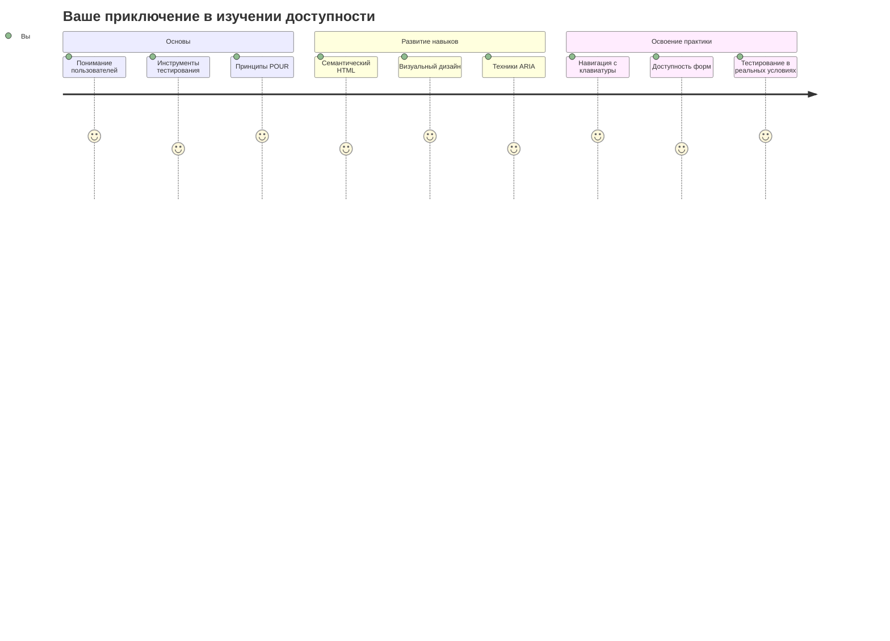

## Квиз перед лекцией
[Квиз перед лекцией](https://ff-quizzes.netlify.app/web/)

> Сила Сети в ее универсальности. Доступ для всех, независимо от ограниченных возможностей, является ее неотъемлемым аспектом.
>
> \- Сэр Тимоти Бернерс-Ли, директор W3C и изобретатель Всемирной паутины

Вот что может вас удивить: когда вы создаете доступные веб-сайты, вы не просто помогаете людям с ограниченными возможностями — вы на самом деле делаете интернет лучше для всех!

Вы когда-нибудь замечали пандусы на углах улиц? Изначально они были разработаны для инвалидных колясок, но теперь они помогают людям с колясками, курьерам с тележками, путешественникам с чемоданами на колесиках и велосипедистам. Именно так работает доступный веб-дизайн — решения, которые помогают одной группе, часто приносят пользу всем. Круто, правда?

В этом уроке мы рассмотрим, как создавать веб-сайты, которые действительно работают для всех, независимо от того, как они просматривают веб-страницы. Вы откроете для себя практические методы, которые уже встроены в веб-стандарты, поработаете с инструментами тестирования и увидите, как доступность делает ваши сайты более удобными для всех пользователей.

К концу этого урока у вас появится уверенность, чтобы сделать доступность естественной частью вашего рабочего процесса разработки. Готовы узнать, как продуманные дизайнерские решения могут открыть доступ к вебу для миллиардов пользователей? Давайте начнем!

```mermaid
mindmap
  root((Веб-доступность))
  Пользователи
    Экранные ридеры
    Навигация с клавиатуры
    Голосовое управление
    Увеличение
  Технологии
    Семантика HTML
    Атрибуты ARIA
    CSS-индикаторы фокуса
    События клавиатуры
  Преимущества
    Широкая аудитория
    Улучшенное SEO
    Соответствие законодательству
    Универсальный дизайн
  Тестирование
    Автоматизированные инструменты
    Ручное тестирование
    Обратная связь от пользователей
    Реальные ассистивные технологии
```

> Вы можете пройти этот урок на [Microsoft Learn](https://docs.microsoft.com/learn/modules/web-development-101/accessibility/?WT.mc_id=academic-77807-sagibbon)!

## Понимание ассистивных технологий

Прежде чем мы перейдем к кодированию, давайте уделим немного времени тому, чтобы понять, как люди с различными способностями на самом деле воспринимают веб. Это не просто теория — понимание этих реальных паттернов навигации сделает вас гораздо лучшим разработчиком!

Ассистивные технологии — это довольно удивительные инструменты, которые помогают людям с ограниченными возможностями взаимодействовать с веб-сайтами способами, которые могут вас удивить. Как только вы поймете, как работают эти технологии, создание доступных веб-интерфейсов станет намного интуитивнее. Это как научиться видеть свой код глазами другого человека.

### Экранные ридеры

[Экранные ридеры](https://ru.wikipedia.org/wiki/Программа_экранного_доступа) — это довольно сложные технологии, которые преобразуют цифровой текст в речь или вывод на шрифт Брайля. Хотя они в основном используются людьми с нарушениями зрения, они также очень полезны для пользователей с трудностями в обучении, такими как дислексия.

Мне нравится думать об экранном ридере как об очень умном рассказчике, который читает вам книгу. Он читает контент вслух в логическом порядке, объявляет интерактивные элементы, такие как «кнопка» или «ссылка», и предоставляет сочетания клавиш для перемещения по странице. Но вот в чем дело — экранные ридеры могут творить свою магию только в том случае, если мы создаем веб-сайты с правильной структурой и осмысленным контентом. Именно здесь вы, как разработчик, вступаете в игру!

**Популярные экранные ридеры на разных платформах:**
- **Windows**: [NVDA](https://www.nvaccess.org/about-nvda/) (бесплатный и самый популярный), [JAWS](https://webaim.org/articles/jaws/), [Экранный диктор](https://support.microsoft.com/windows/complete-guide-to-narrator-e4397a0d-ef4f-b386-d8ae-c172f109bdb1/?WT.mc_id=academic-77807-sagibbon) (встроенный)
- **macOS/iOS**: [VoiceOver](https://support.apple.com/guide/voiceover/welcome/10) (встроенный и очень функциональный)
- **Android**: [TalkBack](https://support.google.com/accessibility/android/answer/6283677) (встроенный)
- **Linux**: [Orca](https://wiki.gnome.org/Projects/Orca) (бесплатный и с открытым исходным кодом)

**Как экранные ридеры перемещаются по веб-контенту:**

Экранные ридеры предоставляют несколько методов навигации, которые делают просмотр эффективным для опытных пользователей:
- **Последовательное чтение**: Читает контент сверху вниз, как при чтении книги
- **Навигация по ориентирам**: Переход между разделами страницы (шапка, навигация, основной контент, подвал)
- **Навигация по заголовкам**: Переход между заголовками для понимания структуры страницы
- **Списки ссылок**: Создание списка всех ссылок для быстрого доступа
- **Элементы управления формы**: Прямой переход между полями ввода и кнопками

> 💡 **Вот что меня поразило**: 68% пользователей экранных ридеров перемещаются в основном по заголовкам ([Опрос WebAIM](https://webaim.org/projects/screenreadersurvey9/#finding)). Это означает, что структура ваших заголовков — это как дорожная карта для пользователей. Когда вы делаете ее правильно, вы буквально помогаете людям быстрее ориентироваться в вашем контенте!

### Создание вашего рабочего процесса тестирования

Вот хорошая новость — эффективное тестирование доступности не должно быть сложным! Вам нужно будет сочетать автоматизированные инструменты (они отлично справляются с выявлением очевидных проблем) с некоторым ручным тестированием. Вот систематический подход, который, как я обнаружил, выявляет большинство проблем, не отнимая у вас весь день:

**Основной рабочий процесс ручного тестирования:**

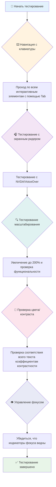

**Пошаговый чек-лист для тестирования:**
1. **Навигация с клавиатуры**: Используйте только Tab, Shift+Tab, Enter, Пробел и клавиши со стрелками
2. **Тестирование с экранным ридером**: Включите NVDA, VoiceOver или Экранный диктор и перемещайтесь с закрытыми глазами
3. **Тестирование масштабирования**: Проверьте при увеличении 200% и 400%
4. **Проверка цветового контраста**: Проверьте весь текст и компоненты пользовательского интерфейса
5. **Тестирование индикатора фокуса**: Убедитесь, что все интерактивные элементы имеют видимые состояния фокуса

✅ **Начните с Lighthouse**: Откройте инструменты разработчика в вашем браузере, запустите аудит доступности Lighthouse, а затем используйте результаты, чтобы направить ваше ручное тестирование на конкретные области.

### Инструменты масштабирования и увеличения

Знаете, как вы иногда увеличиваете масштаб на телефоне, когда текст слишком мелкий, или щуритесь на экран ноутбука при ярком солнечном свете? Многие пользователи ежедневно полагаются на инструменты увеличения, чтобы сделать контент читаемым. К ним относятся люди с плохим зрением, пожилые люди и все, кто когда-либо пытался читать веб-сайт на улице.

Современные технологии масштабирования вышли за рамки простого увеличения. Понимание того, как работают эти инструменты, поможет вам создавать адаптивные дизайны, которые остаются функциональными и привлекательными при любом уровне увеличения.

**Возможности масштабирования современных браузеров:**
- **Масштабирование страницы**: Пропорционально масштабирует весь контент (текст, изображения, макет) - это предпочтительный метод
- **Масштабирование только текста**: Увеличивает размер шрифта, сохраняя исходный макет
- **Жест "щипок для увеличения"**: Поддержка жестов на мобильных устройствах для временного увеличения
- **Поддержка браузерами**: Все современные браузеры поддерживают увеличение до 500% без нарушения функциональности

**Специализированное программное обеспечение для увеличения:**
- **Windows**: [Экранная лупа](https://support.microsoft.com/windows/use-magnifier-to-make-things-on-the-screen-easier-to-see-414948ba-8b1c-d3bd-8615-0e5e32204198) (встроенная), [ZoomText](https://www.freedomscientific.com/training/zoomtext/getting-started/)
- **macOS/iOS**: [Масштаб](https://www.apple.com/accessibility/mac/vision/) (встроенный с расширенными функциями)

> ⚠️ **Рекомендация по дизайну**: WCAG требует, чтобы контент оставался функциональным при увеличении до 200%. На этом уровне горизонтальная прокрутка должна быть минимальной, и все интерактивные элементы должны оставаться доступными.

✅ **Проверьте свой адаптивный дизайн**: Увеличьте масштаб в браузере до 200% и 400%. Адаптируется ли ваш макет плавно? Можете ли вы по-прежнему получить доступ ко всей функциональности без чрезмерной прокрутки?

## Современные инструменты для тестирования доступности

Теперь, когда вы понимаете, как люди перемещаются по вебу с помощью ассистивных технологий, давайте рассмотрим инструменты, которые помогут вам создавать и тестировать доступные веб-сайты.

Думайте об этом так: автоматизированные инструменты отлично справляются с выявлением очевидных проблем (например, отсутствующий альтернативный текст), в то время как ручное тестирование помогает убедиться, что ваш сайт удобен в использовании в реальных условиях. Вместе они дают вам уверенность в том, что ваши сайты работают для всех.

### Тестирование цветового контраста

Вот хорошая новость: цветовой контраст — одна из самых распространенных проблем доступности, но также и одна из самых простых для исправления. Хороший контраст приносит пользу всем — от пользователей с нарушениями зрения до людей, пытающихся читать на своих телефонах на пляже.

**Требования WCAG к контрасту:**

| Тип текста | WCAG AA (Минимум) | WCAG AAA (Улучшенный) |
|-----------|-------------------|---------------------|
| **Обычный текст** (менее 18pt) | Коэффициент контрастности 4.5:1 | Коэффициент контрастности 7:1 |
| **Крупный текст** (18pt+ или 14pt+ жирный) | Коэффициент контрастности 3:1 | Коэффициент контрастности 4.5:1 |
| **Компоненты UI** (кнопки, рамки форм) | Коэффициент контрастности 3:1 | Коэффициент контрастности 3:1 |

**Основные инструменты для тестирования:**
- [Colour Contrast Analyser](https://www.tpgi.com/color-contrast-checker/) - Настольное приложение с пипеткой
- [WebAIM Contrast Checker](https://webaim.org/resources/contrastchecker/) - Веб-инструмент с мгновенной обратной связью
- [Stark](https://www.getstark.co/) - Плагин для инструментов дизайна Figma, Sketch, Adobe XD
- [Accessible Colors](https://accessible-colors.com/) - Поиск доступных цветовых палитр

✅ **Создавайте лучшие цветовые палитры**: Начните с цветов вашего бренда и используйте инструменты проверки контраста для создания доступных вариаций. Задокументируйте их как доступные цветовые токены вашей дизайн-системы.

### Комплексный аудит доступности

Наиболее эффективное тестирование доступности сочетает в себе несколько подходов. Ни один инструмент не выявляет все, поэтому создание рутины тестирования с использованием различных методов обеспечивает тщательное покрытие.

**Тестирование в браузере (встроено в DevTools):**
- **Chrome/Edge**: Аудит доступности Lighthouse + панель Accessibility
- **Firefox**: Accessibility Inspector с подробным древовидным представлением
- **Safari**: Вкладка Audit в Web Inspector с симуляцией VoiceOver

**Профессиональные расширения для тестирования:**
- [axe DevTools](https://www.deque.com/axe/devtools/) - Стандарт индустрии для автоматизированного тестирования
- [WAVE](https://wave.webaim.org/extension/) - Визуальная обратная связь с подсветкой ошибок
- [Accessibility Insights](https://accessibilityinsights.io/) - Комплексный набор для тестирования от Microsoft

**Интеграция с командной строкой и CI/CD:**
- [axe-core](https://github.com/dequelabs/axe-core) - JavaScript-библиотека для автоматизированного тестирования
- [Pa11y](https://pa11y.org/) - Инструмент для тестирования доступности из командной строки
- [Lighthouse CI](https://github.com/GoogleChrome/lighthouse-ci) - Автоматизированная оценка доступности

> 🎯 **Цель тестирования**: Стремитесь к оценке доступности Lighthouse 95+ в качестве базового уровня. Помните, что автоматизированные инструменты выявляют только около 30-40% проблем доступности — ручное тестирование по-прежнему необходимо!

### 🧠 **Проверка навыков тестирования: Готовы находить проблемы?**

**Давайте посмотрим, как вы относитесь к тестированию доступности:**
- Какой метод тестирования кажется вам наиболее доступным прямо сейчас?
- Можете ли вы представить себе использование только клавиатурной навигации в течение целого дня?
- С каким барьером доступности вы лично сталкивались в интернете?

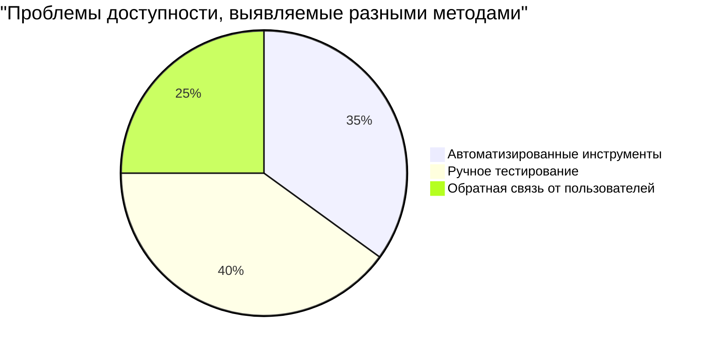

> **Для уверенности**: Профессиональные тестировщики доступности используют именно эту комбинацию методов. Вы изучаете стандартные практики индустрии!

## Создание доступности с нуля

Ключ к успеху в доступности — встраивать ее в основу с самого первого дня. Я знаю, что есть соблазн подумать: «Я добавлю доступность позже», но это все равно что пытаться добавить пандус к дому после того, как он уже построен. Возможно? Да. Легко? Не совсем.

Думайте о доступности как о планировании дома — гораздо проще включить доступность для инвалидных колясок в ваши первоначальные архитектурные планы, чем переделывать все позже.

### Принципы POUR: ваша основа доступности

Руководство по обеспечению доступности веб-контента (WCAG) построено на четырех фундаментальных принципах, которые образуют акроним POUR. Не волнуйтесь — это не занудные академические концепции! На самом деле это практические рекомендации по созданию контента, который работает для всех.

Как только вы освоите POUR, принятие решений о доступности станет намного интуитивнее. Это как иметь мысленный чек-лист, который направляет ваши дизайнерские решения. Давайте разберем это:

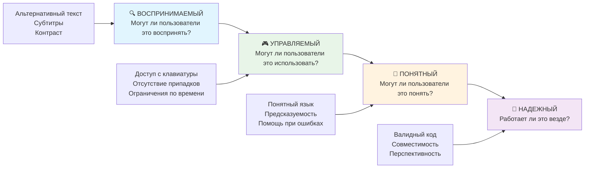

**🔍 Воспринимаемый**: Информация должна быть представлена способами, которые пользователи могут воспринять с помощью доступных им органов чувств.

- Предоставляйте текстовые альтернативы для нетекстового контента (изображения, видео, аудио)
- Обеспечьте достаточный цветовой контраст для всего текста и компонентов пользовательского интерфейса
- Предлагайте субтитры и транскрипты для мультимедийного контента
- Проектируйте контент, который остается функциональным при увеличении до 200%
- Используйте несколько сенсорных характеристик (а не только цвет) для передачи информации

**🎮 Управляемый**: Все компоненты интерфейса должны быть управляемыми с помощью доступных методов ввода.

- Сделайте всю функциональность доступной с помощью навигации с клавиатуры
- Предоставляйте пользователям достаточно времени для чтения и взаимодействия с контентом
- Избегайте контента, который вызывает припадки или вестибулярные расстройства
- Помогайте пользователям эффективно перемещаться с помощью четкой структуры и ориентиров
- Убедитесь, что интерактивные элементы имеют достаточный размер цели (минимум 44px)

**📖 Понятный**: Информация и работа пользовательского интерфейса должны быть ясными и понятными.

- Используйте ясный, простой язык, соответствующий вашей аудитории
- Убедитесь, что контент появляется и работает предсказуемым, последовательным образом
- Предоставляйте четкие инструкции и сообщения об ошибках для пользовательского ввода
- Помогайте пользователям понимать и исправлять ошибки в формах
- Организуйте контент с логическим порядком чтения и иерархией информации

**💪 Надежный**: Контент должен надежно работать на разных технологиях и ассистивных устройствах.

- **Используйте валидный, семантический HTML в качестве основы**
- **Обеспечьте совместимость с текущими и будущими ассистивными технологиями**
- **Следуйте веб-стандартам и лучшим практикам для разметки**
- **Тестируйте на разных браузерах, устройствах и ассистивных инструментах**
- **Структурируйте контент так, чтобы он плавно деградировал, когда расширенные функции не поддерживаются**

### 🎯 **Проверка принципов POUR: закрепление материала**

**Краткое размышление об основах:**
- Можете ли вы придумать функцию веб-сайта, которая нарушает каждый из принципов POUR?
- Какой принцип кажется вам наиболее естественным как разработчику?
- Как эти принципы могут улучшить дизайн для всех, а не только для пользователей с ограниченными возможностями?

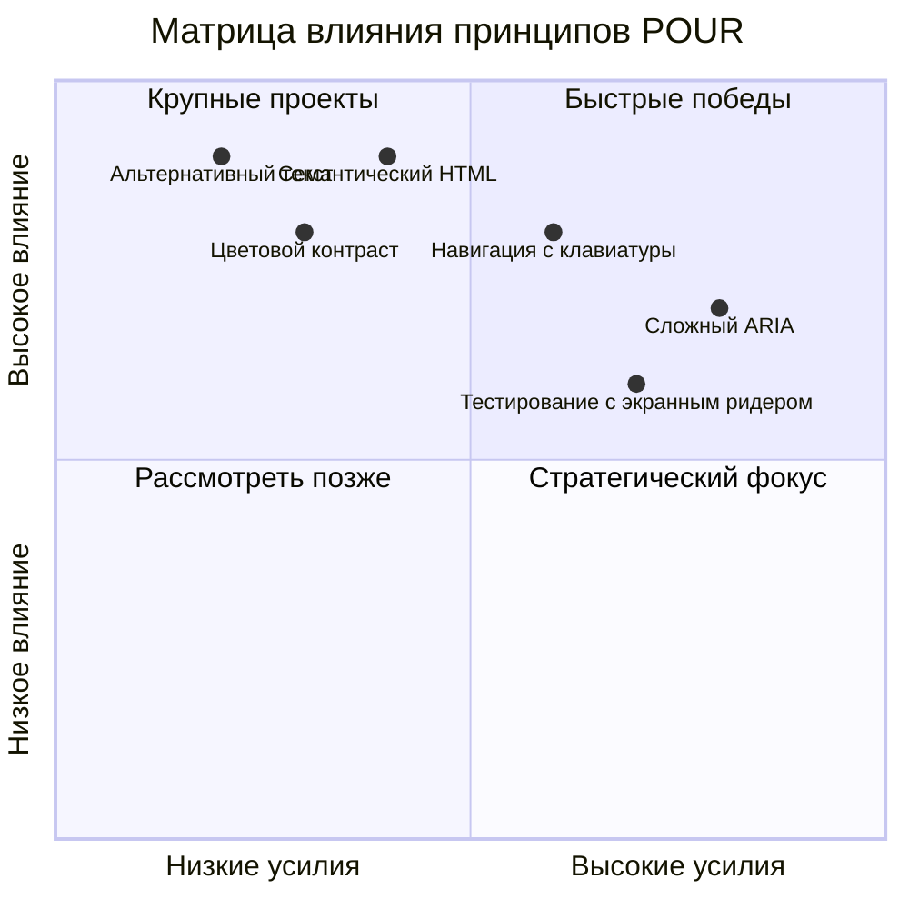

> **Помните**: Начинайте с улучшений с высоким влиянием и низкими усилиями. Семантический HTML и альтернативный текст дают вам самый большой прирост доступности при наименьших затратах!

## Создание доступного визуального дизайна

Хороший визуальный дизайн и доступность идут рука об руку. Когда вы проектируете с учетом доступности, вы часто обнаруживаете, что эти ограничения приводят к более чистым и элегантным решениям, которые приносят пользу всем пользователям.

Давайте рассмотрим, как создавать визуально привлекательные дизайны, которые работают для всех, независимо от их зрительных способностей или условий, в которых они просматривают ваш контент.

### Стратегии цветовой и визуальной доступности

Цвет является мощным средством коммуникации, но он никогда не должен быть единственным способом передачи важной информации. Проектирование за пределами цвета создает более надежные, инклюзивные интерфейсы, которые работают в большем количестве ситуаций.

**Проектирование для различий в цветовом зрении:**

Примерно 8% мужчин и 0.5% женщин имеют ту или иную форму нарушения цветового зрения (часто называемую "дальтонизмом"). Наиболее распространенные типы:
- **Дейтеранопия**: Трудности с различением красного и зеленого
- **Протанопия**: Красный цвет кажется более тусклым
- **Тританопия**: Трудности с синим и желтым (редко)

**Инклюзивные цветовые стратегии:**

```css
/* ❌ Плохо: Использование только цвета для обозначения статуса */
.error { color: red; }
.success { color: green; }

/* ✅ Хорошо: Цвет плюс иконки и контекст */
.error {
  color: #d32f2f;
  border-left: 4px solid #d32f2f;
}
.error::before {
  content: "⚠️";
  margin-right: 8px;
}

.success {
  color: #2e7d32;
  border-left: 4px solid #2e7d32;
}
.success::before {
  content: "✅";
  margin-right: 8px;
}
```

**Помимо базовых требований к контрасту:**
- Проверяйте свои цветовые решения с помощью симуляторов дальтонизма
- Используйте узоры, текстуры или формы наряду с цветовым кодированием
- Убедитесь, что интерактивные состояния остаются различимыми без цвета
- Учитывайте, как ваш дизайн выглядит в режиме высокой контрастности

✅ **Проверьте доступность ваших цветов**: Используйте инструменты, такие как [Coblis](https://www.color-blindness.com/coblis-color-blindness-simulator/), чтобы увидеть, как ваш сайт выглядит для пользователей с различными типами цветового зрения.

### Индикаторы фокуса и дизайн взаимодействия

Индикаторы фокуса — это цифровой эквивалент курсора: они показывают пользователям клавиатуры, где они находятся на странице. Хорошо продуманные индикаторы фокуса улучшают опыт для всех, делая взаимодействия ясными и предсказуемыми.

**Современные лучшие практики для индикаторов фокуса:**

```css
/* Улучшенные стили фокуса, работающие во всех браузерах */
button:focus-visible {
  outline: 2px solid #0066cc;
  outline-offset: 2px;
  box-shadow: 0 0 0 4px rgba(0, 102, 204, 0.25);
}

/* Убираем контур фокуса для пользователей мыши, сохраняем для пользователей клавиатуры */
button:focus:not(:focus-visible) {
  outline: none;
}

/* Focus-within для сложных компонентов */
.card:focus-within {
  box-shadow: 0 0 0 3px rgba(74, 144, 164, 0.5);
  border-color: #4A90A4;
}

/* Убедитесь, что индикаторы фокуса соответствуют требованиям контрастности */
.custom-focus:focus-visible {
  outline: 3px solid #ffffff;
  outline-offset: 2px;
  box-shadow: 0 0 0 6px #000000;
}
```

**Требования к индикаторам фокуса:**
- **Видимость**: Должен иметь коэффициент контрастности не менее 3:1 с окружающими элементами
- **Ширина**: Минимальная толщина 2px вокруг всего элемента
- **Постоянство**: Должен оставаться видимым до тех пор, пока фокус не переместится в другое место
- **Отличие**: Должен визуально отличаться от других состояний пользовательского интерфейса

> 💡 **Совет по дизайну**: Отличные индикаторы фокуса часто используют комбинацию контура, тени и изменения цвета, чтобы обеспечить видимость на разных фонах и в разных контекстах.

✅ **Проведите аудит индикаторов фокуса**: Пройдитесь по вашему сайту с помощью клавиши Tab и отметьте, какие элементы имеют четкие индикаторы фокуса. Есть ли такие, которые трудно увидеть или которые отсутствуют вовсе?

### Семантический HTML: основа доступности

Семантический HTML — это как дать ассистивным технологиям GPS-систему для вашего сайта. Когда вы используете правильные HTML-элементы по их прямому назначению, вы, по сути, предоставляете экранным ридерам, клавиатурам и другим инструментам подробную дорожную карту, чтобы помочь пользователям эффективно перемещаться.

Вот аналогия, которая мне очень помогла: семантический HTML — это разница между хорошо организованной библиотекой с четкими категориями и полезными указателями и складом, где книги разбросаны случайным образом. В обоих местах есть одни и те же книги, но в каком из них вы бы предпочли что-то искать? Именно!

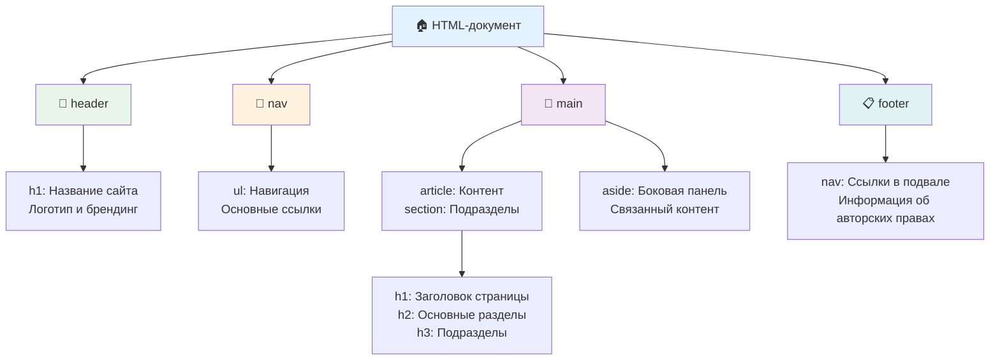

**Строительные блоки доступной структуры страницы:**

```html
<!-- Элементы-ориентиры обеспечивают структуру навигации по странице -->
<header>
  <h1>Название вашего сайта</h1>
  <nav aria-label="Основная навигация">
  <ul>
    <li><a href="/home">Главная</a></li>
    <li><a href="/about">О нас</a></li>
    <li><a href="/services">Услуги</a></li>
  </ul>
  </nav>
</header>

<main>
  <article>
  <header>
    <h1>Заголовок статьи</h1>
    <p>Опубликовано <time datetime="2024-10-14">14 октября 2024</time></p>
  </header>

  <section>
    <h2>Первый раздел</h2>
    <p>Контент, относящийся к этому разделу...</p>
  </section>

  <section>
    <h2>Второй раздел</h2>
    <p>Еще связанный контент...</p>
  </section>
  </article>

  <aside>
  <h2>Связанные ссылки</h2>
  <nav aria-label="Связанные статьи">
    <ul>
    <li><a href="/related-1">Первая связанная статья</a></li>
    <li><a href="/related-2">Вторая связанная статья</a></li>
    </ul>
  </nav>
  </aside>
</main>

<footer>
  <p>&copy; 2024 Название вашего сайта. Все права защищены.</p>
  <nav aria-label="Ссылки в подвале">
  <ul>
    <li><a href="/privacy">Политика конфиденциальности</a></li>
    <li><a href="/contact">Связаться с нами</a></li>
  </ul>
  </nav>
</footer>
```

**Почему семантический HTML преобразует доступность:**

| Семантический элемент | Назначение | Преимущество для экранного ридера |
|------------------|---------|----------------------|
| `<header>` | Заголовок страницы или раздела | "Ориентир-баннер" - быстрый переход к верху |
| `<nav>` | Навигационные ссылки | "Ориентир-навигация" - список навигационных разделов |
| `<main>` | Основной контент страницы | "Основной ориентир" - переход непосредственно к контенту |
| `<article>` | Самостоятельный контент | Объявляет границы статьи |
| `<section>` | Тематические группы контента | Обеспечивает структуру контента |
| `<aside>` | Связанный контент в боковой панели | "Дополнительный ориентир" |
| `<footer>` | Подвал страницы или раздела | "Ориентир-информация о контенте" |

**Суперспособности экранного ридера с семантическим HTML:**
- **Навигация по ориентирам**: Мгновенный переход между основными разделами страницы
- **Структура заголовков**: Создание оглавления из вашей структуры заголовков
- **Списки элементов**: Создание списков всех ссылок, кнопок или элементов управления формы
- **Осознание контекста**: Понимание связей между разделами контента

> 🎯 **Быстрый тест**: Попробуйте перемещаться по вашему сайту с помощью экранного ридера, используя горячие клавиши для ориентиров (D для ориентира, H для заголовка, K для ссылки в NVDA/JAWS). Имеет ли навигация смысл?

### 🏗️ **Проверка мастерства семантического HTML: создание прочных основ**

**Давайте оценим ваше понимание семантики:**
- Можете ли вы определить ориентиры на веб-странице, просто взглянув на HTML?
- Как бы вы объяснили разницу между `<section>` и `<div>` другу?
- Что бы вы проверили в первую очередь, если бы пользователь экранного ридера сообщил о проблемах с навигацией?

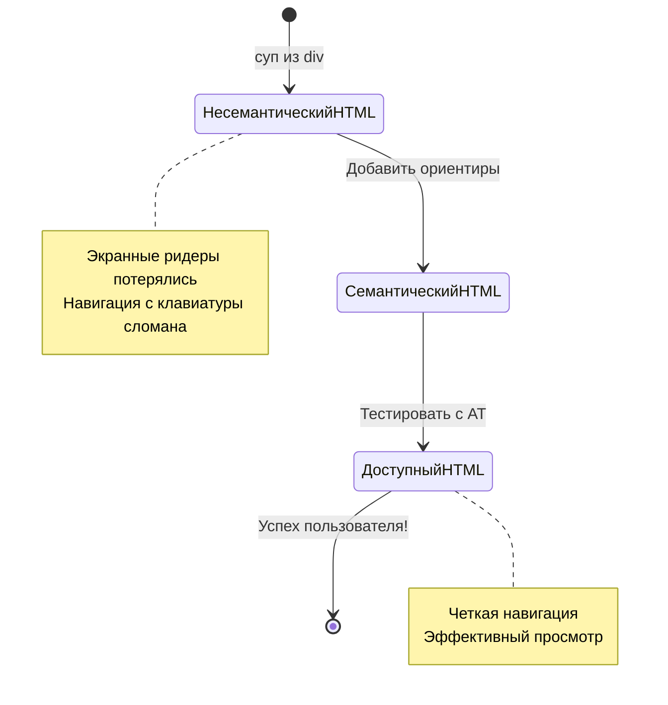

> **Совет от профессионала**: Хороший семантический HTML автоматически решает около 70% проблем доступности. Освойте эту основу, и вы на верном пути!

✅ **Проведите аудит вашей семантической структуры**: Используйте панель Accessibility в инструментах разработчика вашего браузера, чтобы просмотреть дерево доступности и убедиться, что ваша разметка создает логическую структуру.

### Иерархия заголовков: создание логической структуры контента

Заголовки абсолютно необходимы для доступного контента — они как позвоночник, который держит все вместе. Пользователи экранных ридеров в значительной степени полагаются на заголовки для понимания и навигации по вашему контенту. Думайте об этом как о предоставлении оглавления для вашей страницы.

**Вот золотое правило для заголовков:**
Никогда не пропускайте уровни. Всегда двигайтесь логически от `<h1>` к `<h2>`, затем к `<h3>` и так далее. Помните, как в школе составляли планы? Это тот же самый принцип — вы бы не перескочили от "I. Главный пункт" сразу к "C. Под-подпункт" без "A. Подпункт" между ними, верно?

**Пример идеальной структуры заголовков:**

```html
<!-- ✅ Отлично: Логическая, иерархическая последовательность -->
<main>
  <h1>Полное руководство по веб-доступности</h1>

  <section>
  <h2>Понимание экранных ридеров</h2>
  <p>Введение в технологию экранных ридеров...</p>

  <h3>Популярное программное обеспечение для экранных ридеров</h3>
  <p>Сравнение NVDA, JAWS и VoiceOver...</p>

  <h3>Тестирование с экранными ридерами</h3>
  <p>Пошаговые инструкции по тестированию...</p>
  </section>

  <section>
  <h2>Руководство по цвету и контрасту</h2>
  <p>Проектирование с достаточным контрастом...</p>

  <h3>Требования WCAG к контрасту</h3>
  <p>Понимание различных уровней контрастности...</p>

  <h3>Инструменты и методы тестирования</h3>
  <p>Инструменты для проверки коэффициентов контрастности...</p>
  </section>
</main>
```

```html
<!-- ❌ Проблематично: Пропуск уровней, непоследовательная структура -->
<h1>Заголовок страницы</h1>
<h3>Подраздел</h3> <!-- Пропущен h2 -->
<h2>Это должно идти перед h3</h2>
<h1>Еще один главный заголовок?</h1> <!-- Несколько h1 -->
```

**Лучшие практики для заголовков:**
- **Один `<h1>` на страницу**: Обычно это основной заголовок вашей страницы или главный заголовок контента
- **Логическая последовательность**: Никогда не пропускайте уровни (h1 → h2 → h3, а не h1 → h3)
- **Описательное содержание**: Делайте заголовки осмысленными при чтении вне контекста
- **Визуальное оформление с помощью CSS**: Используйте CSS для внешнего вида, а уровни HTML для структуры

**Статистика навигации с помощью экранного ридера:**
- 68% пользователей экранных ридеров перемещаются по заголовкам ([Опрос WebAIM](https://webaim.org/projects/screenreadersurvey9/#finding))
- Пользователи ожидают найти логическую структуру заголовков
- Заголовки предоставляют самый быстрый способ понять структуру страницы

> 💡 **Совет от профессионала**: Используйте расширения для браузера, такие как "HeadingsMap", чтобы визуализировать структуру ваших заголовков. Она должна читаться как хорошо организованное оглавление.

✅ **Проверьте структуру ваших заголовков**: Используйте навигацию по заголовкам в экранном ридере (клавиша H в NVDA), чтобы перемещаться по вашим заголовкам. Рассказывает ли последовательность логическую историю вашего контента?

### Продвинутые техники визуальной доступности

Помимо основ контраста и цвета, существуют сложные техники, которые помогают создавать по-настоящему инклюзивные визуальные впечатления. Эти методы гарантируют, что ваш контент работает в различных условиях просмотра и с различными ассистивными технологиями.

**Основные стратегии визуальной коммуникации:**

- **Мультимодальная обратная связь**: Сочетайте визуальные, текстовые и иногда звуковые сигналы
- **Прогрессивное раскрытие**: Представляйте информацию удобоваримыми порциями
- **Последовательные паттерны взаимодействия**: Используйте знакомые соглашения пользовательского интерфейса
- **Адаптивная типографика**: Масштабируйте текст соответствующим образом на разных устройствах
- **Состояния загрузки и ошибок**: Предоставляйте четкую обратную связь для всех действий пользователя

**CSS-утилиты для улучшенной доступности:**

```css
/* Текст только для экранных ридеров - визуально скрыт, но доступен */
.sr-only {
  position: absolute;
  width: 1px;
  height: 1px;
  padding: 0;
  margin: -1px;
  overflow: hidden;
  clip: rect(0, 0, 0, 0);
  white-space: nowrap;
  border: 0;
}

/* Ссылка для пропуска для навигации с клавиатуры */
.skip-link {
  position: absolute;
  top: -40px;
  left: 6px;
  background: #000000;
  color: #ffffff;
  padding: 8px 16px;
  text-decoration: none;
  border-radius: 4px;
  font-weight: bold;
  transition: top 0.3s ease;
  z-index: 1000;
}

.skip-link:focus {
  top: 6px;
}

/* Уважение к уменьшенному движению */
@media (prefers-reduced-motion: reduce) {
  .skip-link {
  transition: none;
  }

  * {
  animation-duration: 0.01ms !important;
  animation-iteration-count: 1 !important;
  transition-duration: 0.01ms !important;
  }
}

/* Поддержка режима высокой контрастности */
@media (prefers-contrast: high) {
  .button {
  border: 2px solid;
  }
}
```

> 🎯 **Паттерн доступности**: "Ссылка для пропуска" необходима для пользователей клавиатуры. Она должна быть первым фокусируемым элементом на вашей странице и переходить непосредственно к основной области контента.

✅ **Реализуйте пропуск навигации**: Добавьте ссылки для пропуска на ваши страницы и протестируйте их, нажимая Tab сразу после загрузки страницы. Они должны появиться и позволить вам перейти к основному контенту.

## Создание осмысленного текста ссылок

Ссылки — это, по сути, магистрали веба, но плохо написанный текст ссылок — это как дорожные знаки, на которых просто написано «Место» вместо «Центр Чикаго». Не очень полезно, правда?

Вот что меня поразило, когда я впервые это узнал: экранные ридеры могут извлекать все ссылки со страницы и показывать их в виде одного большого списка. Представьте, что кто-то дал вам каталог всех ссылок на вашей странице. Будет ли каждая из них иметь смысл сама по себе? Именно этот тест должен пройти текст вашей ссылки!

### Понимание паттернов навигации по ссылкам

Экранные ридеры предлагают мощные функции навигации по ссылкам, которые полагаются на хорошо написанный текст ссылок:

**Методы навигации по ссылкам:**
- **Последовательное чтение**: Ссылки читаются в контексте как часть потока контента
- **Генерация списка ссылок**: Все ссылки на странице компилируются в каталог с возможностью поиска
- **Быстрая навигация**: Переход между ссылками с помощью сочетаний клавиш (K в NVDA)
- **Функциональность поиска**: Поиск конкретных ссылок по частичному вводу текста

**Почему важен контекст:**
Когда пользователи экранных ридеров генерируют список ссылок, они видят что-то вроде этого:
- "Скачать отчет"
- "Узнать больше"
- "Нажмите здесь"
- "Политика конфиденциальности"
- "Нажмите здесь"

Только две из этих ссылок предоставляют полезную информацию при чтении вне контекста!

> 📊 **Влияние на пользователя**: Пользователи экранных ридеров сканируют списки ссылок, чтобы быстро понять содержание страницы. Общий текст ссылок заставляет их возвращаться к контексту каждой ссылки, что значительно замедляет их работу в интернете.

### Распространенные ошибки в тексте ссылок, которых следует избегать

Понимание того, что не работает, помогает распознавать и исправлять проблемы доступности в существующем контенте.

**❌ Общий текст ссылок, не предоставляющий контекста:**

```html
<!-- Бессмысленно при чтении из списка ссылок -->
<p>Наши усилия в области устойчивого развития подробно описаны в нашем последнем отчете.
   <a href="/sustainability-2024.pdf">Нажмите здесь</a>, чтобы просмотреть его.</p>

<!-- Повторяющийся общий текст по всей странице -->
<div class="article-card">
  <h3>Руководство по веб-доступности</h3>
  <p>Изучите основы...</p>
  <a href="/accessibility-guide">Читать далее</a>
</div>
<div class="article-card">
  <h3>Советы по цветовому контрасту</h3>
  <p>Улучшите свой дизайн...</p>
  <a href="/color-contrast">Читать далее</a>
</div>

<!-- URL-адреса в качестве текста ссылок (трудно произносимы для экранных ридеров) -->
<p>Посетите https://www.w3.org/WAI/WCAG21/quickref/ для ознакомления с рекомендациями WCAG.</p>

<!-- Неопределенные слова-действия -->
<a href="/contact">Перейти</a> | <a href="/about">Посмотреть</a> | <a href="/help">Просмотр</a>
```

**Почему эти паттерны не работают:**
- **"Нажмите здесь"** ничего не говорит пользователям о месте назначения
- **"Читать далее"**, повторенное несколько раз, создает путаницу
- **Прямые URL-адреса** трудно произносить экранным ридерам
- **Одиночные слова**, такие как "Перейти" или "Посмотреть", лишены описательного контекста

### Написание отличного текста ссылок

Описательный текст ссылок приносит пользу всем — зрячие пользователи могут быстро сканировать ссылки, а пользователи экранных ридеров сразу понимают, куда они ведут.

**✅ Примеры ясного, описательного текста ссылок:**

```html
<!-- Описательный текст, объясняющий место назначения -->
<p>Наш всеобъемлющий <a href="/sustainability-2024.pdf">отчет об устойчивом развитии за 2024 год (PDF, 2.1 МБ)</a> подробно описывает наши экологические инициативы.</p>

<!-- Конкретный, уникальный текст ссылки для каждой карточки -->
<div class="article-card">
  <h3>Руководство по веб-доступности</h3>
  <p>Изучите основы инклюзивного дизайна...</p>
  <a href="/accessibility-guide">Прочитайте наше полное руководство по веб-доступности</a>
</div>
<div class="article-card">
  <h3>Советы по цветовому контрасту</h3>
  <p>Улучшите свой дизайн с помощью лучших цветовых решений...</p>
  <a href="/color-contrast">Изучите лучшие практики цветового контраста</a>
</div>

<!-- Осмысленный текст вместо прямых URL-адресов -->
<p><a href="https://www.w3.org/WAI/WCAG21/quickref/">Краткое справочное руководство WCAG 2.1</a> предоставляет исчерпывающие рекомендации по доступности.</p>

<!-- Описательные ссылки-действия -->
<a href="/contact">Связаться с нашей службой поддержки</a> |
<a href="/about">О нашей компании</a> |
<a href="/help">Получить помощь по вашему аккаунту</a>
```

**Лучшие практики для текста ссылок:**
- **Будьте конкретны**: "Скачать квартальный финансовый отчет" вместо "Скачать"
- **Указывайте тип и размер файла**: "(PDF, 1.2 МБ)" для загружаемых файлов
- **Упоминайте, если ссылки открываются во внешнем окне**: "(откроется в новом окне)", когда это уместно
- **Используйте активный язык**: "Связаться с нами" вместо "Страница контактов"
- **Будьте кратки**: Старайтесь использовать 2-8 слов, когда это возможно

### Продвинутые паттерны доступности ссылок

Иногда ограничения визуального дизайна или технические требования требуют особых решений. Вот сложные техники для распространенных сложных сценариев:

**Использование ARIA для улучшения контекста:**

```html
<!-- Когда текст кнопки должен быть коротким, но требует большего контекста -->
<a href="/report.pdf"
   aria-label="Скачать годовой финансовый отчет за 2024 год, формат PDF, 2.3 МБ">
  Скачать отчет
</a>

<!-- Когда полный контекст исходит из окружающего контента -->
<h3 id="sustainability-heading">Инициатива по устойчивому развитию</h3>
<p>Наши усилия по снижению воздействия на окружающую среду...</p>
<a href="/sustainability-details"
   aria-labelledby="sustainability-heading"
   aria-describedby="sustainability-summary">
  Узнать больше
</a>
<p id="sustainability-summary">Подробный разбор наших экологических целей и достижений на 2024 год</p>
```

**Указание типов файлов и внешних ссылок:**

```html
<!-- Метод 1: Включить информацию в видимый текст ссылки -->
<a href="/annual-report.pdf">
  Скачать наш годовой отчет за 2024 год (PDF, 2.3 МБ)
</a>

<!-- Метод 2: Использовать текст только для экранных ридеров для деталей файла -->
<a href="/annual-report.pdf">
  Скачать наш годовой отчет за 2024 год
  <span class="sr-only">(формат PDF, 2.3 МБ)</span>
</a>

<!-- Метод 3: Указание на внешнюю ссылку -->
<a href="https://example.com"
   target="_blank"
   aria-describedby="external-link-warning">
  Посетить внешний ресурс
</a>
<span id="external-link-warning" class="sr-only">
  (откроется в новом окне)
</span>

<!-- Метод 4: Использование CSS для визуальных индикаторов -->
<a href="https://example.com" class="external-link">
  Внешний ресурс
</a>
```

```css
/* Визуальный индикатор для внешних ссылок */
.external-link::after {
  content: " ↗";
  font-size: 0.8em;
  color: #666;
}

/* Объявление для экранного ридера для внешних ссылок */
.external-link::before {
  content: "Внешняя ссылка: ";
  position: absolute;
  left: -10000px;
  width: 1px;
  height: 1px;
  overflow: hidden;
}
```

> ⚠️ **Важно**: При использовании `target="_blank"` всегда информируйте пользователей о том, что ссылка открывается в новом окне или вкладке. Неожиданные изменения навигации могут дезориентировать.

✅ **Проверьте контекст ваших ссылок**: Используйте инструменты разработчика вашего браузера, чтобы сгенерировать список всех ссылок на вашей странице. Можете ли вы понять назначение каждой ссылки без окружающего контекста?

## ARIA: Прокачка доступности HTML

[Accessible Rich Internet Applications (ARIA)](https://developer.mozilla.org/docs/Web/Accessibility/ARIA) — это как универсальный переводчик между вашими сложными веб-приложениями и ассистивными технологиями. Когда один только HTML не может выразить все, что делают ваши интерактивные компоненты, ARIA приходит на помощь, чтобы заполнить эти пробелы.

Мне нравится думать об ARIA как о добавлении полезных аннотаций к вашему HTML — что-то вроде ремарок в сценарии пьесы, которые помогают актерам понять свои роли и отношения.

**Вот самое важное правило об ARIA**: Всегда сначала используйте семантический HTML, а затем добавляйте ARIA для его улучшения. Думайте об ARIA как о приправе, а не об основном блюде. Он должен прояснять и улучшать вашу HTML-структуру, а не заменять ее. Сначала добейтесь правильной основы!

### Стратегическое внедрение ARIA

ARIA — мощный инструмент, но с силой приходит и ответственность. Неправильное использование ARIA может сделать доступность хуже, чем ее полное отсутствие. Вот когда и как его эффективно использовать:

**✅ Используйте ARIA, когда:**
- Создаете пользовательские интерактивные виджеты (аккордеоны, вкладки, карусели)
- Создаете динамический контент, который изменяется без перезагрузки страницы
- Предоставляете дополнительный контекст для сложных связей в пользовательском интерфейсе
- Указываете состояния загрузки или обновления контента в реальном времени
- Создаете интерфейсы, подобные приложениям, с пользовательскими элементами управления

**❌ Избегайте ARIA, когда:**
- Стандартные HTML-элементы уже предоставляют необходимую семантику
- Вы не уверены, как правильно его реализовать
- Он дублирует информацию, уже предоставленную семантическим HTML
- Вы не тестировали с реальными ассистивными технологиями

> 🎯 **Золотое правило ARIA**: "Не изменяйте семантику, если это не абсолютно необходимо, всегда обеспечивайте доступность с клавиатуры и тестируйте с реальными ассистивными технологиями."

**Пять категорий ARIA:**

1. **Роли**: Что это за элемент? (`button`, `tab`, `dialog`)
2. **Свойства**: Каковы его особенности? (`aria-required`, `aria-haspopup`)
3. **Состояния**: Каково его текущее состояние? (`aria-expanded`, `aria-checked`)
4. **Ориентиры**: Где он находится в структуре страницы? (`banner`, `navigation`, `main`)
5. **Живые регионы**: Как должны объявляться изменения? (`aria-live`, `aria-atomic`)

### Основные паттерны ARIA для современных веб-приложений

Эти паттерны решают наиболее распространенные проблемы доступности в интерактивных веб-приложениях:

**Именование и описание элементов:**

```html
<!-- aria-label: Предоставляет доступное имя, когда видимого текста недостаточно -->
<button aria-label="Закрыть диалоговое окно подписки на рассылку">×</button>

<!-- aria-labelledby: Ссылается на существующий текст как на доступное имя -->
<section aria-labelledby="news-heading">
  <h2 id="news-heading">Последние новости</h2>
  <!-- новостной контент -->
</section>

<!-- aria-describedby: Ссылается на дополнительный описательный текст -->
<input type="password"
     aria-describedby="pwd-requirements pwd-strength"
     required>
<div id="pwd-requirements">
  Пароль должен содержать не менее 8 символов, включая заглавные, строчные буквы и цифры.
</div>
<div id="pwd-strength" aria-live="polite">
  <!-- Динамический индикатор надежности пароля -->
</div>
```

**Живые регионы для динамического контента:**

```html
<!-- Вежливые объявления (не прерывают текущую речь) -->
<div aria-live="polite" id="status-updates">
  <!-- Сообщения о статусе появляются здесь -->
</div>

<!-- Настойчивые объявления (прерывают и объявляют немедленно) -->
<div aria-live="assertive" id="urgent-alerts">
  <!-- Сообщения об ошибках и критические оповещения -->
</div>

<!-- Состояния загрузки с живыми регионами -->
<button id="submit-btn" aria-describedby="loading-status">
  Отправить заявку
</button>
<div id="loading-status" aria-live="polite" aria-atomic="true">
  <!-- "Обработка вашей заявки..." появляется здесь -->
</div>
```

**Пример интерактивного виджета (аккордеон):**

```html
<div class="accordion">
  <h3>
  <button aria-expanded="false"
      aria-controls="panel-1"
      id="accordion-trigger-1"
      class="accordion-trigger">
    Руководство по доступности
  </button>
  </h3>
  <div id="panel-1"
     role="region"
     aria-labelledby="accordion-trigger-1"
     hidden>
  <p>WCAG 2.1 предоставляет исчерпывающие рекомендации...</p>
  </div>
</div>
```

```javascript
// JavaScript для управления состоянием аккордеона
function toggleAccordion(trigger) {
  const panel = document.getElementById(trigger.getAttribute('aria-controls'));
  const isExpanded = trigger.getAttribute('aria-expanded') === 'true';

  // Переключение состояний
  trigger.setAttribute('aria-expanded', !isExpanded);
  panel.hidden = isExpanded;

  // Объявление об изменении для экранных ридеров
  const status = document.getElementById('status-updates');
  status.textContent = isExpanded ? 'Раздел свернут' : 'Раздел развернут';
}
```

### Лучшие практики внедрения ARIA

ARIA — мощный инструмент, но требует осторожного внедрения. Соблюдение этих рекомендаций помогает гарантировать, что ARIA улучшает, а не ухудшает доступность:

**🛡️ Основные принципы:**

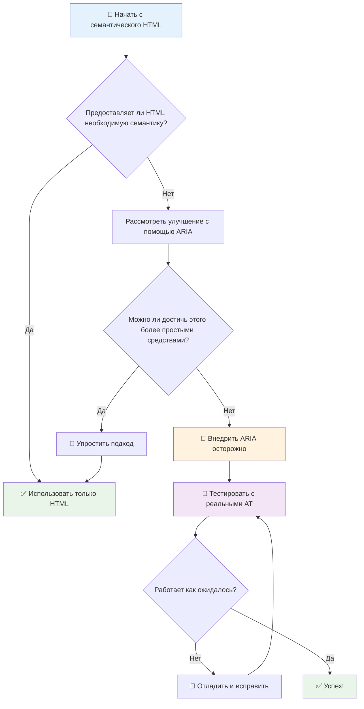

1. **Сначала семантический HTML**: Всегда предпочитайте `<button>` вместо `<div role="button">`
2. **Не нарушайте семантику**: Никогда не переопределяйте существующее значение HTML (избегайте `<h1 role="button">`)
3. **Поддерживайте доступность с клавиатуры**: Все интерактивные элементы ARIA должны быть полностью доступны с клавиатуры
4. **Тестируйте с реальными пользователями**: Поддержка ARIA значительно различается между ассистивными технологиями
5. **Начинайте с простого**: Сложные реализации ARIA с большей вероятностью содержат ошибки

**🔍 Рабочий процесс тестирования:**

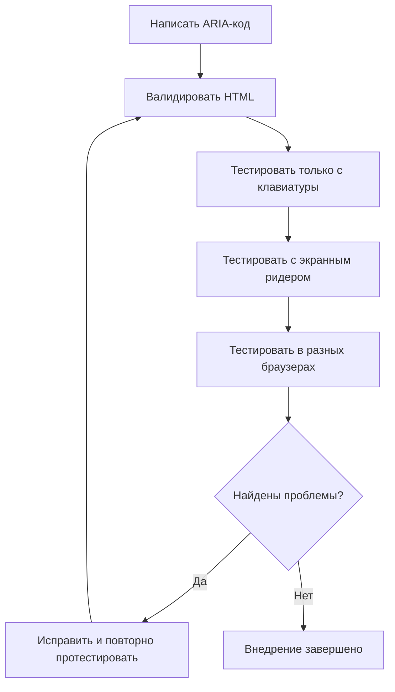

**🚫 Распространенные ошибки ARIA, которых следует избегать:**

- **Противоречивая информация**: Не противоречьте семантике HTML
- **Чрезмерная маркировка**: Слишком много информации ARIA перегружает пользователей
- **Статический ARIA**: Забывание обновлять состояния ARIA при изменении контента
- **Непротестированные реализации**: ARIA, который работает в теории, но не на практике
- **Отсутствие поддержки клавиатуры**: Роли ARIA без соответствующих взаимодействий с клавиатурой

> 💡 **Ресурсы для тестирования**: Используйте инструменты, такие как [accessibility-checker](https://www.npmjs.com/package/accessibility-checker), для автоматической валидации ARIA, но всегда тестируйте с реальными экранными ридерами для получения полного опыта.

### 🎭 **Проверка навыков ARIA: Готовы к сложным взаимодействиям?**

**Оцените свою уверенность в ARIA:**
- Когда бы вы выбрали ARIA вместо семантического HTML? (Подсказка: почти никогда!)
- Можете ли вы объяснить, почему `<div role="button">` обычно хуже, чем `<button>`?
- Что самое важное нужно помнить о тестировании ARIA?

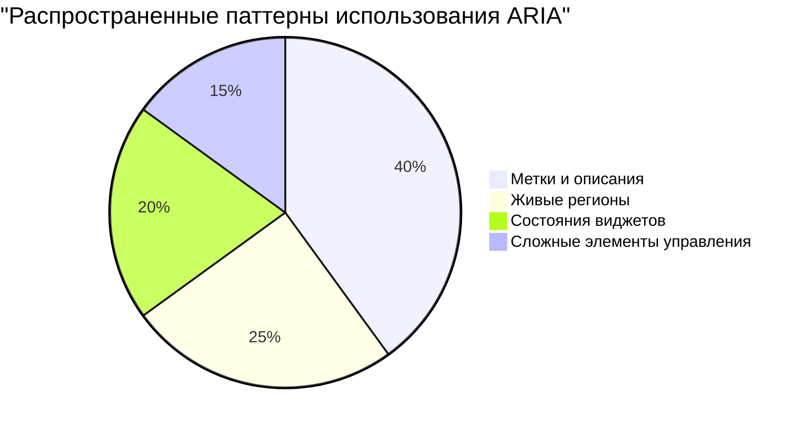

> **Ключевая мысль**: Большинство случаев использования ARIA связано с маркировкой и описанием элементов. Сложные паттерны виджетов встречаются гораздо реже, чем вы могли бы подумать!

✅ **Учитесь у экспертов**: Изучите [Руководство по практикам разработки ARIA](https://w3c.github.io/aria-practices/) для проверенных временем паттернов и реализаций сложных интерактивных виджетов.

## Обеспечение доступности изображений и медиа

Визуальный и аудиоконтент являются неотъемлемой частью современных веб-интерфейсов, но они могут создавать барьеры, если не реализованы продуманно. Цель состоит в том, чтобы информация и эмоциональное воздействие ваших медиа достигали каждого пользователя. Как только вы освоите это, это станет второй натурой.

Различные типы медиа требуют разных подходов к доступности. Это как в кулинарии — вы не будете обращаться с нежной рыбой так же, как с сытным стейком. Понимание этих различий поможет вам выбрать правильное решение для каждой ситуации.

### Стратегическая доступность изображений

Каждое изображение на вашем сайте служит определенной цели. Понимание этой цели поможет вам писать лучший альтернативный текст и создавать более инклюзивные интерфейсы.

**Четыре типа изображений и их стратегии альтернативного текста:**

**Информативные изображения** - передают важную информацию:
```html

```

**Декоративные изображения** - чисто визуальные, без информационной ценности:
```html

```

**Функциональные изображения** - служат кнопками или элементами управления:
```html
<button>
  
</button>
```

**Сложные изображения** - диаграммы, графики, инфографика:
```html

<div id="chart-description">
  <p>Подробное описание: Данные о продажах показывают стабильный рост во всех кварталах...</p>
</div>
```

### Доступность видео и аудио

**Требования к видео:**
- **Субтитры**: Текстовая версия устной речи и звуковых эффектов
- **Аудиодескрипция**: Описание визуальных элементов для слепых пользователей
- **Транскрипты**: Полная текстовая версия всего аудио и визуального контента

```html
<video controls>
  <source src="video.mp4" type="video/mp4">
  <track kind="captions" src="captions.vtt" srclang="en" label="Английский">
  <track kind="descriptions" src="descriptions.vtt" srclang="en" label="Аудиодескрипция">
</video>
```

**Требования к аудио:**
- **Транскрипты**: Текстовая версия всего устного контента
- **Визуальные индикаторы**: Для аудиоконтента предоставляйте визуальные подсказки

### Современные техники работы с изображениями

**Использование CSS для декоративных изображений:**
```css
.hero-section {
  background-image: url('decorative-hero.jpg');
  /* Декоративным изображениям в CSS не нужен альтернативный текст */
}
```

**Адаптивные изображения с учетом доступности:**
```html
<picture>
  <source media="(min-width: 800px)" srcset="large-chart.png">
  <source media="(min-width: 400px)" srcset="medium-chart.png">
  
</picture>
```

✅ **Проверьте доступность изображений**: Используйте экранный ридер для навигации по странице с изображениями. Получаете ли вы достаточно информации, чтобы понять контент?

## Навигация с клавиатуры и управление фокусом

Многие пользователи перемещаются по вебу исключительно с помощью клавиатуры. К ним относятся люди с двигательными нарушениями, опытные пользователи, которые считают клавиатуру быстрее мыши, и все, у кого перестала работать мышь. Убедиться, что ваш сайт хорошо работает с клавиатурным вводом, необходимо и часто делает ваш сайт более эффективным для всех.

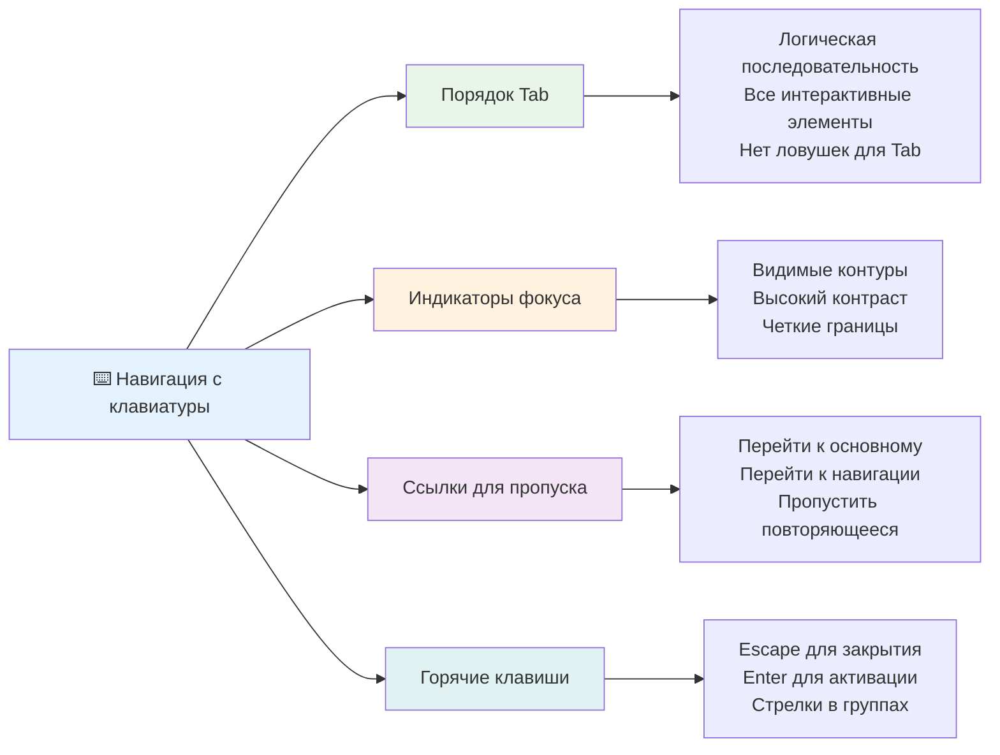

### Основные паттерны навигации с клавиатуры

**Стандартные взаимодействия с клавиатурой:**
- **Tab**: Перемещает фокус вперед по интерактивным элементам
- **Shift + Tab**: Перемещает фокус назад
- **Enter**: Активирует кнопки и ссылки
- **Пробел**: Активирует кнопки, устанавливает флажки
- **Клавиши со стрелками**: Навигация внутри групп компонентов (радиокнопки, меню)
- **Escape**: Закрывает модальные окна, выпадающие списки или отменяет операции

### Лучшие практики управления фокусом

**Видимые индикаторы фокуса:**
```css
/* Убедитесь, что фокус всегда виден */
button:focus-visible {
  outline: 2px solid #4A90A4;
  outline-offset: 2px;
}

/* Пользовательские стили фокуса для разных компонентов */
.card:focus-within {
  box-shadow: 0 0 0 3px rgba(74, 144, 164, 0.5);
}
```

**Ссылки для пропуска для эффективной навигации:**
```html
<a href="#main-content" class="skip-link">Перейти к основному контенту</a>
<a href="#navigation" class="skip-link">Перейти к навигации</a>

<nav id="navigation">
  <!-- навигационный контент -->
</nav>
<main id="main-content">
  <!-- основной контент -->
</main>
```

**Правильный порядок табуляции:**
```html
<!-- Используйте семантический HTML для естественного порядка табуляции -->
<form>
  <label for="name">Имя:</label>
  <input type="text" id="name" tabindex="0">

  <label for="email">Email:</label>
  <input type="email" id="email" tabindex="0">

  <button type="submit" tabindex="0">Отправить</button>
</form>
```

### Захват фокуса в модальных окнах

При открытии модальных диалоговых окон фокус должен быть заперт внутри модального окна:

```javascript
// Современная реализация захвата фокуса
function trapFocus(element) {
  const focusableElements = element.querySelectorAll(
  'button, [href], input, select, textarea, [tabindex]:not([tabindex="-1"])'
  );

  const firstElement = focusableElements[0];
  const lastElement = focusableElements[focusableElements.length - 1];

  element.addEventListener('keydown', (e) => {
  if (e.key === 'Tab') {
    if (e.shiftKey && document.activeElement === firstElement) {
    e.preventDefault();
    lastElement.focus();
    } else if (!e.shiftKey && document.activeElement === lastElement) {
    e.preventDefault();
    firstElement.focus();
    }
  }

  if (e.key === 'Escape') {
    closeModal();
  }
  });

  // Фокус на первом элементе при открытии модального окна
  firstElement.focus();
}
```

✅ **Проверьте навигацию с клавиатуры**: Попробуйте перемещаться по вашему сайту, используя только клавишу Tab. Можете ли вы добраться до всех интерактивных элементов? Логичен ли порядок фокуса? Четко ли видны индикаторы фокуса?

## Доступность форм

Формы критически важны для взаимодействия с пользователем и требуют особого внимания к доступности.

### Связь метки и элемента управления формы

**Каждый элемент управления формы нуждается в метке:**
```html
<!-- Явная маркировка (предпочтительно) -->
<label for="username">Имя пользователя:</label>
<input type="text" id="username" name="username" required>

<!-- Неявная маркировка -->
<label>
  Пароль:
  <input type="password" name="password" required>
</label>

<!-- Использование aria-label, когда визуальная метка нежелательна -->
<input type="search" aria-label="Поиск товаров" placeholder="Поиск...">
```

### Обработка ошибок и валидация

**Доступные сообщения об ошибках:**
```html
<label for="email">Адрес электронной почты:</label>
<input type="email" id="email" name="email"
     aria-describedby="email-error"
     aria-invalid="true" required>
<div id="email-error" role="alert">
  Пожалуйста, введите действительный адрес электронной почты
</div>
```

**Лучшие практики валидации форм:**
- Используйте `aria-invalid` для обозначения неверных полей
- Предоставляйте четкие, конкретные сообщения об ошибках
- Используйте `role="alert"` для важных сообщений об ошибках
- Показывайте ошибки как немедленно, так и при отправке формы

### Наборы полей и группировка

**Группируйте связанные элементы управления формы:**
```html
<fieldset>
  <legend>Адрес доставки</legend>
  <label for="street">Улица:</label>
  <input type="text" id="street" name="street">

  <label for="city">Город:</label>
  <input type="text" id="city" name="city">
</fieldset>

<fieldset>
  <legend>Предпочтительный способ связи</legend>
  <input type="radio" id="contact-email" name="contact" value="email">
  <label for="contact-email">Электронная почта</label>

  <input type="radio" id="contact-phone" name="contact" value="phone">
  <label for="contact-phone">Телефон</label>
</fieldset>
```

## Ваш путь к доступности: ключевые выводы

Поздравляем! Вы только что получили базовые знания для создания по-настоящему инклюзивных веб-интерфейсов. Это очень захватывающе! Веб-доступность — это не просто проставление галочек в чек-листах соответствия, это признание разнообразия способов взаимодействия людей с цифровым контентом и проектирование с учетом этой удивительной сложности.

Теперь вы являетесь частью растущего сообщества разработчиков, которые понимают, что отличный дизайн работает для всех. Добро пожаловать в клуб!

**🎯 Ваш набор инструментов для доступности теперь включает:**

| Основной принцип | Реализация | Влияние |
|----------------|----------------|---------|
| **Основа из семантического HTML** | Использование правильных HTML-элементов по их прямому назначению | Экранные ридеры могут эффективно перемещаться, клавиатура работает автоматически |
| **Инклюзивный визуальный дизайн** | Достаточный контраст, осмысленное использование цвета, видимые индикаторы фокуса | Ясно для всех при любом освещении |
| **Описательный контент** | Осмысленный текст ссылок, альтернативный текст, заголовки | Пользователи понимают контент без визуального контекста |
| **Доступность с клавиатуры** | Порядок табуляции, горячие клавиши, управление фокусом | Доступность для людей с двигательными нарушениями и эффективность для опытных пользователей |
| **Улучшение с помощью ARIA** | Стратегическое использование для заполнения семантических пробелов | Сложные приложения работают с ассистивными технологиями |
| **Комплексное тестирование** | Автоматизированные инструменты + ручная проверка + тестирование с реальными пользователями | Выявление проблем до того, как они повлияют на пользователей |

**🚀 Ваши следующие шаги:**

1. **Встройте доступность в свой рабочий процесс**: Сделайте тестирование естественной частью вашего процесса разработки
2. **Учитесь у реальных пользователей**: Ищите обратную связь от людей, которые используют ассистивные технологии
3. **Будьте в курсе**: Техники доступности развиваются вместе с новыми технологиями и стандартами
4. **Выступайте за инклюзивность**: Делитесь своими знаниями и сделайте доступность приоритетом команды

> 💡 **Помните**: Ограничения доступности часто приводят к инновационным, элегантным решениям, которые приносят пользу всем. Пандусы, субтитры и голосовое управление — все это начиналось как функции доступности и стало улучшениями для массового пользователя.

**Бизнес-обоснование кристально ясно**: Доступные веб-сайты охватывают больше пользователей, лучше ранжируются в поисковых системах, имеют более низкие затраты на обслуживание и избегают юридических рисков. Но, честно говоря, настоящая причина заботиться о доступности гораздо глубже. Доступные веб-сайты воплощают лучшие ценности веба — открытость, инклюзивность и идею о том, что каждый заслуживает равного доступа к информации.

Теперь вы вооружены для создания инклюзивного веба будущего. Каждый доступный сайт, который вы создаете, делает интернет более гостеприимным местом для всех. Это довольно удивительно, если задуматься!

## Дополнительные ресурсы

Продолжайте свое обучение доступности с этими важными ресурсами:

**📚 Официальные стандарты и руководства:**
- [Руководство WCAG 2.1](https://www.w3.org/WAI/WCAG21/quickref/) - Официальный стандарт доступности с кратким справочником
- [Руководство по практикам разработки ARIA](https://w3c.github.io/aria-practices/) - Комплексные паттерны для интерактивных виджетов
- [Руководства WebAIM](https://webaim.org/) - Практическое, понятное для начинающих руководство по доступности

**🛠️ Инструменты и ресурсы для тестирования:**
- [axe DevTools](https://www.deque.com/axe/devtools/) - Стандарт индустрии для тестирования доступности
- [Чек-лист проекта A11y](https://www.a11yproject.com/checklist/) - Пошаговая проверка доступности
- [Accessibility Insights](https://accessibilityinsights.io/) - Комплексный набор для тестирования от Microsoft
- [Color Oracle](https://colororacle.org/) - Симулятор дальтонизма для тестирования дизайна

**🎓 Обучение и сообщество:**
- [Опрос пользователей экранных ридеров WebAIM](https://webaim.org/projects/screenreadersurvey9/) - Предпочтения и поведение реальных пользователей
- [Инклюзивные компоненты](https://inclusive-components.design/) - Современные паттерны доступных компонентов
- [A11y Coffee](https://a11y.coffee/) - Краткие советы и идеи по доступности
- [Инициатива по веб-доступности (WAI)](https://www.w3.org/WAI/) - Комплексные ресурсы по доступности от W3C

**🎥 Практическое обучение:**
- [Руководство для разработчиков по доступности](https://www.accessibility-developer-guide.com/) - Практическое руководство по внедрению
- [Университет Deque](https://dequeuniversity.com/) - Профессиональные курсы по доступности

## Задание для агента GitHub Copilot 🚀

Используйте режим агента для выполнения следующего задания:

**Описание:** Создайте доступный компонент модального диалогового окна, который демонстрирует правильное управление фокусом, атрибуты ARIA и паттерны навигации с клавиатуры.

**Запрос:** Создайте полный компонент модального диалогового окна с HTML, CSS и JavaScript, который включает: правильный захват фокуса, закрытие по клавише ESC, закрытие по клику вне окна, атрибуты ARIA для экранных ридеров и видимые индикаторы фокуса. Модальное окно должно содержать форму с правильными метками и обработкой ошибок. Убедитесь, что компонент соответствует стандартам WCAG 2.1 AA.


## 🚀 Задание

Возьмите этот HTML и перепишите его, чтобы он был максимально доступным, учитывая изученные вами стратегии.

```html
<!DOCTYPE html>
<html lang="en">
  <head>
  <meta charset="UTF-8">
  <meta name="viewport" content="width=device-width, initial-scale=1.0">
  <title>Turtle Ipsum - The World's Premier Turtle Fan Club</title>
  <link href='../assets/style.css' rel='stylesheet' type='text/css'>
  </head>
  <body>
  <header class="site-header">
    <h1 class="site-title">Turtle Ipsum</h1>
    <p class="site-subtitle">The World's Premier Turtle Fan Club</p>
  </header>

  <nav class="main-nav" aria-label="Main navigation">
    <h2 class="nav-header">Resources</h2>
    <ul class="nav-list">
    <li><a href="https://www.youtube.com/watch?v=CMNry4PE93Y">"I like turtles" video</a></li>
    <li><a href="https://en.wikipedia.org/wiki/Turtle">Basic turtle information</a></li>
    <li><a href="https://en.wikipedia.org/wiki/Turtles_(chocolate)">Chocolate turtles candy</a></li>
    </ul>
  </nav>

  <main class="main-content">
    <article>
    <h1>Welcome to Turtle Ipsum</h1>
    <p class="intro">
      <a href="/about">Learn more about our turtle community</a> and discover fascinating facts about these amazing creatures.
    </p>
    <p class="article-text">
      Turtle ipsum dolor sit amet, consectetur adipiscing elit, sed do eiusmod tempor incididunt ut labore et dolore magna aliqua. Ut enim ad minim veniam, quis nostrud exercitation ullamco laboris nisi ut aliquip ex ea commodo consequat. Duis aute irure dolor in reprehenderit in voluptate velit esse cillum dolore eu fugiat nulla pariatur. Excepteur sint occaecat cupidatat non proident, sunt in culpa qui officia deserunt mollit anim id est laborum.
    </p>
    </article>
  </main>

  <footer class="footer">
    <section class="newsletter-signup">
    <h2>Stay Updated</h2>
    <button type="button" onclick="showNewsletterForm()">Sign up for turtle news</button>
    </section>

    <nav class="footer-nav" aria-label="Footer navigation">
    <h2>Site Pages</h2>
    <ul>
      <li><a href="../">Home</a></li>
      <li><a href="../semantic">Semantic HTML example</a></li>
    </ul>
    </nav>

    <p class="footer-copyright">&copy; 2024 Instrument. All rights reserved.</p>
  </footer>
  </body>
</html>
```

**Ключевые улучшения:**
- Добавлена правильная семантическая структура HTML
- Исправлена иерархия заголовков (один h1, логическая последовательность)
- Добавлен осмысленный текст ссылок вместо "нажмите здесь"
- Включены правильные метки ARIA для навигации
- Добавлен атрибут lang и правильные мета-теги
- Использован элемент button для интерактивных элементов
- Структурирован контент подвала с правильными ориентирами

## Квиз после лекции
[Квиз после лекции](https://ff-quizzes.netlify.app/web/en/)

## Обзор и самостоятельное изучение

Во многих странах существуют законы, касающиеся требований к доступности. Изучите законы о доступности в вашей стране. Что они охватывают, а что нет? Примером может служить [этот правительственный веб-сайт](https://accessibility.blog.gov.uk/).

## Задание

[Проанализируйте недоступный веб-сайт](assignment.md)

Благодарности: [Turtle Ipsum](https://github.com/Instrument/semantic-html-sample) от Instrument

---

## 🚀 Ваш путь к мастерству в доступности

### ⚡ **Что вы можете сделать в следующие 5 минут**
- [ ] Установить расширение axe DevTools в вашем браузере
- [ ] Запустить аудит доступности Lighthouse на вашем любимом сайте
- [ ] Попробовать перемещаться по любому сайту, используя только клавишу Tab
- [ ] Протестировать встроенный в ваш браузер экранный ридер (Экранный диктор/VoiceOver)

### 🎯 **Что вы можете сделать за этот час**
- [ ] Пройти квиз после лекции и поразмышлять о полученных знаниях в области доступности
- [ ] Попрактиковаться в написании осмысленного альтернативного текста для 10 разных изображений
- [ ] Провести аудит структуры заголовков сайта с помощью расширения HeadingsMap
- [ ] Исправить проблемы доступности, найденные в HTML из задания
- [ ] Проверить цветовой контраст на вашем текущем проекте с помощью инструмента WebAIM

### 📅 **Ваш недельный путь к доступности**
- [ ] Выполнить задание по анализу недоступного веб-сайта
- [ ] Настроить свою среду разработки с инструментами для тестирования доступности
- [ ] Попрактиковаться в навигации с клавиатуры на 5 разных сложных сайтах
- [ ] Создать простую форму с правильными метками, обработкой ошибок и ARIA
- [ ] Присоединиться к сообществу по доступности (A11y Slack, форум WebAIM)
- [ ] Посмотреть, как реальные пользователи с ограниченными возможностями перемещаются по сайтам (на YouTube есть отличные примеры)

### 🌟 **Ваша месячная трансформация**
- [ ] Интегрировать тестирование доступности в ваш рабочий процесс разработки
- [ ] Внести вклад в проект с открытым исходным кодом, исправив проблемы доступности
- [ ] Провести юзабилити-тестирование с кем-то, кто использует ассистивные технологии
- [ ] Создать библиотеку доступных компонентов для вашей команды
- [ ] Продвигать доступность на вашем рабочем месте или в сообществе
- [ ] Стать наставником для кого-то нового в концепциях доступности

### 🏆 **Финальная проверка чемпиона по доступности**

**Отметьте свой путь к доступности:**
- Что самое удивительное вы узнали о том, как люди используют веб?
- Какой принцип доступности больше всего соответствует вашему стилю разработки?
- Как изучение доступности изменило ваш взгляд на дизайн?
- Какое первое улучшение доступности вы хотите внести в реальный проект?

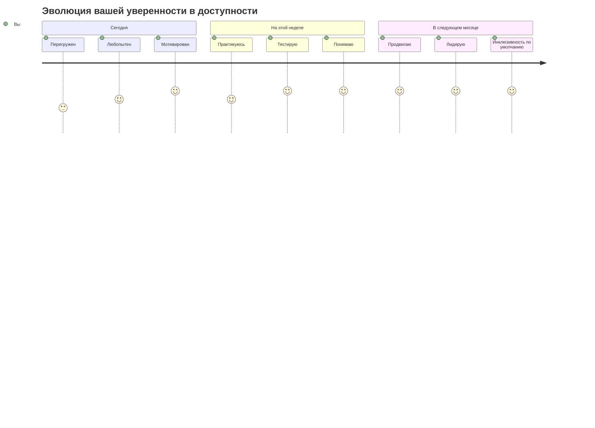

> 🌍 **Теперь вы — чемпион по доступности!** Вы понимаете, что отличные веб-интерфейсы работают для всех, независимо от того, как они получают доступ к вебу. Каждая доступная функция, которую вы создаете, делает интернет более инклюзивным. Вебу нужны такие разработчики, как вы, которые видят в доступности не ограничение, а возможность создавать лучшие интерфейсы для всех пользователей. Добро пожаловать в движение! 🎉
