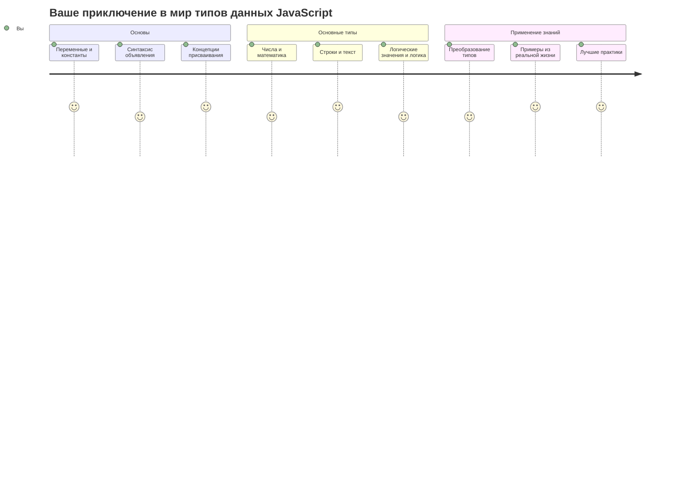
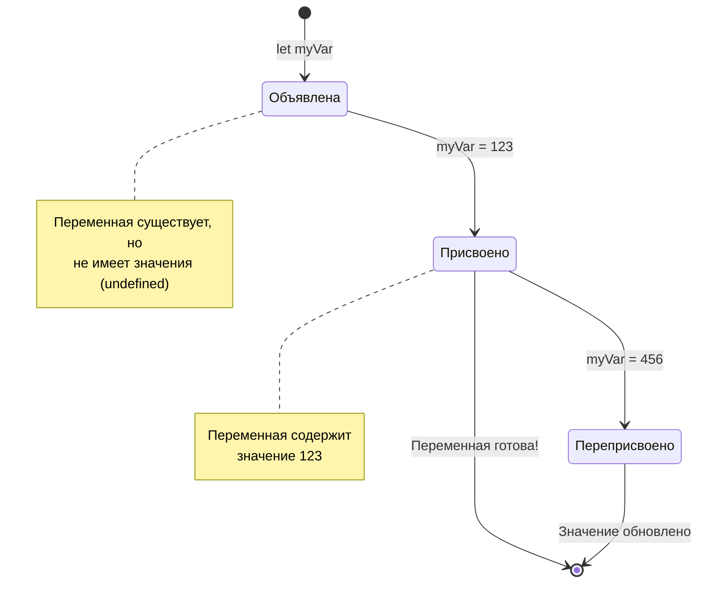
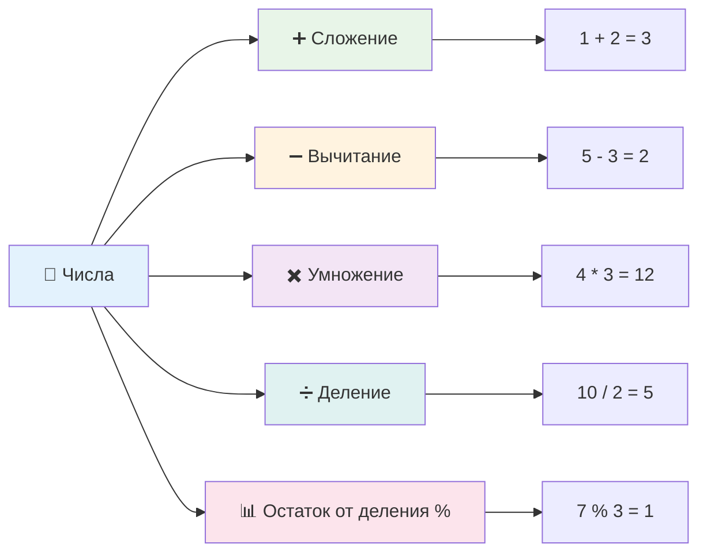
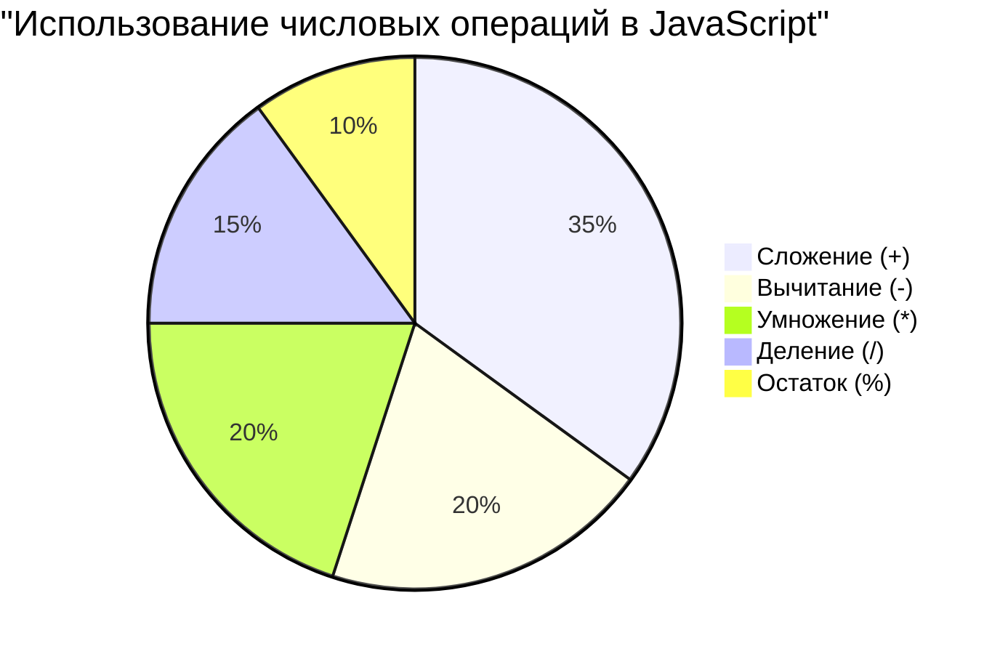
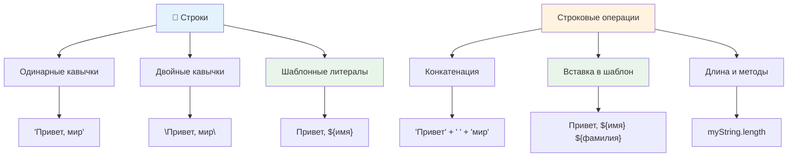
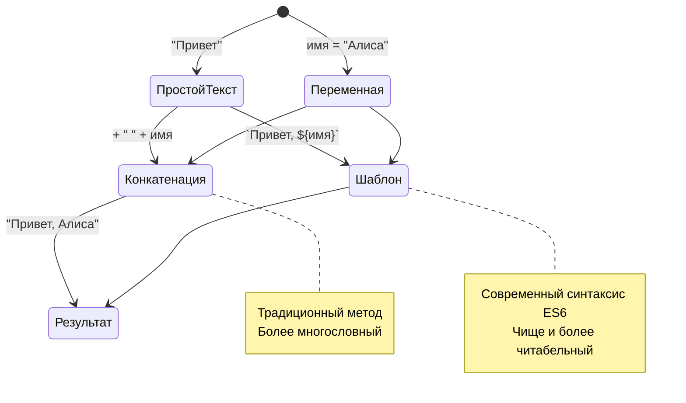
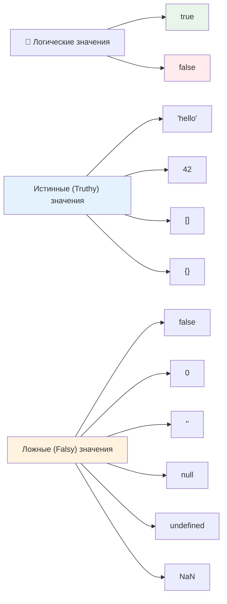
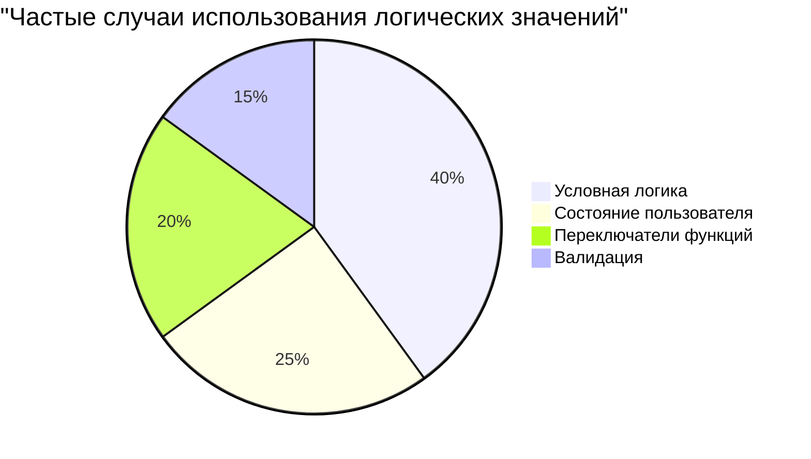
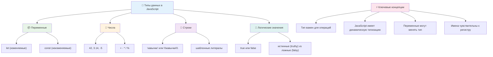
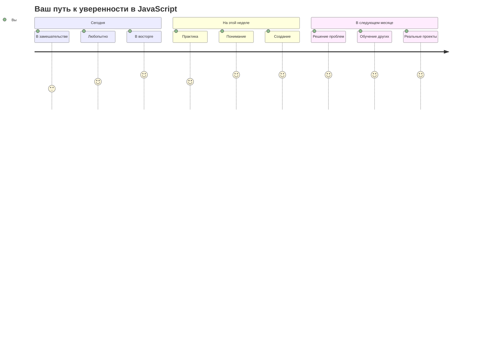

# Основы JavaScript: Типы данных


> Скетчноут от [Томоми Имура](https://twitter.com/girlie_mac)



Типы данных — это одна из фундаментальных концепций в JavaScript, с которой вы столкнетесь в каждой программе, которую будете писать. Представьте типы данных как систему каталогизации, которую использовали древние библиотекари в Александрии — у них были определенные места для свитков с поэзией, математикой и историческими записями. JavaScript организует информацию похожим образом, используя разные категории для разных видов данных.

В этом уроке мы рассмотрим основные типы данных, которые заставляют JavaScript работать. Вы научитесь работать с числами, текстом, значениями истина/ложь и поймете, почему выбор правильного типа так важен для ваших программ. Эти концепции могут показаться абстрактными на первый взгляд, но с практикой они станут для вас второй натурой.

Понимание типов данных сделает все остальное в JavaScript намного понятнее. Точно так же, как архитекторам необходимо разбираться в различных строительных материалах перед возведением собора, эти основы будут поддерживать все, что вы будете создавать в будущем.

## Тест перед лекцией
[Тест перед лекцией](https://ff-quizzes.netlify.app/web/)

Этот урок охватывает основы JavaScript, языка, который обеспечивает интерактивность в вебе.

> Вы можете пройти этот урок на [Microsoft Learn](https://docs.microsoft.com/learn/modules/web-development-101-variables/?WT.mc_id=academic-77807-sagibbon)!

[](https://youtube.com/watch?v=JNIXfGiDWM8 "Переменные в JavaScript")

[](https://youtube.com/watch?v=AWfA95eLdq8 "Типы данных в JavaScript")

> 🎥 Нажмите на изображения выше, чтобы посмотреть видео о переменных и типах данных

Давайте начнем с переменных и типов данных, которыми они заполняются!

```mermaid
mindmap
  root((Данные в JavaScript))
  Переменные
    let myVar
    const PI = 3.14
    var oldStyle
  Примитивные типы
    number (число)
    42
    3.14
    -5
    string (строка)
    "Привет"
    'Мир'
    `Шаблон`
    boolean (логический)
    true
    false
    undefined
    null
  Операции
    Арифметические
    + - * / %
    Строковые методы
    конкатенация
    шаблонные литералы
    Преобразование типов
    неявное
    явное
```

## Переменные

Переменные — это фундаментальные строительные блоки в программировании. Подобно подписанным банкам, которые средневековые алхимики использовали для хранения различных веществ, переменные позволяют вам хранить информацию и давать ей описательное имя, чтобы вы могли ссылаться на нее позже. Нужно запомнить чей-то возраст? Сохраните его в переменной с именем `age`. Хотите отслеживать имя пользователя? Храните его в переменной `userName`.

Мы сосредоточимся на современном подходе к созданию переменных в JavaScript. Техники, которые вы здесь изучите, представляют собой годы эволюции языка и лучшие практики, разработанные сообществом программистов.

Создание и **объявление** переменной имеет следующий синтаксис **[ключевое слово] [имя]**. Он состоит из двух частей:

- **Ключевое слово**. Используйте `let` для переменных, которые могут изменяться, или `const` для значений, которые остаются неизменными.
- **Имя переменной**, это описательное имя, которое вы выбираете сами.

✅ Ключевое слово `let` было введено в ES6 и дает вашей переменной так называемую _блочную область видимости_. Рекомендуется использовать `let` или `const` вместо устаревшего ключевого слова `var`. Мы подробнее рассмотрим блочные области видимости в будущих уроках.

### Задание - работа с переменными

1. **Объявите переменную**. Давайте начнем с создания нашей первой переменной:

  ```javascript
  let myVariable;
  ```

   **Что это делает:**
   - Это говорит JavaScript создать место для хранения под названием `myVariable`
   - JavaScript выделяет место в памяти для этой переменной
   - В настоящее время переменная не имеет значения (undefined)

2. **Присвойте ей значение**. Теперь давайте что-нибудь положим в нашу переменную:

  ```javascript
  myVariable = 123;
  ```

   **Как работает присваивание:**
   - Оператор `=` присваивает значение 123 нашей переменной
   - Теперь переменная содержит это значение, а не является undefined
   - Вы можете ссылаться на это значение в своем коде, используя `myVariable`

   > Примечание: использование `=` в этом уроке означает, что мы используем "оператор присваивания", который используется для установки значения переменной. Он не обозначает равенство.

3. **Сделайте это по-умному**. На самом деле, давайте объединим эти два шага:

  ```javascript
  let myVariable = 123;
  ```

  **Этот подход более эффективен:**
  - Вы объявляете переменную и присваиваете ей значение в одном выражении
  - Это стандартная практика среди разработчиков
  - Это сокращает длину кода, сохраняя при этом ясность

4. **Измените свое мнение**. Что, если мы хотим сохранить другое число?

   ```javascript
   myVariable = 321;
   ```

   **Понимание переприсваивания:**
   - Теперь переменная содержит 321 вместо 123
   - Предыдущее значение заменяется — переменные хранят только одно значение за раз
   - Эта изменяемость является ключевой характеристикой переменных, объявленных с помощью `let`

   ✅ Попробуйте! Вы можете писать JavaScript прямо в своем браузере. Откройте окно браузера и перейдите в Инструменты разработчика. В консоли вы найдете приглашение; введите `let myVariable = 123`, нажмите return, затем введите `myVariable`. Что произойдет? Примечание: вы узнаете больше об этих концепциях в последующих уроках.

### 🧠 **Проверка мастерства владения переменными: Осваиваемся**

**Давайте посмотрим, как вы относитесь к переменным:**
- Можете ли вы объяснить разницу между объявлением и присваиванием переменной?
- Что произойдет, если вы попытаетесь использовать переменную до ее объявления?
- Когда бы вы выбрали `let` вместо `const` для переменной?



> **Краткий совет**: Думайте о переменных как о подписанных коробках для хранения. Вы создаете коробку (`let`), кладете в нее что-то (`=`) и позже можете заменить содержимое при необходимости!

## Константы

Иногда вам нужно хранить информацию, которая никогда не должна меняться во время выполнения программы. Думайте о константах как о математических принципах, которые Евклид установил в Древней Греции — однажды доказанные и задокументированные, они оставались неизменными для всех будущих ссылок.

Константы работают аналогично переменным, но с важным ограничением: как только вы присвоили им значение, его нельзя изменить. Эта неизменяемость помогает предотвратить случайные изменения критически важных значений в вашей программе.

Объявление и инициализация константы следуют тем же концепциям, что и у переменной, за исключением ключевого слова `const`. Константы обычно объявляются заглавными буквами.

```javascript
const MY_VARIABLE = 123;
```

**Вот что делает этот код:**
- **Создает** константу с именем `MY_VARIABLE` и значением 123
- **Использует** соглашение об именовании заглавными буквами для констант
- **Предотвращает** любые будущие изменения этого значения

У констант есть два основных правила:

- **Вы должны сразу присвоить им значение** — пустые константы не допускаются!
- **Вы никогда не сможете изменить это значение** — JavaScript выдаст ошибку, если вы попытаетесь. Давайте посмотрим, что я имею в виду:

   **Простое значение** - Следующее НЕ допускается:

    ```javascript
    const PI = 3;
    PI = 4; // не допускается
    ```

   **Что вам нужно помнить:**
   - **Попытки** переприсвоить константу вызовут ошибку
   - **Защищает** важные значения от случайных изменений
   - **Гарантирует**, что значение остается постоянным на протяжении всей вашей программы

   **Ссылка на объект защищена** - Следующее НЕ допускается:

    ```javascript
    const obj = { a: 3 };
    obj = { b: 5 } // не допускается
    ```

   **Понимание этих концепций:**
   - **Предотвращает** замену всего объекта новым
   - **Защищает** ссылку на исходный объект
   - **Сохраняет** идентичность объекта в памяти

  **Значение объекта не защищено** - Следующее ДОПУСКАЕТСЯ:

    ```javascript
    const obj = { a: 3 };
    obj.a = 5;  // допускается
    ```

    **Разберем, что здесь происходит:**
    - **Изменяет** значение свойства внутри объекта
    - **Сохраняет** ту же ссылку на объект
    - **Демонстрирует**, что содержимое объекта может меняться, в то время как ссылка остается постоянной

   > Примечание: `const` означает, что ссылка защищена от переприсваивания. Однако значение не является _неизменяемым_ и может меняться, особенно если это сложная структура, такая как объект.

## Типы данных

JavaScript организует информацию в различные категории, называемые типами данных. Эта концепция отражает то, как древние ученые классифицировали знания — Аристотель различал разные типы рассуждений, зная, что логические принципы нельзя применять одинаково к поэзии, математике и натурфилософии.

Типы данных важны, потому что разные операции работают с разными видами информации. Точно так же, как вы не можете выполнять арифметические действия с именем человека или упорядочивать по алфавиту математическое уравнение, JavaScript требует соответствующий тип данных для каждой операции. Понимание этого предотвращает ошибки и делает ваш код более надежным.

Переменные могут хранить много разных типов значений, таких как числа и текст. Эти различные типы значений известны как **тип данных**. Типы данных являются важной частью разработки программного обеспечения, поскольку они помогают разработчикам принимать решения о том, как должен быть написан код и как должно работать программное обеспечение. Кроме того, некоторые типы данных имеют уникальные особенности, которые помогают преобразовывать или извлекать дополнительную информацию из значения.

✅ Типы данных также называют примитивами данных JavaScript, поскольку они являются самыми низкоуровневыми типами данных, предоставляемыми языком. Существует 7 примитивных типов данных: string, number, bigint, boolean, undefined, null и symbol. Потратьте минуту, чтобы представить, что может представлять каждый из этих примитивов. Что такое `зебра`? А как насчет `0`? `true`?

### Числа (Numbers)

Числа — это самый простой тип данных в JavaScript. Работаете ли вы с целыми числами, такими как 42, десятичными дробями, такими как 3.14, или отрицательными числами, такими как -5, JavaScript обрабатывает их единообразно.

Помните нашу переменную из предыдущего раздела? То 123, которое мы сохранили, на самом деле было числовым типом данных:

```javascript
let myVariable = 123;
```

**Ключевые характеристики:**
- JavaScript автоматически распознает числовые значения
- Вы можете выполнять математические операции с этими переменными
- Явное объявление типа не требуется

Переменные могут хранить все типы чисел, включая десятичные или отрицательные. Числа также могут использоваться с арифметическими операторами, которые рассматриваются в [следующем разделе](#арифметические-операторы).



### Арифметические операторы

Арифметические операторы позволяют выполнять математические вычисления в JavaScript. Эти операторы следуют тем же принципам, которые математики использовали на протяжении веков — те же символы, которые появлялись в работах ученых, таких как Аль-Хорезми, разработавший алгебраическую нотацию.

Операторы работают так, как вы ожидаете от традиционной математики: плюс для сложения, минус для вычитания и так далее.

Существует несколько типов операторов для выполнения арифметических функций, и некоторые из них перечислены здесь:

| Символ | Описание                                                                 | Пример                           |
| ------ | ------------------------------------------------------------------------ | -------------------------------- |
| `+`    | **Сложение**: вычисляет сумму двух чисел                                 | `1 + 2 //ожидаемый ответ 3`      |
| `-`    | **Вычитание**: вычисляет разность двух чисел                             | `1 - 2 //ожидаемый ответ -1`     |
| `*`    | **Умножение**: вычисляет произведение двух чисел                         | `1 * 2 //ожидаемый ответ 2`      |
| `/`    | **Деление**: вычисляет частное двух чисел                                | `1 / 2 //ожидаемый ответ 0.5`    |
| `%`    | **Остаток**: вычисляет остаток от деления двух чисел                     | `1 % 2 //ожидаемый ответ 1`      |

✅ Попробуйте! Попробуйте выполнить арифметическую операцию в консоли вашего браузера. Результаты вас удивляют?

### 🧮 **Проверка математических навыков: Уверенные вычисления**

**Проверьте свое понимание арифметики:**
- В чем разница между `/` (деление) и `%` (остаток)?
- Можете ли вы предсказать, чему равно `10 % 3`? (Подсказка: это не 3.33...)
- Почему оператор остатка может быть полезен в программировании?



> **Инсайт из реального мира**: Оператор остатка (%) очень полезен для проверки чисел на четность/нечетность, создания шаблонов или циклического перебора массивов!

### Строки (Strings)

В JavaScript текстовые данные представляются в виде строк. Термин "строка" (string) происходит от концепции символов, "нанизанных" (strung) вместе в последовательность, подобно тому, как писцы в средневековых монастырях соединяли буквы, чтобы формировать слова и предложения в своих рукописях.

Строки являются основой веб-разработки. Каждый фрагмент текста, отображаемый на веб-сайте — имена пользователей, надписи на кнопках, сообщения об ошибках, контент — обрабатывается как строковые данные. Понимание строк необходимо для создания функциональных пользовательских интерфейсов.

Строки — это наборы символов, заключенные в одинарные или двойные кавычки.

```javascript
'Это строка'
"Это тоже строка"
let myString = 'Это строковое значение, хранящееся в переменной';
```

**Понимание этих концепций:**
- **Использует** либо одинарные кавычки `'`, либо двойные кавычки `"` для определения строк
- **Хранит** текстовые данные, которые могут включать буквы, цифры и символы
- **Присваивает** строковые значения переменным для последующего использования
- **Требует** кавычек, чтобы отличать текст от имен переменных

Не забывайте использовать кавычки при написании строки, иначе JavaScript будет считать, что это имя переменной.



### Форматирование строк

Манипулирование строками позволяет объединять текстовые элементы, включать переменные и создавать динамический контент, который реагирует на состояние программы. Эта техника позволяет вам конструировать текст программно.

Часто вам нужно соединить несколько строк вместе — этот процесс называется конкатенацией.

Чтобы **конкатенировать** (объединить) две или более строки, используйте оператор `+`.

```javascript
let myString1 = "Привет";
let myString2 = "мир";

myString1 + myString2 + "!"; //Приветмир!
myString1 + " " + myString2 + "!"; //Привет мир!
myString1 + ", " + myString2 + "!"; //Привет, мир!
```

**Шаг за шагом, вот что происходит:**
- **Объединяет** несколько строк с помощью оператора `+`
- **Соединяет** строки напрямую без пробелов в первом примере
- **Добавляет** пробельные символы `" "` между строками для читаемости
- **Вставляет** знаки препинания, такие как запятые, для правильного форматирования

✅ Почему в JavaScript `1 + 1 = 2`, а `'1' + '1' = 11?` Подумайте об этом. А как насчет `'1' + 1`?

**Шаблонные литералы** — это еще один способ форматирования строк, только вместо кавычек используется обратный апостроф. Все, что не является обычным текстом, должно быть помещено внутрь плейсхолдеров `${ }`. Это включает любые переменные, которые могут быть строками.

```javascript
let myString1 = "Привет";
let myString2 = "мир";

`${myString1} ${myString2}!` //Привет мир!
`${myString1}, ${myString2}!` //Привет, мир!
```

**Давайте разберем каждую часть:**
- **Использует** обратные апострофы `` ` `` вместо обычных кавычек для создания шаблонных литералов
- **Встраивает** переменные напрямую с помощью синтаксиса плейсхолдера `${}`
- **Сохраняет** пробелы и форматирование в точности, как они написаны
- **Предоставляет** более чистый способ создания сложных строк с переменными

Вы можете достичь своих целей форматирования любым из этих методов, но шаблонные литералы будут учитывать любые пробелы и переносы строк.

✅ Когда бы вы использовали шаблонный литерал вместо обычной строки?

### 🔤 **Проверка мастерства владения строками: Уверенность в манипуляции текстом**

**Оцените свои навыки работы со строками:**
- Можете ли вы объяснить, почему `'1' + '1'` равно `'11'`, а не `2`?
- Какой метод работы со строками вы находите более читабельным: конкатенацию или шаблонные литералы?
- Что произойдет, если вы забудете кавычки вокруг строки?



> **Совет от профессионала**: Шаблонные литералы обычно предпочтительнее для создания сложных строк, потому что они более читабельны и прекрасно справляются с многострочными строками!

### Логические значения (Booleans)

Логические значения представляют простейшую форму данных: они могут содержать только одно из двух значений — `true` (истина) или `false` (ложь). Эта система двоичной логики восходит к работам Джорджа Буля, математика 19-го века, который разработал булеву алгебру.

Несмотря на свою простоту, логические значения необходимы для логики программы. Они позволяют вашему коду принимать решения на основе условий — вошел ли пользователь в систему, была ли нажата кнопка или выполнены ли определенные критерии.

Логические значения могут быть только двух видов: `true` или `false`. Они помогают принимать решения о том, какие строки кода должны выполняться при выполнении определенных условий. Во многих случаях [операторы](#арифметические-операторы) помогают установить значение логического типа, и вы часто будете замечать и писать переменные, которые инициализируются или обновляются с помощью оператора.

```javascript
let myTrueBool = true;
let myFalseBool = false;
```

**В примере выше мы:**
- **Создали** переменную, которая хранит логическое значение `true`
- **Продемонстрировали**, как хранить логическое значение `false`
- **Использовали** точные ключевые слова `true` и `false` (кавычки не нужны)
- **Подготовили** эти переменные для использования в условных операторах

✅ Переменная может считаться 'истинной' (truthy), если она преобразуется в логическое `true`. Интересно, что в JavaScript [все значения являются истинными, если они не определены как ложные (falsy)](https://developer.mozilla.org/docs/Glossary/Truthy).



### 🎯 **Проверка логического мышления: Навыки принятия решений**

**Проверьте свое понимание логических значений:**
- Как вы думаете, почему в JavaScript есть "истинные" (truthy) и "ложные" (falsy) значения помимо просто `true` и `false`?
- Можете ли вы предсказать, какие из этих значений являются ложными: `0`, `"0"`, `[]`, `"false"`?
- Как логические значения могут быть полезны для управления потоком выполнения программы?



> **Запомните**: В JavaScript только 6 значений являются ложными (falsy): `false`, `0`, `""`, `null`, `undefined` и `NaN`. Все остальное — истинное (truthy)!

---

## 📊 **Краткий обзор вашего набора инструментов для типов данных**



## Задание от GitHub Copilot Agent 🚀

Используйте режим Agent, чтобы выполнить следующее задание:

**Описание:** Создайте менеджер личной информации, который демонстрирует все типы данных JavaScript, изученные в этом уроке, при работе с реальными сценариями данных.

**Запрос:** Создайте программу на JavaScript, которая создает объект профиля пользователя, содержащий: имя человека (строка), возраст (число), статус студента (логическое значение), любимые цвета в виде массива и объект адреса со свойствами улицы, города и почтового индекса. Включите функции для отображения информации профиля и обновления отдельных полей. Убедитесь, что вы продемонстрировали конкатенацию строк, шаблонные литералы, арифметические операции с возрастом и логические операции со статусом студента.

Узнайте больше о [режиме agent](https://code.visualstudio.com/blogs/2025/02/24/introducing-copilot-agent-mode) здесь.

## 🚀 Задание

В JavaScript есть некоторые особенности поведения, которые могут застать разработчиков врасплох. Вот классический пример для изучения: попробуйте ввести в консоли вашего браузера: `let age = 1; let Age = 2; age == Age` и посмотрите на результат. Он вернет `false` — можете ли вы определить, почему?

Это одна из многих особенностей поведения JavaScript, которые стоит понять. Знакомство с этими причудами поможет вам писать более надежный код и эффективнее отлаживать проблемы.

## Тест после лекции
[Тест после лекции](https://ff-quizzes.netlify.app)

## Обзор и самостоятельное изучение

Взгляните на [этот список упражнений по JavaScript](https://css-tricks.com/snippets/javascript/) и попробуйте выполнить одно из них. Что вы узнали?

## Домашнее задание

[Практика по типам данных](assignment.md)

## 🚀 Ваш путь к мастерству в типах данных JavaScript

### ⚡ **Что вы можете сделать в следующие 5 минут**
- [ ] Откройте консоль браузера и создайте 3 переменные с разными типами данных
- [ ] Попробуйте выполнить задание: `let age = 1; let Age = 2; age == Age` и выясните, почему результат `false`
- [ ] Попрактикуйтесь в конкатенации строк с вашим именем и любимым числом
- [ ] Проверьте, что произойдет, если сложить число со строкой

### 🎯 **Что вы можете достичь за этот час**
- [ ] Пройдите тест после урока и разберите все непонятные концепции
- [ ] Создайте мини-калькулятор, который складывает, вычитает, умножает и делит два числа
- [ ] Создайте простой форматер имен с использованием шаблонных литералов
- [ ] Изучите различия между операторами сравнения `==` и `===`
- [ ] Попрактикуйтесь в преобразовании между различными типами данных

### 📅 **Ваш недельный фундамент в JavaScript**
- [ ] Выполните домашнее задание уверенно и творчески
- [ ] Создайте объект личного профиля, используя все изученные типы данных
- [ ] Попрактикуйтесь с [упражнениями по JavaScript от CSS-Tricks](https://css-tricks.com/snippets/javascript/)
- [ ] Создайте простой валидатор форм, используя логические операции
- [ ] Поэкспериментируйте с типами данных массив и объект (анонс будущих уроков)
- [ ] Присоединитесь к сообществу JavaScript и задавайте вопросы о типах данных

### 🌟 **Ваша трансформация за месяц**
- [ ] Интегрируйте знания о типах данных в более крупные программные проекты
- [ ] Поймите, когда и почему использовать каждый тип данных в реальных приложениях
- [ ] Помогайте другим новичкам понять основы JavaScript
- [ ] Создайте небольшое приложение, которое управляет различными типами пользовательских данных
- [ ] Изучите продвинутые концепции типов данных, такие как приведение типов и строгое равенство
- [ ] Вносите вклад в открытые проекты JavaScript, улучшая документацию

### 🧠 **Финальная проверка мастерства владения типами данных**

**Отпразднуйте свой фундамент в JavaScript:**
- Какой тип данных удивил вас больше всего своим поведением?
- Насколько уверенно вы можете объяснить разницу между переменными и константами другу?
- Что самое интересное вы узнали о системе типов в JavaScript?
- Какое реальное приложение вы можете представить себе, созданное на этих основах?



> 💡 **Вы заложили фундамент!** Понимание типов данных — это как изучение алфавита перед написанием историй. Каждая программа на JavaScript, которую вы когда-либо напишете, будет использовать эти фундаментальные концепции. Теперь у вас есть строительные блоки для создания интерактивных веб-сайтов, динамических приложений и решения реальных проблем с помощью кода. Добро пожаловать в удивительный мир JavaScript! 🎉
