# Основы JavaScript: Методы и функции


> Скетчноут от [Tomomi Imura](https://twitter.com/girlie_mac)

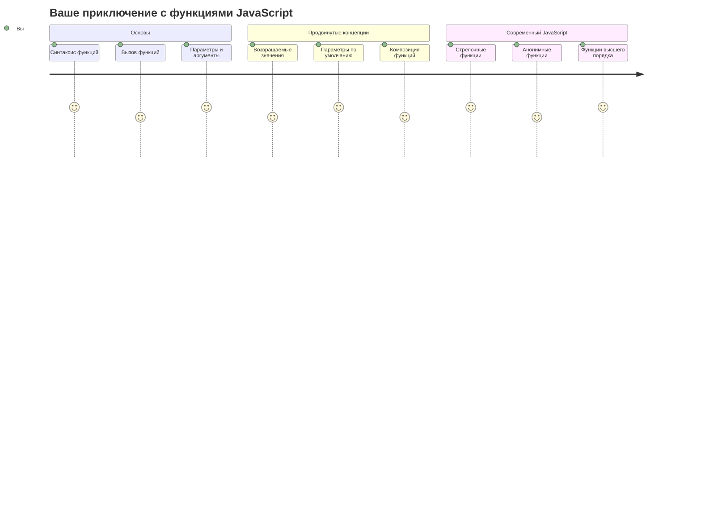

## Викторина перед лекцией
[Викторина перед лекцией](https://ff-quizzes.netlify.app)

Постоянное повторение одного и того же кода — одна из самых распространенных проблем в программировании. Функции решают эту проблему, позволяя упаковывать код в блоки, которые можно использовать повторно. Представьте функции как стандартизированные детали, которые сделали революцию на конвейере Генри Форда — создав надежный компонент, вы можете использовать его где угодно, не создавая заново.

Функции позволяют объединять части кода, чтобы использовать их в разных местах программы. Вместо того чтобы копировать и вставлять одну и ту же логику, вы можете создать функцию один раз и вызывать ее, когда это необходимо. Такой подход помогает организовать код и значительно упрощает его обновление.

На этом уроке вы научитесь создавать собственные функции, передавать им информацию и получать полезные результаты. Вы узнаете разницу между функциями и методами, изучите современные подходы к синтаксису и увидите, как функции могут взаимодействовать друг с другом. Мы будем изучать эти концепции шаг за шагом.

[](https://youtube.com/watch?v=XgKsD6Zwvlc "Методы и функции")

> 🎥 Нажмите на изображение выше, чтобы посмотреть видео о методах и функциях.

> Вы можете пройти этот урок на [Microsoft Learn](https://docs.microsoft.com/learn/modules/web-development-101-functions/?WT.mc_id=academic-77807-sagibbon)!

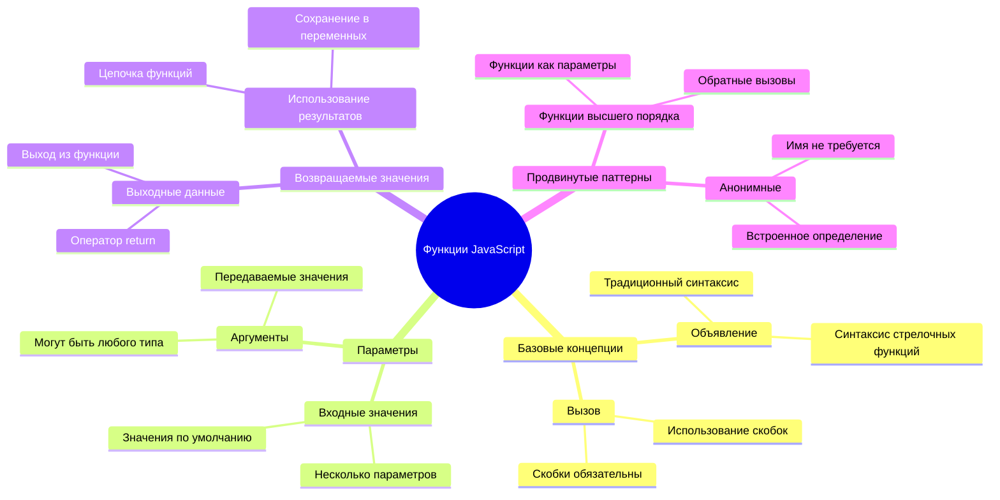

## Функции

Функция — это автономный блок кода, выполняющий определенную задачу. Она инкапсулирует логику, которую можно выполнить в любое время.

Вместо того чтобы писать один и тот же код несколько раз в программе, вы можете упаковать его в функцию и вызывать эту функцию, когда это необходимо. Такой подход помогает поддерживать чистоту кода и значительно упрощает его обновление. Представьте, как сложно было бы вносить изменения в логику, если бы она была разбросана по 20 разным местам в вашем коде.

Очень важно давать функциям понятные названия. Хорошо названная функция четко передает свою цель — когда вы видите `cancelTimer()`, сразу понятно, что она делает, так же как четко обозначенная кнопка говорит вам, что произойдет при нажатии.

## Создание и вызов функции

Давайте рассмотрим, как создать функцию. Синтаксис следует определенному шаблону:

```javascript
function nameOfFunction() { // определение функции
 // тело функции
}
```

Разберем это:
- Ключевое слово `function` говорит JavaScript: "Эй, я создаю функцию!"
- `nameOfFunction` — это место, где вы даете своей функции описательное название
- Круглые скобки `()` — это место, где вы можете добавить параметры (об этом мы поговорим позже)
- Фигурные скобки `{}` содержат фактический код, который выполняется при вызове функции

Давайте создадим простую функцию приветствия, чтобы увидеть, как это работает:

```javascript
function displayGreeting() {
  console.log('Hello, world!');
}
```

Эта функция выводит "Hello, world!" в консоль. После того как вы ее определили, вы можете использовать ее столько раз, сколько потребуется.

Чтобы выполнить (или "вызвать") вашу функцию, напишите ее имя, за которым следуют круглые скобки. JavaScript позволяет вам определить функцию до или после ее вызова — движок JavaScript сам разберется с порядком выполнения.

```javascript
// вызов нашей функции
displayGreeting();
```

Когда вы выполните эту строку, она выполнит весь код внутри вашей функции `displayGreeting`, выводя "Hello, world!" в консоль вашего браузера. Вы можете вызывать эту функцию многократно.

### 🧠 **Проверка основ функций: создание ваших первых функций**

**Давайте посмотрим, как вы понимаете базовые функции:**
- Можете ли вы объяснить, зачем мы используем фигурные скобки `{}` в определениях функций?
- Что произойдет, если вы напишете `displayGreeting` без скобок?
- Почему вам может понадобиться вызывать одну и ту же функцию несколько раз?

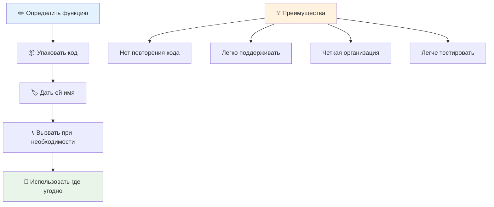

> **Примечание:** На протяжении этих уроков вы уже использовали **методы**. `console.log()` — это метод, по сути, функция, которая принадлежит объекту `console`. Основное различие заключается в том, что методы привязаны к объектам, а функции существуют независимо. Многие разработчики используют эти термины взаимозаменяемо в повседневной речи.

### Лучшие практики написания функций

Вот несколько советов, которые помогут вам писать хорошие функции:

- Давайте вашим функциям четкие, описательные названия — ваш будущий "я" скажет вам спасибо!
- Используйте **camelCasing** для названий из нескольких слов (например, `calculateTotal` вместо `calculate_total`)
- Сосредоточьтесь на том, чтобы каждая функция выполняла одну задачу хорошо

## Передача информации в функцию

Наша функция `displayGreeting` ограничена — она может отображать только "Hello, world!" для всех. Параметры позволяют сделать функции более гибкими и полезными.

**Параметры** действуют как заполнители, куда можно вставлять разные значения каждый раз при использовании функции. Таким образом, одна и та же функция может работать с разной информацией при каждом вызове.

Вы перечисляете параметры внутри круглых скобок при определении функции, разделяя несколько параметров запятыми:

```javascript
function name(param, param2, param3) {

}
```

Каждый параметр действует как заполнитель — когда кто-то вызывает вашу функцию, он предоставляет фактические значения, которые вставляются в эти места.

Давайте обновим нашу функцию приветствия, чтобы она принимала имя человека:

```javascript
function displayGreeting(name) {
  const message = `Hello, ${name}!`;
  console.log(message);
}
```

Обратите внимание, как мы используем обратные кавычки (`` ` ``) и `${}`, чтобы вставить имя прямо в сообщение — это называется шаблонной строкой, и это очень удобный способ создания строк с переменными.

Теперь, вызывая нашу функцию, мы можем передать любое имя:

```javascript
displayGreeting('Christopher');
// выводит "Hello, Christopher!" при выполнении
```

JavaScript берет строку `'Christopher'`, присваивает ее параметру `name` и создает персонализированное сообщение "Hello, Christopher!"

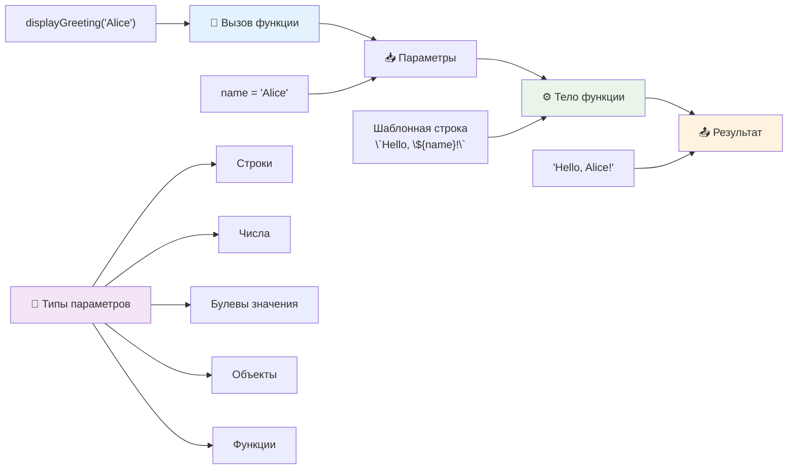

## Значения по умолчанию

Что, если мы хотим сделать некоторые параметры необязательными? Вот тут-то и пригодятся значения по умолчанию!

Предположим, мы хотим, чтобы люди могли настроить слово приветствия, но если они его не укажут, мы просто используем "Hello" как запасной вариант. Вы можете установить значения по умолчанию, используя знак равенства, как при установке переменной:

```javascript
function displayGreeting(name, salutation='Hello') {
  console.log(`${salutation}, ${name}`);
}
```

Здесь `name` все еще обязателен, но у `salutation` есть резервное значение `'Hello'`, если никто не укажет другое приветствие.

Теперь мы можем вызвать эту функцию двумя разными способами:

```javascript
displayGreeting('Christopher');
// выводит "Hello, Christopher"

displayGreeting('Christopher', 'Hi');
// выводит "Hi, Christopher"
```

В первом вызове JavaScript использует значение по умолчанию "Hello", так как мы не указали приветствие. Во втором вызове используется наше собственное "Hi". Такая гибкость делает функции адаптивными к различным сценариям.

### 🎛️ **Проверка владения параметрами: делаем функции гибкими**

**Проверьте ваше понимание параметров:**
- В чем разница между параметром и аргументом?
- Почему значения по умолчанию полезны в реальном программировании?
- Можете ли вы предсказать, что произойдет, если передать больше аргументов, чем параметров?

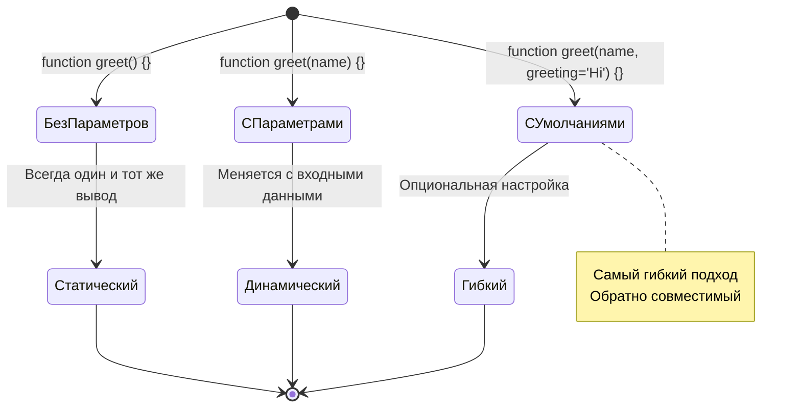

> **Профессиональный совет**: Параметры по умолчанию делают ваши функции более удобными для пользователя. Пользователи могут быстро начать с разумных значений по умолчанию, но все еще могут настроить их при необходимости!

## Возвращаемые значения

Наши функции до сих пор просто выводили сообщения в консоль, но что, если вы хотите, чтобы функция что-то вычисляла и возвращала результат?

Вот тут-то и появляются **возвращаемые значения**. Вместо того чтобы просто что-то отображать, функция может вернуть значение, которое вы можете сохранить в переменной или использовать в других частях вашего кода.

Чтобы вернуть значение, используйте ключевое слово `return`, за которым следует то, что вы хотите вернуть:

```javascript
return myVariable;
```

Важно помнить: когда функция достигает оператора `return`, она немедленно прекращает выполнение и возвращает это значение тому, кто ее вызвал.

Давайте изменим нашу функцию приветствия, чтобы она возвращала сообщение, а не выводила его:

```javascript
function createGreetingMessage(name) {
  const message = `Hello, ${name}`;
  return message;
}
```

Теперь вместо вывода приветствия эта функция создает сообщение и возвращает его нам.

Чтобы использовать возвращенное значение, мы можем сохранить его в переменной, как любое другое значение:

```javascript
const greetingMessage = createGreetingMessage('Christopher');
```

Теперь переменная `greetingMessage` содержит "Hello, Christopher", и мы можем использовать ее где угодно в нашем коде — для отображения на веб-странице, включения в электронное письмо или передачи другой функции.

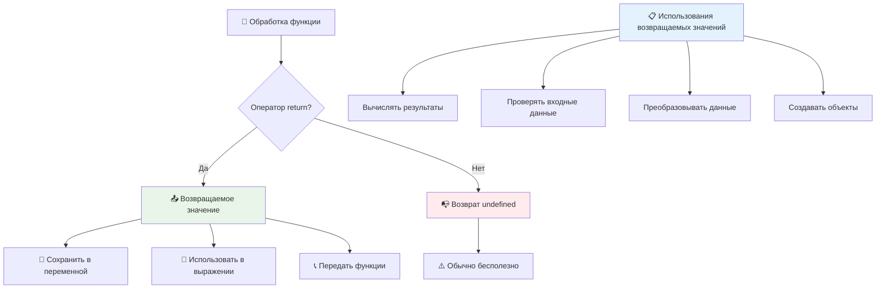

### 🔄 **Проверка возвращаемых значений: получение результатов обратно**

**Оцените ваше понимание возвращаемых значений:**
- Что происходит с кодом после оператора `return` в функции?
- Почему возврат значений часто лучше, чем просто вывод в консоль?
- Может ли функция возвращать разные типы значений (строка, число, булево значение)?

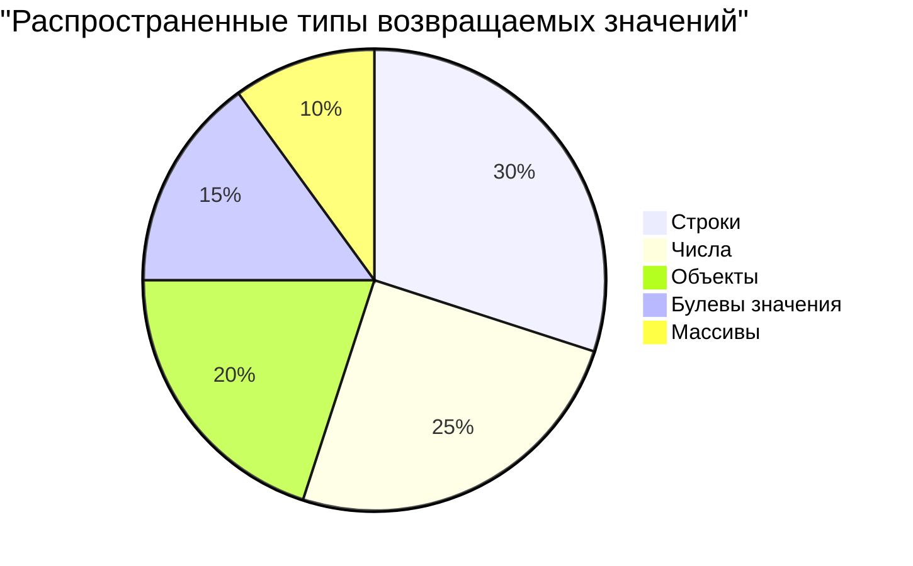

> **Ключевое понимание**: Функции, возвращающие значения, более универсальны, потому что вызывающий код решает, что делать с результатом. Это делает ваш код более модульным и переиспользуемым!

## Функции как параметры для функций

Функции могут быть переданы как параметры другим функциям. Хотя эта концепция может показаться сложной на первый взгляд, это мощная возможность, которая позволяет создавать гибкие шаблоны программирования.

Этот шаблон очень распространен, когда вы хотите сказать: "когда что-то произойдет, выполните другое действие". Например, "когда таймер закончится, выполните этот код" или "когда пользователь нажмет кнопку, вызовите эту функцию".

Рассмотрим `setTimeout`, встроенную функцию, которая ждет определенное время, а затем выполняет некоторый код. Нам нужно указать, какой код выполнить — идеальный случай для передачи функции!

Попробуйте этот код — через 3 секунды вы увидите сообщение:

```javascript
function displayDone() {
  console.log('3 seconds has elapsed');
}
// значение таймера в миллисекундах
setTimeout(displayDone, 3000);
```

Обратите внимание, как мы передаем `displayDone` (без круглых скобок) в `setTimeout`. Мы не вызываем функцию сами — мы передаем ее в `setTimeout` и говорим: "вызови это через 3 секунды".

### Анонимные функции

Иногда вам нужна функция только для одного действия, и вы не хотите давать ей имя. Подумайте — если вы используете функцию только один раз, зачем загромождать код лишним именем?

JavaScript позволяет создавать **анонимные функции** — функции без имени, которые можно определить прямо там, где они нужны.

Вот как мы можем переписать наш пример с таймером, используя анонимную функцию:

```javascript
setTimeout(function() {
  console.log('3 seconds has elapsed');
}, 3000);
```

Это достигает того же результата, но функция определяется прямо внутри вызова `setTimeout`, исключая необходимость в отдельном объявлении функции.

### Стрелочные функции

Современный JavaScript предлагает еще более короткий способ написания функций, называемый **стрелочными функциями**. Они используют `=>` (что похоже на стрелку — согласитесь?) и очень популярны среди разработчиков.

Стрелочные функции позволяют пропустить ключевое слово `function` и писать более лаконичный код.

Вот наш пример с таймером, используя стрелочную функцию:

```javascript
setTimeout(() => {
  console.log('3 seconds has elapsed');
}, 3000);
```

`()` — это место для параметров (в данном случае пустое), затем идет стрелка `=>`, и, наконец, тело функции в фигурных скобках. Это обеспечивает ту же функциональность с более лаконичным синтаксисом.

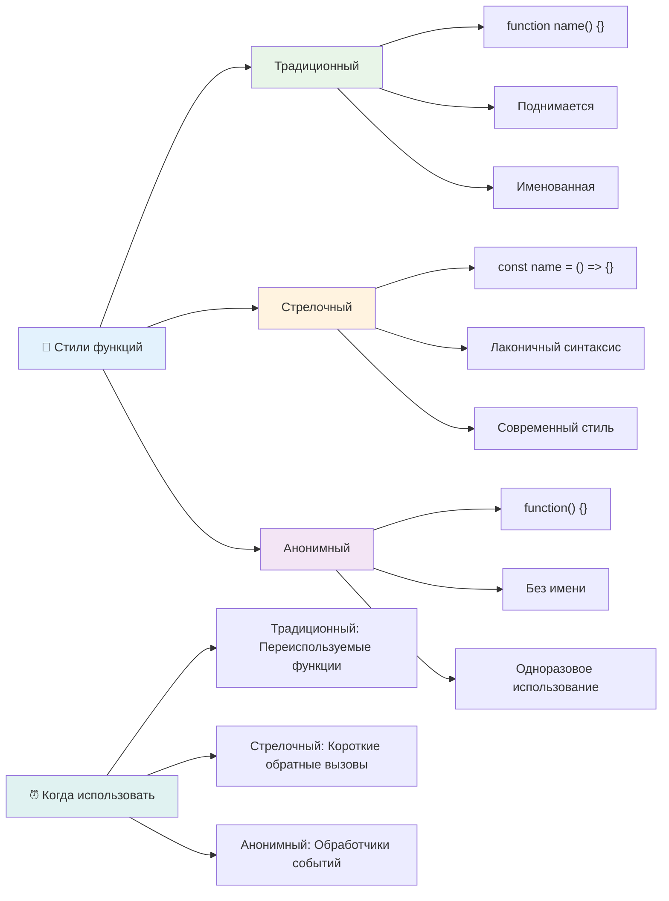

### Когда использовать каждый подход

Когда следует использовать каждый подход? Практическое правило: если вы будете использовать функцию несколько раз, дайте ей имя и определите отдельно. Если она предназначена для одного конкретного использования, рассмотрите возможность использования анонимной функции. Оба варианта — стрелочные функции и традиционный синтаксис — являются допустимыми, хотя стрелочные функции широко распространены в современных кодовых базах JavaScript.

### 🎨 **Проверка владения стилями функций: выбор правильного синтаксиса**

**Проверьте ваше понимание синтаксиса:**
- Когда вы можете предпочесть стрелочные функции традиционному синтаксису функций?
- В чем главное преимущество анонимных функций?
- Можете ли вы придумать ситуацию, когда именованная функция лучше анонимной?

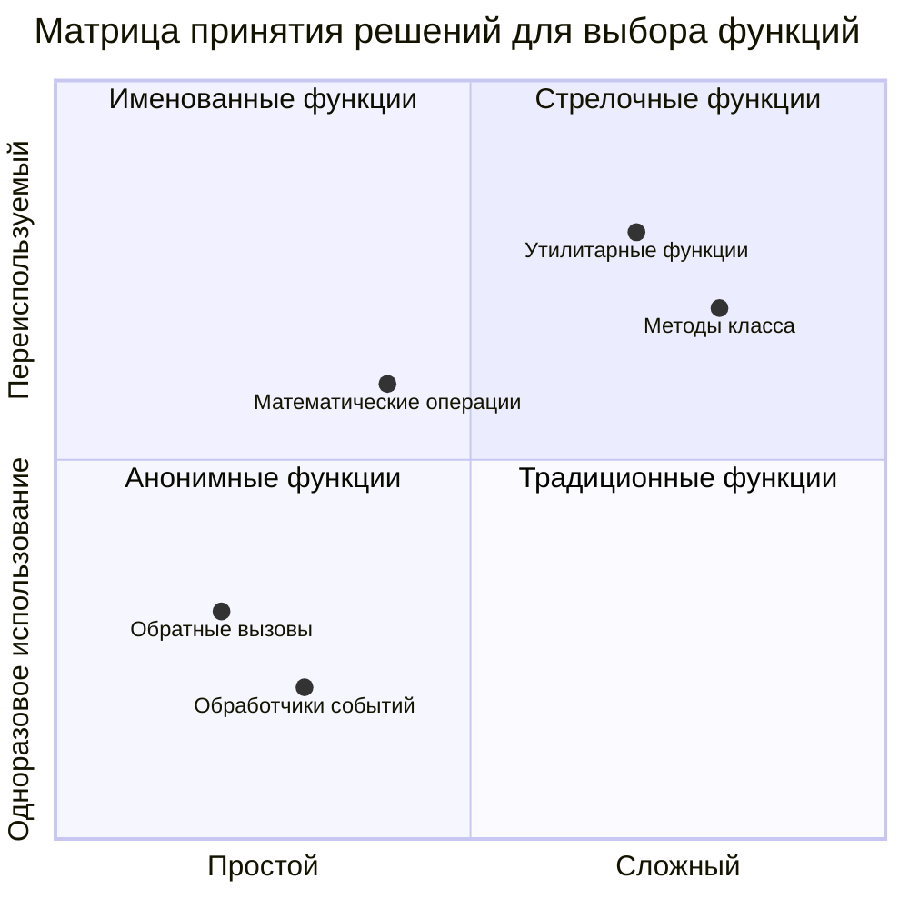

> **Современная тенденция**: Стрелочные функции становятся выбором по умолчанию для многих разработчиков благодаря своему лаконичному синтаксису, но традиционные функции все еще имеют свое место!

---

## 🚀 Задание

Сможете ли вы в одном предложении объяснить разницу между функциями и методами? Попробуйте!

## Задание GitHub Copilot Agent 🚀

Используйте режим Agent, чтобы выполнить следующее задание:

**Описание:** Создайте библиотеку утилит для математических функций, демонстрирующую различные концепции функций, рассмотренные в этом уроке, включая параметры, значения по умолчанию, возвращаемые значения и стрелочные функции.

**Задание:** Создайте JavaScript-файл под названием `mathUtils.js`, который содержит следующие функции:
1. Функция `add`, принимающая два параметра и возвращающая их сумму
2. Функция `multiply` с параметрами по умолчанию (второй параметр по умолчанию равен 1)
3. Стрелочная функция `square`, принимающая число и возвращающая его квадрат
4. Функция `calculate`, принимающая другую функцию в качестве параметра и два числа, затем применяющая эту функцию к этим числам
5. Продемонстрируйте вызов каждой функции с соответствующими тестовыми случаями

Узнайте больше о [режиме Agent](https://code.visualstudio.com/blogs/2025/02/24/introducing-copilot-agent-mode) здесь.

## Викторина после лекции
[Викторина после лекции](https://ff-quizzes.netlify.app)

## Обзор и самостоятельное изучение

Стоит [почитать немного больше о стрелочных функциях](https://developer.mozilla.org/docs/Web/JavaScript/Reference/Functions/Arrow_functions), так как они все чаще используются в кодовых базах. Попрактикуйтесь в написании функции, а затем перепишите ее с использованием этого синтаксиса.

## Задание

[Веселимся с функциями](assignment.md)

---

## 🧰 **Резюме вашего инструментария функций JavaScript**

```mermaid
graph TD
    A["🎯 Функции JavaScript"] --> B["📋 Объявление функции"]
    A --> C["📥 Параметры"]
    A --> D["📤 Возвращаемые значения"]
    A --> E["🎨 Современный синтаксис"]

    B --> B1["function name() {}"]
    B --> B2["Описательное именование"]
    B --> B3["Переиспользуемые блоки кода"]

    C --> C1["Входные данные"]
    C --> C2["Значения по умолчанию"]
    C --> C3["Несколько параметров"]

    D --> D1["Оператор return"]
    D --> D2["Выход из функции"]
    D --> D3["Передача данных обратно"]

    E --> E1["Стрелочные функции: () =>"]
    E --> E2["Анонимные функции"]
    E --> E3["Функции высшего порядка"]

    F["⚡ Ключевые преимущества"] --> F1["Переиспользование кода"]
    F --> F2["Лучшая организация"]
    F --> F3["Легче тестировать"]
    F --> F4["Модульный дизайн"]

    style A fill:#e3f2fd
    style B fill:#e8f5e8
    style C fill:#fff3e0
    style D fill:#f3e5f5
    style E fill:#e0f2f1
    style F fill:#fce4ec
```

---

## 🚀 Ваш временной план освоения функций JavaScript

### ⚡ **Что вы можете сделать в следующие 5 минут**
- [ ] Написать простую функцию, возвращающую ваше любимое число
- [ ] Создать функцию с двумя параметрами, складывающую их вместе
- [ ] Попробовать преобразовать традиционную функцию в синтаксис стрелочной функции
- [ ] Практиковать задание: объяснить разницу между функциями и методами

### 🎯 **Что вы можете достичь за этот час**
- [ ] Пройти викторину после урока и повторить любые запутанные концепции
- [ ] Создать библиотеку математических утилит из задания GitHub Copilot
- [ ] Создать функцию, использующую другую функцию в качестве параметра
- [ ] Практиковать написание функций с параметрами по умолчанию
- [ ] Экспериментировать с шаблонными строками в возвращаемых значениях функций

### 📅 **Ваше недельное освоение функций**
- [ ] Завершить задание "Веселимся с функциями" с креативностью
- [ ] Рефакторить некоторый повторяющийся код, который вы написали, в переиспользуемые функции
- [ ] Построить небольшой калькулятор, используя только функции (без глобальных переменных)
- [ ] Практиковать стрелочные функции с методами массивов, такими как `map()` и `filter()`
- [ ] Создать коллекцию утилитарных функций для общих задач
- [ ] Изучить функции высшего порядка и концепции функционального программирования

### 🌟 **Ваша месячная трансформация**
- [ ] Освоить продвинутые концепции функций, такие как замыкания и область видимости
- [ ] Построить проект, который сильно использует композицию функций
- [ ] Внести вклад в open source, улучшая документацию функций
- [ ] Обучить кого-то другого функциям и разным стилям синтаксиса
- [ ] Исследовать парадигмы функционального программирования в JavaScript
- [ ] Создать личную библиотеку переиспользуемых функций для будущих проектов

### 🏆 **Финальная проверка чемпиона функций**

**Отпразднуйте ваше мастерство функций:**
- Какая самая полезная функция, которую вы создали до сих пор?
- Как изучение функций изменило ваше представление об организации кода?
- Какой синтаксис функций вы предпочитаете и почему?
- Какую реальную проблему вы решили бы, написав функцию?

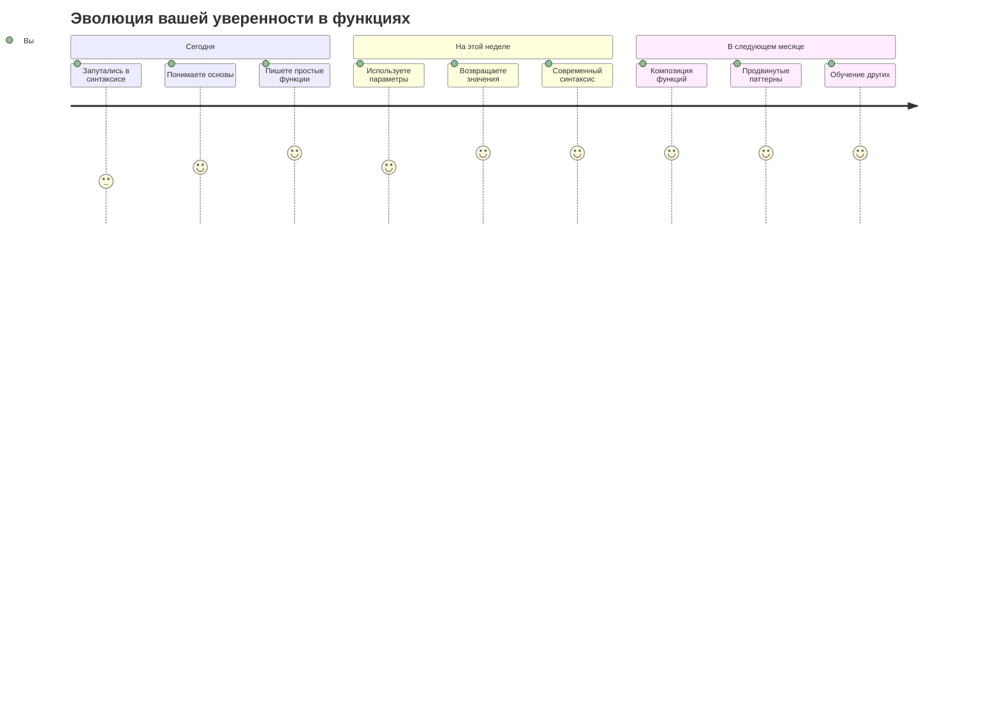

> 🎉 **Вы освоили одну из самых мощных концепций программирования!** Функции — это строительные блоки больших программ. Каждое приложение, которое вы когда-либо создадите, будет использовать функции для организации, переиспользования и структурирования кода. Теперь вы понимаете, как упаковывать логику в переиспользуемые компоненты, делая вас более эффективным и успешным программистом. Добро пожаловать в мир модульного программирования! 🚀
